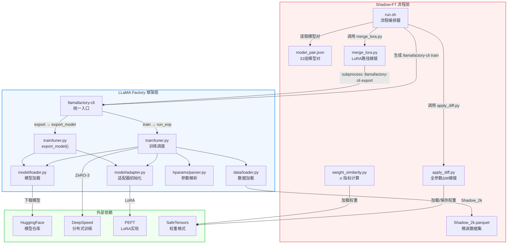
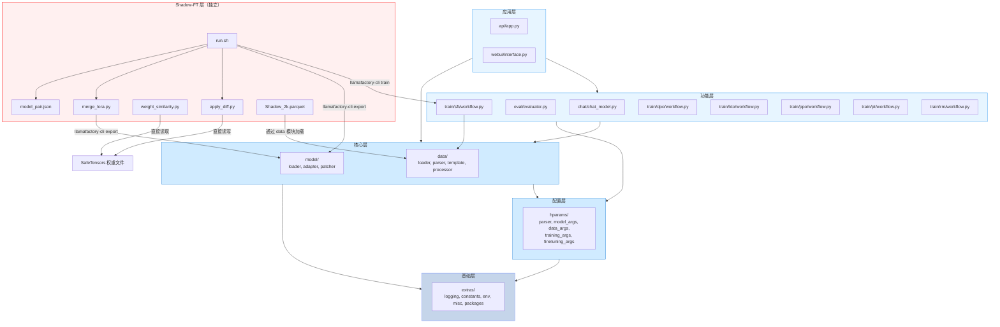

# 01 项目总览与 Shadow-FT 全景

## 一、项目定位

### 1.1 LLaMA Factory：统一大语言模型微调框架

LLaMA Factory 是一个面向大语言模型（LLM）的统一微调框架，其核心目标是降低大模型微调的技术门槛，提供从数据准备、模型训练到推理评估的一站式解决方案。项目覆盖了当前主流的微调范式，包括全参数微调（Full）、冻结微调（Freeze）、LoRA 及其变体（DoRA、PiSSA、rsLoRA 等），并支持 SFT、DPO、KTO、PPO、RM 等多种训练阶段。

框架的设计哲学体现为 **层次化架构** 与 **命令行统一入口** 两个关键特征：

- **层次化架构**：代码按照 `api/webui > chat/eval/train > data/model > hparams > extras` 五层依赖关系组织（见 [file:///workspace/src/llamafactory/__init__.py](file:///workspace/src/llamafactory/__init__.py)），上层模块调用下层模块，下层模块不感知上层逻辑，确保了模块间的低耦合。
- **命令行统一入口**：所有功能通过 `llamafactory-cli` 统一调度，支持 `train`、`export`、`chat`、`eval`、`api`、`webui` 等子命令（见 [file:///workspace/src/llamafactory/cli.py](file:///workspace/src/llamafactory/cli.py)），用户无需关心内部模块编排。

### 1.2 Shadow-FT：核心创新

Shadow-FT（Shadow Fine-Tuning）是本项目引入的核心创新方法，论文发表于 arXiv:2505.12716，题为 *"Shadow-FT: Tuning Instruct Model via Training on Paired Base Model"*。其核心思想可以用一个简洁的公式概括：

$$W_{\text{shadow}} = W_{\text{instruct}} + \Delta W, \quad \Delta W = W_{\text{tuned}} - W_{\text{base}}$$

其中：
- **$W_{\text{base}}$**：Base 模型（预训练基座）的权重
- **$W_{\text{instruct}}$**：Instruct 模型（经过指令对齐的版本）的权重
- **$W_{\text{tuned}}$**：在 Base 模型上微调后得到的权重
- **$\Delta W$**：微调产生的权重增量

Shadow-FT 的关键洞察在于：**直接在 Instruct 模型上微调容易破坏其已有的指令对齐能力，而先在 Base 模型上微调、再将增量嫁接（graft）到 Instruct 模型，可以在保留对齐能力的同时注入新知识**。这一方法同时支持全参数微调路径和 LoRA 微调路径，在 `src/shadow/` 目录下提供了完整实现。

---

## 二、目录结构总览

### 2.1 项目目录树

```mermaid
graph TD
    ROOT["LLaMA-Factory/"] --> SRC["src/"]
    ROOT --> DATA["data/"]
    ROOT --> EXAMPLES["examples/"]
    ROOT --> SCRIPTS["scripts/"]
    ROOT --> EVAL["evaluation/"]
    ROOT --> TESTS["tests/"]
    ROOT --> DOCKER["docker/"]
    ROOT --> ASSETS["assets/"]
    ROOT --> RUNSH["run.sh"]

    SRC --> LF["llamafactory/"]
    SRC --> SHADOW["shadow/ 🔑"]
    SRC --> API_PY["api.py"]
    SRC --> TRAIN_PY["train.py"]
    SRC --> WEBUI_PY["webui.py"]

    LF --> API["api/"]
    LF --> CHAT["chat/"]
    LF --> DATA_MOD["data/"]
    LF --> EVAL_MOD["eval/"]
    LF --> EXTRAS["extras/"]
    LF --> HPARAMS["hparams/"]
    LF --> MODEL["model/"]
    LF --> TRAIN_MOD["train/"]
    LF --> WEBUI_MOD["webui/"]
    LF --> CLI["cli.py"]
    LF --> LAUNCHER["launcher.py"]

    SHADOW --> WS["weight_similarity.py"]
    SHADOW --> AD["apply_diff.py"]
    SHADOW --> ML["merge_lora.py"]

    TRAIN_MOD --> SFT["sft/"]
    TRAIN_MOD --> DPO["dpo/"]
    TRAIN_MOD --> KTO["kto/"]
    TRAIN_MOD --> PPO["ppo/"]
    TRAIN_MOD --> PT["pt/"]
    TRAIN_MOD --> RM["rm/"]

    MODEL --> LOADER["loader.py"]
    MODEL --> ADAPTER["adapter.py"]
    MODEL --> PATCHER["patcher.py"]
    MODEL --> MU["model_utils/"]

    DATA_MOD --> LOADER_D["loader.py"]
    DATA_MOD --> PARSER["parser.py"]
    DATA_MOD --> TEMPLATE["template.py"]
    DATA_MOD --> PROC["processor/"]

    HPARAMS --> PARSER_H["parser.py"]
    HPARAMS --> MODEL_ARGS["model_args.py"]
    HPARAMS --> DATA_ARGS["data_args.py"]
    HPARAMS --> TRAIN_ARGS["training_args.py"]
    HPARAMS --> FINETUNE_ARGS["finetuning_args.py"]

    EXAMPLES --> MP["model_pair.json 🔑"]
    EXAMPLES --> TRAIN_LORA["train_lora/"]
    EXAMPLES --> TRAIN_FULL["train_full/"]
    EXAMPLES --> MERGE_LORA["merge_lora/"]
    EXAMPLES --> DEEPSPEED["deepspeed/"]

    DATA --> SHADOW_2K["Shadow_2k.parquet 🔑"]
    DATA --> DATASET_INFO["dataset_info.json"]

    style SHADOW fill:#ff6b6b,stroke:#c92a2a,color:#fff
    style MP fill:#ff6b6b,stroke:#c92a2a,color:#fff
    style SHADOW_2K fill:#ff6b6b,stroke:#c92a2a,color:#fff
    style DATASET_INFO fill:#ffd43b,stroke:#f59f00
```



> 🔑 红色高亮标记为 Shadow-FT 相关的关键文件/目录

### 2.2 核心目录说明

| 目录 | 职责 | 与 Shadow-FT 的关系 |
|------|------|---------------------|
| `src/llamafactory/` | LLaMA Factory 主框架 | Shadow-FT 的训练引擎，提供 `llamafactory-cli train/export` |
| `src/shadow/` | Shadow-FT 核心实现 | **直接实现**：权重相似度计算、增量嫁接、LoRA 合并 |
| `data/` | 数据集存储与配置 | 提供 `Shadow_2k` 数据集（Shadow-FT 专用微调数据） |
| `examples/` | 配置样例与模型对 | `model_pair.json` 定义 31 组 Base-Instruct 模型对 |
| `run.sh` | 自动化训练脚本生成器 | 编排 Shadow-FT 完整流程：训练 → 增量计算 → 嫁接 |
| `scripts/` | 辅助脚本 | 通用工具，非 Shadow-FT 专属 |
| `evaluation/` | 评测数据集 | 用于评估 Shadow-FT 嫁接后模型的效果 |
| `tests/` | 单元测试与端到端测试 | 覆盖 LLaMA Factory 核心模块 |

---

## 三、各模块独立解读

### 3.1 Shadow-FT 模块（`src/shadow/`）

Shadow-FT 的实现集中在 `src/shadow/` 目录下，包含三个核心脚本：

#### 3.1.1 weight_similarity.py —— 权重相似度度量

[file:///workspace/src/shadow/weight_similarity.py](file:///workspace/src/shadow/weight_similarity.py)

该脚本实现了 Shadow-FT 论文（Sec 2.3）中定义的 σ 指标，用于量化 Base 模型与 Instruct 模型之间的权重差异：

$$\sigma(W_A, W_B) = \frac{\sum|W_A - W_B|}{\sum|W_A| + \sum|W_B|}$$

**核心设计要点**：

1. **逐层加载策略**：通过解析 `model.safetensors.index.json` 获取层-键映射关系，每次仅加载当前层的权重到内存，避免 70B+ 模型导致的 OOM 问题。
2. **BF16→FP32 上转**：在执行减法运算前，将 BF16 张量上转为 FP32，确保数值精度。
3. **稀疏度辅助指标**：除 σ 外，还提供 `calculate_sparsity_ratio()` 函数，计算 |W_A - W_B| < 阈值的比例，作为辅助分析手段。

使用方式：
```bash
python3 src/shadow/weight_similarity.py --B Qwen3-8B-Base/ --I Qwen3-8B/
```

#### 3.1.2 apply_diff.py —— 全参数增量嫁接

[file:///workspace/src/shadow/apply_diff.py](file:///workspace/src/shadow/apply_diff.py)

该脚本实现了 Shadow-FT 的全参数微调路径，核心逻辑为：

```python
delta_weights = {k: a_weights[k] - c_weights[k]
                 for k in a_weights if k in c_weights and is_linear_param(k)}
new_weights = {k: (b_weights[k] + delta_weights[k]) if k in delta_weights else v
               for k, v in b_weights.items()}
```

**关键设计**：

1. **仅对线性层嫁接**：`is_linear_param()` 通过正则匹配 `k_proj`、`q_proj`、`v_proj`、`o_proj`、`up_proj`、`gate_proj`、`down_proj` 等模式，筛选出注意力投影层和 MLP 投影层进行增量嫁接，非线性的 LayerNorm、Embedding 等参数直接沿用 Instruct 模型原始值。
2. **多格式权重加载**：支持 `.safetensors` 分片、单文件 `pytorch_model.bin`、以及多分片 `.bin` 三种格式。
3. **分片保存**：使用 `huggingface_hub.save_torch_state_dict` 处理共享张量（如 tied embeddings）和自动分片，输出格式与 HuggingFace 标准兼容。
4. **配置文件复制**：`copy_tokenizer_and_config()` 将 Instruct 模型的 tokenizer、config 等文件复制到输出目录，确保嫁接后的模型可直接加载使用。

命令行接口：
```bash
python3 src/shadow/apply_diff.py \
  --tuned_model <Base微调后的模型路径> \
  --target_model <Instruct模型路径> \
  --base_model <Base模型路径>
```

#### 3.1.3 merge_lora.py —— LoRA 路径增量嫁接

[file:///workspace/src/shadow/merge_lora.py](file:///workspace/src/shadow/merge_lora.py)

该脚本实现了 Shadow-FT 的 LoRA 微调路径。与全参数路径不同，LoRA 路径的增量嫁接通过 LLaMA Factory 自身的 `export` 功能完成：

```python
cmd = ["llamafactory-cli", "export", str(config_file)]
subprocess.run(cmd, check=True)
```

**工作流程**：

1. 接收 LoRA adapter 路径、目标基座模型路径和合并标签
2. 生成 YAML 配置文件，设置 `model_name_or_path` 为目标模型、`adapter_name_or_path` 为 LoRA 输出
3. 调用 `llamafactory-cli export` 将 LoRA adapter 合并到目标模型权重中
4. 输出目录命名为 `merged-{merge_tag}`（如 `merged-B2I` 表示 Base→Instruct 嫁接）

**与全参数路径的本质区别**：全参数路径（`apply_diff.py`）直接在权重张量层面做算术运算（W_instruct + ΔW），而 LoRA 路径（`merge_lora.py`）依赖 LLaMA Factory 的 `export_model()` 函数，通过 `model.merge_and_unload()` 将 LoRA 权重融入基座模型。这意味着 LoRA 路径的"增量嫁接"隐含在 LoRA 合并过程中——在 Base 模型上训练的 LoRA adapter 被合并到 Instruct 模型时，等效于将 Base 上学到的增量迁移到 Instruct。

### 3.2 LLaMA Factory 核心模块

#### 3.2.1 入口与调度层（`cli.py` / `launcher.py`）

[file:///workspace/src/llamafactory/cli.py](file:///workspace/src/llamafactory/cli.py) 是整个框架的统一入口，通过命令映射表 `COMMAND_MAP` 将子命令分派到对应模块：

| 子命令 | 目标函数 | 功能 |
|--------|----------|------|
| `train` | `run_exp` | 启动训练（自动检测多卡并启动 torchrun） |
| `export` | `export_model` | 合并 LoRA 并导出模型 |
| `chat` | `run_chat` | CLI 对话 |
| `eval` | `run_eval` | 模型评估 |
| `api` | `run_api` | 启动 OpenAI 兼容 API 服务 |
| `webui` | `run_web_ui` | 启动 Web 界面 |

Shadow-FT 的 `run.sh` 脚本主要调用 `train` 和 `export` 两个子命令。

[file:////workspace/src/llamafactory/launcher.py](file:///workspace/src/llamafactory/launcher.py) 是 torchrun 的入口点，直接调用 `run_exp()`，用于分布式训练场景。

#### 3.2.2 训练模块（`train/`）

[file:///workspace/src/llamafactory/train/tuner.py](file:///workspace/src/llamafactory/train/tuner.py) 是训练的中央调度器，`run_exp()` 函数解析参数后根据 `finetuning_args.stage` 分派到具体训练流程：

```
stage=pt   → run_pt()   (预训练)
stage=sft  → run_sft()  (监督微调) ← Shadow-FT 使用此路径
stage=dpo  → run_dpo()  (直接偏好优化)
stage=kto  → run_kto()  (Kahneman-Tversky 优化)
stage=ppo  → run_ppo()  (近端策略优化)
stage=rm   → run_rm()   (奖励模型训练)
```

`export_model()` 函数负责模型导出，Shadow-FT 的 LoRA 路径通过此函数将 adapter 合并到目标模型。

#### 3.2.3 模型模块（`model/`）

[file:///workspace/src/llamafactory/model/loader.py](file:///workspace/src/llamafactory/model/loader.py) 负责模型加载与初始化，核心函数包括：

- `load_tokenizer()`：加载分词器和处理器
- `load_model()`：加载预训练模型，支持 CausalLM、Seq2Seq、Vision2Seq 等多种架构

[file:///workspace/src/llamafactory/model/adapter.py](file:///workspace/src/llamafactory/model/adapter.py) 负责适配器初始化，通过 `init_adapter()` 函数根据 `finetuning_type` 选择：

- `full`：全参数微调（`_setup_full_tuning`）
- `freeze`：冻结微调（`_setup_freeze_tuning`）
- `lora`：LoRA 微调（`_setup_lora_tuning`），支持 DoRA、PiSSA、rsLoRA 等变体

Shadow-FT 的全参数路径使用 `full` 类型，LoRA 路径使用 `lora` 类型。

#### 3.2.4 数据模块（`data/`）

数据模块负责数据集的加载、解析、格式化和批处理。Shadow-FT 使用 `Shadow_2k` 数据集，其配置定义在 [file:///workspace/data/dataset_info.json](file:///workspace/data/dataset_info.json) 中：

```json
"Shadow_2k": {
  "file_name": "Shadow_2k.parquet",
  "formatting": "sharegpt",
  "columns": {
    "messages": "conversations"
  }
}
```

该数据集采用 ShareGPT 格式，包含约 2000 条多轮对话样本，是 Shadow-FT 论文实验中使用的标准微调数据。

#### 3.2.5 超参数模块（`hparams/`）

[file:///workspace/src/llamafactory/hparams/parser.py](file:///workspace/src/llamafactory/hparams/parser.py) 是参数解析的核心，定义了三组参数组合：

- **训练参数**：`ModelArguments + DataArguments + TrainingArguments + FinetuningArguments + GeneratingArguments`
- **推理参数**：`ModelArguments + DataArguments + FinetuningArguments + GeneratingArguments`
- **评估参数**：`ModelArguments + DataArguments + EvaluationArguments + FinetuningArguments`

Shadow-FT 的 `run.sh` 生成的训练脚本中，所有参数最终都通过此模块解析。

#### 3.2.6 其他模块

- **`api/`**：基于 FastAPI 的 OpenAI 兼容 API 服务，Shadow-FT 嫁接后的模型可通过此模块部署
- **`chat/`**：对话引擎，支持 HF、vLLM、SGLang 三种推理后端
- **`eval/`**：评测模块，用于评估 Shadow-FT 嫁接模型的效果
- **`extras/`**：基础设施工具（日志、常量、环境变量、包检测等）
- **`webui/`**：基于 Gradio 的 Web 界面

### 3.3 自动化脚本（`run.sh`）

[file:///workspace/run.sh](file:///workspace/run.sh) 是 Shadow-FT 的自动化流程编排脚本，它完成以下工作：

1. **模型对解析**：从 `examples/model_pair.json` 中读取 Base-Instruct 模型对，支持本地路径和 HuggingFace Hub ID
2. **训练脚本生成**：为每个模型对生成完整的训练脚本，包含：
   - Base 模型训练（`generate_train B`）
   - Instruct 模型训练（`generate_train I`）
3. **增量嫁接**：
   - LoRA 模式：调用 `merge_lora.py` 将 Base 上训练的 adapter 合并到 Instruct 模型（B2I），以及 Instruct 上的 adapter 合并回 Instruct（I2I，作为对照实验）
   - 全参数模式：调用 `apply_diff.py` 执行 ΔW 嫁接
4. **评估列表**：生成评估配置元组列表，用于后续批量评测

### 3.4 模型对配置（`examples/model_pair.json`）

[file:///workspace/examples/model_pair.json](file:///workspace/examples/model_pair.json) 定义了 31 组 Base-Instruct 模型对，覆盖 10 个主流模型系列：

| 模型系列 | 示例 Base → Instruct | 数量 |
|----------|---------------------|------|
| Qwen3 | Qwen3-8B-Base → Qwen3-8B | 6 |
| Qwen2.5 | Qwen2.5-7B → Qwen2.5-7B-Chat | 3 |
| Falcon | falcon-7b → falcon-7b-instruct | 4 |
| Gemma | gemma-3-27b → gemma-3-27b-it | 6 |
| Llama | (通过 template 匹配) | — |
| Mistral | Mistral-7B-v0.1 → Mistral-7B-Instruct-v0.1 | 1 |
| Yi | Yi-6B → Yi-6B-Chat | 3 |
| Baichuan | Baichuan2-7B → Baichuan2-7B-Chat | 1 |
| InternLM | internlm2-7b → internlm2-7b-chat | 5 |
| GLM-4 | glm-4-32b → glm-4-32b-chat | 1 |
| Seed-Coder | Seed-Coder-8B-Base → Seed-Coder-8B-Instruct | 1 |

这些模型对是 Shadow-FT 论文实验的基础，确保了方法在不同架构、不同规模模型上的广泛验证。

---

## 四、Shadow-FT 在架构中的核心地位

### 4.1 架构交互全景图



### 4.2 Shadow-FT 的核心地位分析

从架构交互全景图可以清晰看出，Shadow-FT 在整个项目中扮演着 **方法论创新层** 的角色，其核心地位体现在以下三个维度：

**维度一：流程编排者**

`run.sh` 是整个 Shadow-FT 实验流程的编排中枢。它不是 LLaMA Factory 的内部模块，而是一个**外部编排层**，通过调用 `llamafactory-cli` 和 `src/shadow/` 下的脚本，将 LLaMA Factory 的训练/导出能力与 Shadow-FT 特有的增量嫁接逻辑串联起来。这种设计使得 Shadow-FT 的核心逻辑与 LLaMA Factory 的通用框架保持解耦。

**维度二：方法论的实现载体**

`src/shadow/` 下的三个脚本分别对应 Shadow-FT 方法论的不同侧面：
- `weight_similarity.py`：**分析工具**，量化 Base-Instruct 权重差异，为论文提供实验数据支撑
- `apply_diff.py`：**全参数路径**，直接在张量层面执行 ΔW 嫁接，是 Shadow-FT 的核心算法实现
- `merge_lora.py`：**LoRA 路径**，通过 LLaMA Factory 的 export 功能间接实现增量迁移

**维度三：LLaMA Factory 的上层应用**

Shadow-FT 并不修改 LLaMA Factory 的任何核心代码，而是作为一个**纯上层应用**存在。它通过以下两种方式与 LLaMA Factory 交互：
1. **命令行调用**：`run.sh` 生成 `llamafactory-cli train/export` 命令
2. **权重文件操作**：`apply_diff.py` 和 `weight_similarity.py` 直接读写模型权重文件，绕过 LLaMA Factory 的模型加载逻辑

这种"不侵入框架、仅使用框架"的设计，使得 Shadow-FT 可以独立演进，同时充分复用 LLaMA Factory 的训练能力。

---

## 五、Shadow-FT 与各模块的深度交互

### 5.1 Shadow-FT 与训练模块（`train/`）的交互

Shadow-FT 的训练流程由 `run.sh` 编排，通过 `llamafactory-cli train` 调用 LLaMA Factory 的训练模块。交互细节如下：

**全参数路径**：

```
run.sh → llamafactory-cli train (stage=sft, finetuning_type=full, model=Base)
       → run_exp() → run_sft() → CustomSeq2SeqTrainer.train()
       → 保存微调后的 Base 模型到 output_dir
       → apply_diff.py --tuned_model <output_dir> --target_model <Instruct> --base_model <Base>
       → 计算 ΔW = W_tuned - W_base，嫁接到 W_instruct
```

在 [file:///workspace/src/llamafactory/train/sft/workflow.py](file:///workspace/src/llamafactory/train/sft/workflow.py) 中，`run_sft()` 函数依次完成：加载分词器 → 获取模板 → 加载数据集 → 加载模型 → 创建 Trainer → 训练 → 保存。Shadow-FT 的 Base 模型训练完全复用此流程。

**LoRA 路径**：

```
run.sh → llamafactory-cli train (stage=sft, finetuning_type=lora, model=Base)
       → run_exp() → run_sft() → CustomSeq2SeqTrainer.train()
       → 保存 LoRA adapter 到 output_dir
       → merge_lora.py --adapter_path <output_dir> --target_base <Instruct> --merge_tag B2I
       → llamafactory-cli export (合并 adapter 到 Instruct 模型)
       → export_model() → model.merge_and_unload() → 保存合并后的模型
```

在 [file:///workspace/src/llamafactory/train/tuner.py](file:///workspace/src/llamafactory/train/tuner.py) 中，`export_model()` 函数加载模型和 adapter，调用 `model.save_pretrained()` 保存合并后的权重。Shadow-FT 的 LoRA 路径通过此函数实现增量迁移。

**关键参数映射**（`run.sh` 生成的训练命令）：

| 参数 | Shadow-FT 中的值 | 说明 |
|------|-----------------|------|
| `--model_name_or_path` | Base 模型路径 | 在 Base 上训练 |
| `--stage` | `sft` | 监督微调 |
| `--finetuning_type` | `lora` 或 `full` | 两条路径 |
| `--dataset` | `Shadow_2k` | Shadow-FT 专用数据集 |
| `--deepspeed` | `ds_z3_config.json` | ZeRO-3 分布式训练 |
| `--template` | 根据 Base 模型自动选择 | 如 `qwen3`、`llama3` 等 |

### 5.2 Shadow-FT 与模型模块（`model/`）的交互

Shadow-FT 与模型模块的交互存在两条截然不同的路径：

**路径一：间接交互（通过训练/导出流程）**

当 Shadow-FT 通过 `llamafactory-cli train` 训练 Base 模型时，模型模块的完整加载链被激活：

```
load_tokenizer(model_args)
  → AutoTokenizer.from_pretrained() + patch_tokenizer()

load_model(tokenizer, model_args, finetuning_args, is_trainable=True)
  → load_config() → patch_config()
  → AutoModelForCausalLM.from_pretrained()  [或 Unsloth 加载]
  → patch_model()
  → init_adapter()  [full: 全参数可训练 / lora: 注入 LoRA 权重]
```

在 [file:///workspace/src/llamafactory/model/adapter.py](file:///workspace/src/llamafactory/model/adapter.py) 中，`init_adapter()` 是关键的分支点：
- 全参数路径调用 `_setup_full_tuning()`，解除所有非禁止模块的梯度冻结
- LoRA 路径调用 `_setup_lora_tuning()`，通过 `get_peft_model()` 注入 LoRA adapter

**路径二：直接交互（绕过框架，操作权重文件）**

`apply_diff.py` 和 `weight_similarity.py` 完全绕过 LLaMA Factory 的模型加载逻辑，直接使用 `safetensors` 库读写权重文件。这种设计选择的原因是：

1. **内存效率**：逐层加载仅需当前层的权重，而 `load_model()` 会加载整个模型到 GPU
2. **无需 GPU**：增量嫁接是纯张量运算，可在 CPU 上完成
3. **解耦性**：不依赖 transformers/PEFT 的模型类，避免版本兼容问题

`apply_diff.py` 中的 `is_linear_param()` 函数硬编码了线性层的匹配模式，这与 LLaMA Factory 中 `model_utils/misc.py` 的 `find_all_linear_modules()` 函数功能类似但实现方式不同——前者基于正则匹配参数名，后者基于 `isinstance(module, torch.nn.Linear)` 的类型检查。

### 5.3 Shadow-FT 与数据模块（`data/`）的交互

Shadow-FT 与数据模块的交互相对简单，主要通过 `Shadow_2k` 数据集进行：

1. `run.sh` 中设置 `--dataset Shadow_2k`
2. LLaMA Factory 的数据模块通过 `dataset_info.json` 查找数据集配置
3. 加载 `data/Shadow_2k.parquet`，按 ShareGPT 格式解析
4. 数据处理器（`SupervisedDatasetProcessor`）将对话转换为训练样本

Shadow-FT 对数据模块没有特殊修改需求，完全复用 LLaMA Factory 的标准数据处理流程。`Shadow_2k` 数据集的 ShareGPT 格式与 LLaMA Factory 的 `sharegpt` 格式化方式完全兼容。

### 5.4 Shadow-FT 与超参数模块（`hparams/`）的交互

Shadow-FT 的训练参数通过 `run.sh` 以命令行参数的形式传递给 `llamafactory-cli train`，最终由 `hparams/parser.py` 解析为结构化的参数对象。

**Shadow-FT 的关键超参数选择**：

| 超参数 | 全参数路径 | LoRA 路径 | 说明 |
|--------|-----------|-----------|------|
| `learning_rate` | 1e-5 | 2e-4 | LoRA 通常使用更高学习率 |
| `lora_rank` | — | 8 | LoRA 秩 |
| `num_train_epochs` | 1 | 1 | 统一训练 1 个 epoch |
| `cutoff_len` | 4096 | 4096 | 序列长度 |
| `deepspeed` | ZeRO-3 | ZeRO-3 | 全参数必须 ZeRO-3 |
| `max_samples` | 2000 | 2000 | 使用全部 Shadow_2k 数据 |
| `per_device_train_batch_size` | 2 | 2 | 批大小 |
| `gradient_accumulation_steps` | 16 | 16 | 梯度累积 |

在 [file:///workspace/src/llamafactory/hparams/parser.py](file:///workspace/src/llamafactory/hparams/parser.py) 中，`get_train_args()` 函数执行大量参数校验，例如：
- 全参数微调 + 量化模型会报错
- LoRA + DeepSpeed ZeRO-3 需要特殊处理
- `predict_with_generate` 仅在 SFT 阶段可用

Shadow-FT 的参数组合（Base 模型 + SFT + full/lora + DeepSpeed ZeRO-3）通过了所有校验规则。

### 5.5 Shadow-FT 与评估模块（`eval/`）的交互

`run.sh` 在脚本末尾生成评估列表（`EVAL_LINES`），记录每个实验配置的名称和输出路径。这些评估元组用于后续批量调用 `llamafactory-cli eval` 进行标准化评测。

Shadow-FT 的评估对比组包括：
- **B2I（Shadow-FT）**：Base 微调 → ΔW 嫁接到 Instruct（核心实验组）
- **I2I（对照）**：Instruct 微调 → LoRA 合并回 Instruct（对照实验组）
- **I-SFT（对照）**：Instruct 全参数微调（仅全参数路径的对照）

### 5.6 Shadow-FT 与 API/WebUI 模块的交互

Shadow-FT 嫁接后的模型是标准的 HuggingFace 格式模型，可以直接通过 LLaMA Factory 的 API 或 WebUI 模块部署使用，无需任何额外处理。交互路径为：

```
Shadow-FT 嫁接模型 → llamafactory-cli api --model_name_or_path <merged-B2I>
                    → ChatModel → HuggingFaceEngine / vLLMEngine
                    → OpenAI 兼容 API
```

---

## 六、模块依赖关系图



**依赖层级解读**：

- **应用层（L5）**：API 和 WebUI 是面向终端用户的前端，依赖功能层和核心层
- **功能层（L4）**：各种训练/推理/评测工作流，依赖核心层提供数据和模型，依赖配置层提供参数
- **核心层（L3）**：数据加载与模型加载是框架的核心能力，被功能层广泛调用
- **配置层（L2）**：参数解析与校验，为核心层和功能层提供结构化配置
- **基础层（L1）**：日志、常量、环境检测等基础设施，被所有上层模块依赖
- **Shadow-FT 层**：独立于 LLaMA Factory 的五层架构之外，通过命令行调用和文件操作两种方式与框架交互

---

## 七、总结

Shadow-FT 在 LLaMA Factory 项目中占据着独特的方法论创新地位。从架构视角看，它既不是 LLaMA Factory 的内部模块，也不是简单的外部工具，而是一个**基于 LLaMA Factory 构建的上层方法实现**：

1. **复用而非修改**：Shadow-FT 完全复用 LLaMA Factory 的训练（`train`）和导出（`export`）能力，不修改框架任何核心代码
2. **补充而非替代**：`src/shadow/` 下的脚本补充了 LLaMA Factory 不具备的增量嫁接能力（`apply_diff.py`）和权重分析能力（`weight_similarity.py`）
3. **编排而非嵌入**：`run.sh` 以外部编排的方式将 Shadow-FT 的多步流程串联，而非将 Shadow-FT 逻辑嵌入 LLaMA Factory 的训练循环

这种架构选择使得 Shadow-FT 具有良好的可移植性——理论上，只要另一个框架提供等价的 `train` 和 `export` 命令行接口，Shadow-FT 的流程就可以迁移到该框架上运行。同时，`apply_diff.py` 和 `weight_similarity.py` 的纯文件操作设计，使其不依赖任何特定框架的模型加载逻辑，进一步增强了独立性。

从更宏观的视角看，Shadow-FT 代表了一种重要的研究范式：**在现有微调框架之上构建新的微调方法论**。这种方法论-框架的分离设计，既保证了方法研究的灵活性和创新性，又充分利用了成熟框架的工程能力，是值得借鉴的工程实践。
