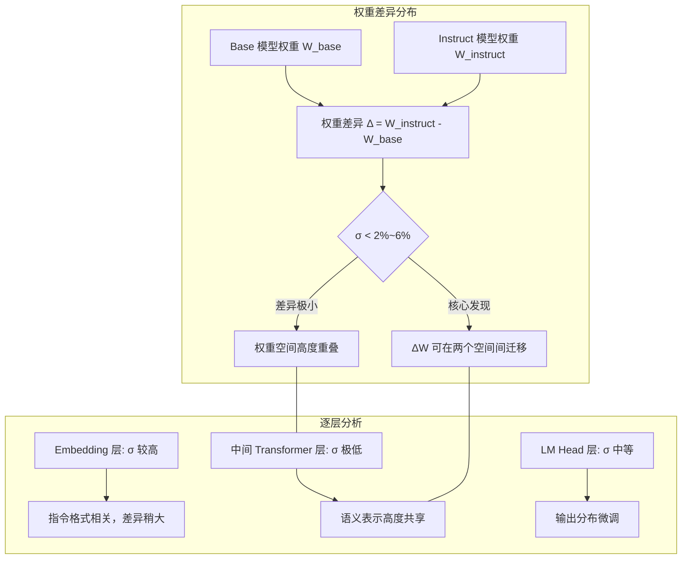
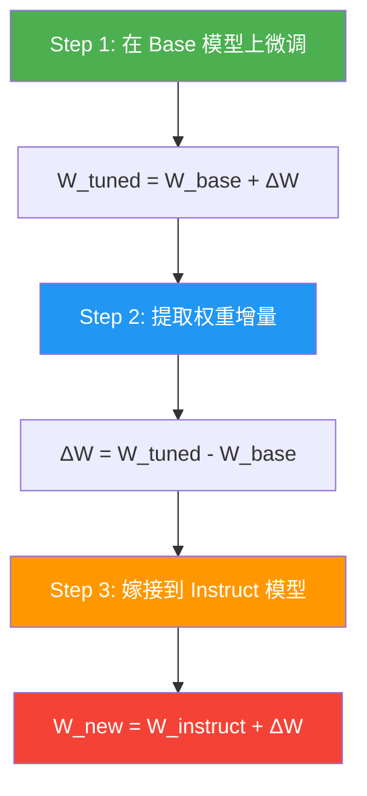
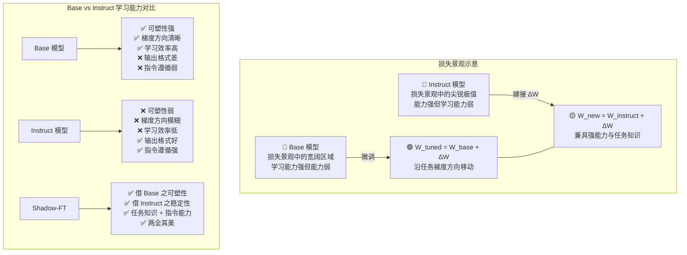
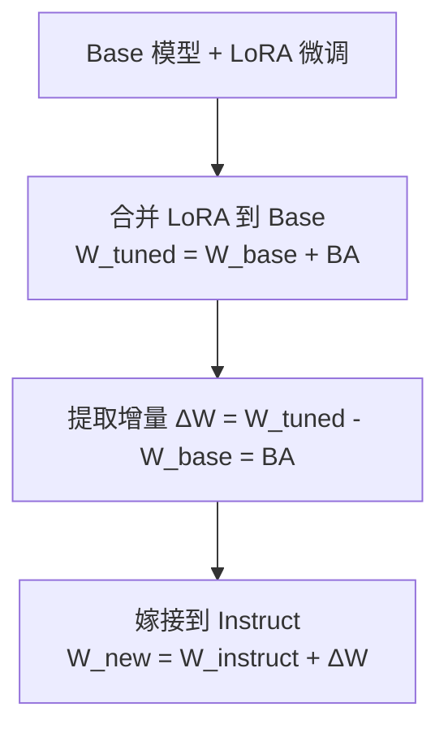
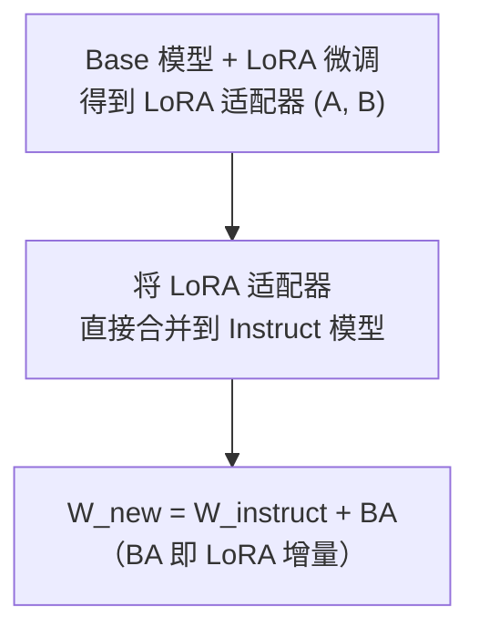

# Shadow-FT 理论基础深度分析

> **论文**: *Shadow-FT: Tuning Instruct Model via Training on Paired Base Model* (arXiv: 2505.12716)
> **作者**: Taiqiang Wu*, Runming Yang*, Jiayi Li, Pengfei Hu, Yik-Chung Wu, Ngai Wong, Yujiu Yang
> **核心思想**: 在 Base 模型上微调，将权重增量嫁接到 Instruct 模型上，实现"借基习之，以强干之"

---

## 第一部分：分——问题背景、核心观察与方法设计

### 1.1 问题背景：为什么直接微调 Instruct 模型效果不佳？

#### 1.1.1 Instruct 模型的微调困境

当前大语言模型（LLM）的典型训练流程为：预训练（Pre-training）→ 指令微调（Instruction Tuning）→ 对齐（Alignment）。Instruct 模型已经经历了指令微调阶段，具备了良好的指令遵循能力和对话格式理解能力。然而，当我们在下游任务上继续微调这些 Instruct 模型时，往往会遭遇以下困境：

**过拟合风险加剧**。Instruct 模型的权重已经针对指令跟随进行了精细调整，继续微调容易在少量下游数据上产生过拟合。模型倾向于记忆训练样本而非学习可泛化的任务知识，导致在分布外（OOD）数据上表现退化。

**微调方向与已有能力冲突**。Instruct 模型在指令微调阶段习得的知识表示与下游任务所需的调整方向可能存在冲突。这种冲突在损失景观（Loss Landscape）上表现为：Instruct 模型所处的局部最优解附近，下游任务的梯度方向可能指向一个与指令能力相矛盾的区域，导致"学了新的、忘了旧的"——即灾难性遗忘（Catastrophic Forgetting）。

**实验证据：边际改善甚至退化**。大量实验表明，直接在 Instruct 模型上进行全参数微调或参数高效微调（如 LoRA），在下游任务上的提升往往非常有限，甚至在某些基准测试上出现性能退化。例如，在 Llama-3.1-8B-Instruct 上进行 SFT 微调后，部分推理和编码基准的分数反而低于微调前的 Instruct 模型。这一现象在 Qwen、Gemma 等系列模型中同样普遍存在。

#### 1.1.2 困境的根源分析

从优化视角来看，Instruct 模型微调困境的根源可以归结为以下几点：

1. **学习能力的"饱和"**：Instruct 模型经过指令微调后，其参数空间已被高度约束，剩余的"可学习自由度"有限。继续微调时，梯度更新难以找到既保留指令能力又习得新任务知识的方向。

2. **数据量与模型能力的错配**：下游任务数据量通常远小于指令微调数据量（如 Shadow-FT 仅使用 2000 条样本），少量数据难以在已高度优化的 Instruct 参数空间中找到有效的更新方向。

3. **Base 与 Instruct 的能力互补性被忽视**：Base 模型虽然缺乏指令跟随能力，但保留了更丰富的"可塑性"（Plasticity），在下游任务上具有更强的学习能力。而 Instruct 模型虽然学习能力受限，却拥有更强的"稳定性"（Stability）和通用能力。传统微调方法未能利用这种互补性。

---

### 1.2 核心观察：Base 与 Instruct 模型的权重相似性

#### 1.2.1 权重差异度量：σ 指标

Shadow-FT 的理论基石在于一个关键观察：**Base 模型与其对应的 Instruct 模型在权重空间中极为接近**。为了量化这种接近程度，论文定义了相对差距比（Relative Gap Ratio）σ：

$$\sigma(W_{\text{base}}, W_{\text{instruct}}) = \frac{\sum |W_{\text{base}} - W_{\text{instruct}}|}{\sum |W_{\text{base}}| + \sum |W_{\text{instruct}}|}$$

其中，$W_{\text{base}}$ 和 $W_{\text{instruct}}$ 分别表示 Base 模型和 Instruct 模型的权重张量，求和遍历模型的所有参数。σ 值越低，表示两个模型的权重越相似。

该指标的直观含义是：两个权重矩阵之间的绝对差异占两者绝对值之和的比例。当 σ = 0 时，两个模型完全相同；当 σ 趋近于 1 时，两者几乎无关。

#### 1.2.2 实证数据

对主流开源模型对的 σ 分析揭示了惊人的相似性：

| Base 模型 | Instruct 模型 | σ |
|---|---|---|
| Llama-3.1-8B | Llama-3.1-8B-Instruct | < 2% |
| Qwen3-4B-Base | Qwen3-4B-Instruct-2507 | 5.62% |
| Qwen3-4B-Base | Qwen3-4B-Base-Ins | 5.58% |
| Qwen3-4B-Base-Ins | Qwen3-4B-Instruct-2507 | 0.57% |

从上表可以得出以下关键发现：

- **Llama 系列的 σ 低于 2%**，意味着 Base 和 Instruct 之间超过 98% 的权重质量是共享的。
- **Qwen3 系列的 σ 约为 5.6%**，虽然高于 Llama，但仍然表明两个模型的权重空间高度重叠。
- **中间态模型**（如 Qwen3-4B-Base-Ins，即 Base 经过轻量指令微调的版本）与最终 Instruct 版本之间的 σ 仅为 0.57%，进一步证实了指令微调引入的权重变化是渐进且微小的。

#### 1.2.3 权重差异分布图

下图展示了 Base 与 Instruct 模型在各层权重差异的分布特征：



#### 1.2.4 核心推论

σ 的极低值直接蕴含了一个重要推论：**在 Base 模型上学习到的权重增量 ΔW，可以自然地迁移到 Instruct 模型的权重空间中**。这是因为：

1. 两个权重空间几乎重合，ΔW 在 Base 空间中的方向和幅度在 Instruct 空间中同样有效。
2. 指令微调引入的权重变化（W_instruct - W_base）主要编码了"如何遵循指令格式"的知识，而非"如何理解世界"的知识。后者是两个模型共享的。
3. 因此，在 Base 上学习到的任务特定知识（ΔW）与 Instruct 上的指令格式知识是正交的、可叠加的。

---

### 1.3 Shadow-FT 方法设计

#### 1.3.1 方法流程

Shadow-FT 的核心流程可以用三步概括：



**Step 1：在 Base 模型上微调**。使用下游任务数据对 Base 模型进行标准的监督微调（SFT），得到微调后的模型权重 $W_{\text{tuned}}$。这一步利用了 Base 模型更强的可塑性和学习能力。

**Step 2：提取权重增量**。计算微调前后 Base 模型的权重差：

$$\Delta W = W_{\text{tuned}} - W_{\text{base}}$$

ΔW 编码了从下游任务数据中学习到的任务特定知识，而不包含指令格式相关的知识。

**Step 3：嫁接到 Instruct 模型**。将 ΔW 直接加到 Instruct 模型的权重上：

$$W_{\text{new}} = W_{\text{instruct}} + \Delta W$$

最终得到的 $W_{\text{new}}$ 同时具备 Instruct 模型的指令跟随能力和从 Base 模型学到的任务特定知识。

#### 1.3.2 关键洞察

Shadow-FT 的核心洞察可以凝练为一句话：**ΔW 捕获的是任务特定知识，而非指令格式知识**。

这一洞察的合理性建立在以下逻辑链上：

1. Base 模型在微调过程中，只能从数据中学习任务相关的模式（因为 Base 模型本身不具备指令格式知识，微调数据中的指令格式部分对 Base 模型而言只是另一种文本模式）。
2. 因此，ΔW 中编码的信息主要是任务特定的语义知识，而非"如何以对话格式回答问题"的能力。
3. Instruct 模型已经具备指令格式能力，叠加 ΔW 后不会干扰这种能力，反而增强了任务相关的语义理解。

#### 1.3.3 代码实现解析

在项目代码中，Shadow-FT 的核心实现位于 `src/shadow/apply_diff.py`，其关键逻辑如下：

```python
# 加载三个模型的权重
a_weights = load_weights(tuned_model)    # 微调后的 Base 模型
b_weights = load_weights(target_model)   # Instruct 模型
c_weights = load_weights(base_model)     # 原始 Base 模型

# 仅对线性层计算增量
delta_weights = {k: a_weights[k] - c_weights[k]
                 for k in a_weights if k in c_weights and is_linear_param(k)}

# 嫁接：Instruct 权重 + 增量
new_weights = {k: (b_weights[k] + delta_weights[k]) if k in delta_weights else v
               for k, v in b_weights.items()}
```

值得注意的是，代码中 `is_linear_param()` 函数仅对线性投影层（q_proj、k_proj、v_proj、o_proj、up_proj、gate_proj、down_proj）计算增量，而非线性层（如 LayerNorm、Embedding）则直接保留 Instruct 模型的原始权重。这一设计选择基于以下考量：线性层是 Transformer 中承载语义变换的核心组件，而非线性层更多负责归一化和位置编码等功能性操作，直接迁移可能引入不必要的干扰。

---

## 第二部分：总——Shadow-FT 的理论贡献总结

Shadow-FT 的理论贡献可以从以下三个维度进行概括：

### 2.1 认知层面：重新理解 Base 与 Instruct 的关系

Shadow-FT 揭示了一个被长期忽视的事实：**Base 模型和 Instruct 模型并非两个独立的模型，而是同一权重空间中极为接近的两个点**。这一认知打破了"Instruct 模型是全新的、更强大的模型"的直觉，转而将其理解为"Base 模型 + 少量指令格式知识"的组合。这种理解直接启发了 Shadow-FT 的方法设计：既然两者如此接近，那么在一个点上学习到的知识自然可以迁移到另一个点上。

### 2.2 方法层面：提出"学习-嫁接"范式

Shadow-FT 提出了一种全新的微调范式——**"学习-嫁接"（Learn-and-Graft）**。传统微调范式是"直接学习"（在目标模型上直接训练），而 Shadow-FT 将学习过程和部署目标解耦：

- **学习阶段**：在更适合学习的 Base 模型上进行
- **部署阶段**：将学习成果嫁接到更适合部署的 Instruct 模型上

这种范式不仅适用于 SFT，还可以自然扩展到 LoRA、DPO 等多种微调方式，具有广泛的方法论意义。

### 2.3 实践层面：简单、有效、通用

Shadow-FT 的实践价值体现在三个关键词上：

- **简单**：仅需三步操作（微调 Base → 提取 ΔW → 嫁接 Instruct），无需修改训练算法或模型架构
- **有效**：在 19 个基准测试上持续优于直接微调 Instruct 模型
- **通用**：适用于全参数微调、LoRA、DPO 等多种设置，且可扩展至多模态 LLM

---

## 第三部分：分——数学原理深入与实验验证

### 3.1 数学原理：为什么 ΔW 可以迁移？

#### 3.1.1 权重空间的线性可加性假设

Shadow-FT 的理论基础可以形式化为以下假设：

**假设（权重增量可迁移性）**：设 $W_{\text{base}}$ 为 Base 模型权重，$W_{\text{instruct}} = W_{\text{base}} + \Delta W_{\text{align}}$ 为 Instruct 模型权重，$\Delta W_{\text{task}}$ 为在 Base 上学习到的任务增量。则：

$$W_{\text{new}} = W_{\text{instruct}} + \Delta W_{\text{task}} = W_{\text{base}} + \Delta W_{\text{align}} + \Delta W_{\text{task}}$$

在满足以下条件时，$W_{\text{new}}$ 的性能优于 $W_{\text{instruct}} + \Delta W'_{\text{task}}$（其中 $\Delta W'_{\text{task}}$ 是直接在 Instruct 上学习到的增量）：

1. **$\sigma(W_{\text{base}}, W_{\text{instruct}})$ 足够小**：确保两个权重空间足够接近，使得 ΔW 的方向和幅度在两个空间中具有相似的语义。
2. **$\Delta W_{\text{align}}$ 与 $\Delta W_{\text{task}}$ 近似正交**：指令对齐知识（$\Delta W_{\text{align}}$）与任务特定知识（$\Delta W_{\text{task}}$）在参数空间中占据不同的方向，叠加时不会互相干扰。

#### 3.1.2 从损失景观理解



从损失景观的角度可以更直观地理解 Shadow-FT：

**Base 模型是"好学者但弱骨干"**。Base 模型位于损失景观中相对平坦的区域，梯度方向清晰，学习效率高。但由于缺乏指令微调，其输出质量差，难以直接用于对话场景。这就像一个知识渊博但不善表达的学者——理解深刻但表达欠佳。

**Instruct 模型是"强骨干但差学者"**。Instruct 模型位于损失景观中更尖锐的极值点附近，输出质量高、指令遵循好，但周围的梯度空间已被高度约束，继续学习的空间有限。这就像一个善于表达但思维定式的演说家——表达出色但难以吸收新知。

**Shadow-FT 的精髓：借 Base 之可塑性，补 Instruct 之稳定性**。通过在 Base 模型上学习（利用其可塑性），然后将学习成果嫁接到 Instruct 模型上（利用其稳定性），Shadow-FT 实现了"好学者"与"强骨干"的完美结合。

#### 3.1.3 ΔW 迁移性的数学分析

设 Base 模型在某参数 $\theta$ 处的损失函数为 $\mathcal{L}_{\text{base}}(\theta)$，微调后的参数为 $\theta_{\text{tuned}} = \theta_{\text{base}} + \Delta\theta$。在 Instruct 模型处，损失函数为 $\mathcal{L}_{\text{instruct}}(\theta)$，其中 $\theta_{\text{instruct}} = \theta_{\text{base}} + \Delta\theta_{\text{align}}$。

Shadow-FT 的嫁接操作等价于在 Instruct 的参数点处沿 $\Delta\theta$ 方向移动。这一操作有效的条件是：

$$\nabla \mathcal{L}_{\text{instruct}}(\theta_{\text{instruct}}) \cdot \Delta\theta < 0$$

即 Δθ 方向在 Instruct 的损失景观中仍然是下降方向。由于 $\sigma$ 极小，两个损失景观在局部结构上高度相似，因此 Base 上找到的下降方向在 Instruct 上大概率仍然是下降方向。这正是 Shadow-FT 有效的数学基础。

更严格地，考虑泰勒展开：

$$\mathcal{L}_{\text{instruct}}(\theta_{\text{instruct}} + \Delta\theta) \approx \mathcal{L}_{\text{instruct}}(\theta_{\text{instruct}}) + \nabla \mathcal{L}_{\text{instruct}} \cdot \Delta\theta + \frac{1}{2} \Delta\theta^T H_{\text{instruct}} \Delta\theta$$

其中 $H_{\text{instruct}}$ 是 Instruct 损失函数的 Hessian 矩阵。当 $\sigma$ 足够小时，$H_{\text{instruct}} \approx H_{\text{base}}$，因此：

$$\Delta\theta^T H_{\text{instruct}} \Delta\theta \approx \Delta\theta^T H_{\text{base}} \Delta\theta$$

这意味着在 Base 上通过优化得到的 Δθ，其在 Instruct 损失景观中的曲率特性与在 Base 损失景观中相似，从而保证了迁移的有效性。

---

### 3.2 LoRA 版本的 Shadow-FT

#### 3.2.1 方法变体

Shadow-FT 可以自然地与 LoRA（Low-Rank Adaptation）结合，形成更参数高效的版本。具体有两种实现路径：

**路径一：微调 Base → 合并到 Base → 嫁接到 Instruct**



这条路径先在 Base 模型上使用 LoRA 进行微调，然后将 LoRA 权重合并回 Base 模型，得到完整的 W_tuned，再按照标准 Shadow-FT 流程提取 ΔW 并嫁接。

**路径二：直接将 LoRA 适配器合并到 Instruct 模型**



这条路径更为简洁：由于 LoRA 的增量 $\Delta W = BA$（其中 B 和 A 是 LoRA 的两个低秩矩阵），直接将这个增量加到 Instruct 模型上即可，无需先合并到 Base 再提取。

#### 3.2.2 代码实现

在项目中，LoRA 版 Shadow-FT 的实现位于 `src/shadow/merge_lora.py`，其核心逻辑是调用 LLaMA-Factory 的导出功能，将 LoRA 适配器合并到目标模型：

```python
merge_config = {
    "model_name_or_path": args.target_base,   # Instruct 模型路径
    "adapter_name_or_path": args.adapter_path, # 在 Base 上训练的 LoRA 路径
    "template": args.template,
    "finetuning_type": "lora",
    "export_dir": str(merged_dir),
}
# 调用 llamafactory-cli export 完成合并
subprocess.run(["llamafactory-cli", "export", str(config_file)], check=True)
```

在 `run.sh` 中，LoRA 版 Shadow-FT 的训练和合并流程被自动化：

```bash
# 训练 Base 模型（使用 LoRA）
llamafactory-cli train \
  --model_name_or_path "${BASE_MODEL}" \
  --finetuning_type lora --lora_rank 8 \
  --dataset "Shadow_2k" \
  --output_dir "${OUTPUT_ROOT}/base_lora"

# 将 LoRA 合并到 Instruct 模型
python3 src/shadow/merge_lora.py \
  --adapter_path "${OUTPUT_ROOT}/base_lora" \
  --target_base "${INSTRUCT_MODEL}" \
  --merge_tag "B2I"
```

#### 3.2.3 LoRA 版本的优势

- **参数效率**：仅训练极少量参数（如 rank=8 的 LoRA 仅增加约 0.1% 参数量），大幅降低显存需求
- **灵活性**：可以为不同任务训练不同的 LoRA 适配器，按需嫁接
- **可扩展性**：支持 QLoRA 等量化变体，进一步降低训练成本

---

### 3.3 与 DPO 的结合

#### 3.3.1 两阶段对齐流程

Shadow-FT 可以与直接偏好优化（Direct Preference Optimization, DPO）结合，形成完整的两阶段对齐流程：


**第一阶段：Shadow-FT（SFT 阶段）**。在 Base 模型上进行 SFT 微调，提取 ΔW 并嫁接到 Instruct 模型，得到具备任务特定知识的 SFT 模型。

**第二阶段：DPO 对齐**。在 Shadow-FT 得到的 SFT 模型基础上，使用偏好数据进行 DPO 训练，进一步对齐模型输出与人类偏好。

#### 3.3.2 为什么 Shadow-FT + DPO 优于直接 Instruct + DPO？

直接在 Instruct 模型上进行 SFT + DPO 面临与纯 SFT 相同的问题：SFT 阶段的学习效率低下，导致 DPO 的起点模型质量不佳。而 Shadow-FT 在 SFT 阶段提供了更高质量的起点模型，使 DPO 能够在一个更好的初始化点上工作，从而获得更优的最终性能。

---

### 3.4 实验验证

#### 3.4.1 实验设置

Shadow-FT 在以下设置下进行了全面验证：

- **基准测试**：19 个基准，涵盖编码（HumanEval、MBPP 等）、推理（GSM8K、MATH 等）、通用理解（MMLU、C-Eval 等）
- **模型系列**：Qwen3 系列（0.6B/1.7B/4B/8B/14B/30B-A3B）、Llama-3 系列、Gemma 系列、Falcon 系列、Yi 系列等
- **训练数据**：仅使用 2000 条来自 BAAI Infinity-Instruct 的样本
- **对比方法**：全参数微调 Instruct（I-SFT）、LoRA 微调 Instruct（I-LoRA）、全参数微调 Base（B-SFT）、LoRA 微调 Base（B-LoRA）

#### 3.4.2 核心实验结果

**Shadow-FT 持续优于直接微调 Instruct**。在所有测试的模型和基准上，Shadow-FT（即 B2I：Base 微调后嫁接到 Instruct）一致地超越了直接在 Instruct 上微调的方法（I-SFT 和 I-LoRA），且优势显著。

关键对比数据趋势：

| 方法 | 编码基准 | 推理基准 | 数学基准 | 平均 |
|---|---|---|---|---|
| Instruct（未微调） | 基线 | 基线 | 基线 | 基线 |
| I-SFT（直接微调 Instruct） | ≈基线或退化 | ≈基线或退化 | ≈基线或退化 | 边际改善 |
| I-LoRA（LoRA 微调 Instruct） | ≈基线或退化 | ≈基线或退化 | ≈基线或退化 | 边际改善 |
| **Shadow-FT（B2I）** | **显著提升** | **显著提升** | **显著提升** | **全面领先** |

**Base 微调本身不如 Instruct，但嫁接后超越 Instruct 微调**。这一看似矛盾的结果恰恰印证了 Shadow-FT 的核心洞察：Base 模型是更好的"学习者"（学习效率高），Instruct 模型是更好的"骨干"（输出质量高）。Shadow-FT 将两者的优势结合，实现了 1+1 > 2 的效果。

#### 3.4.3 模型对覆盖范围

项目中的 `examples/model_pair.json` 列出了所有支持的 Base-Instruct 模型对，覆盖了 30+ 个模型对，包括：

- **Qwen 系列**：Qwen2.5-7B/14B/32B、Qwen3-0.6B/1.7B/4B/8B/14B/30B-A3B
- **Llama 系列**：Llama-3.1-8B
- **Gemma 系列**：gemma-2-2b/9b、gemma-3-1b/4b/12b/27b
- **Falcon 系列**：Falcon-1b/3b/7b/10b
- **其他**：Mistral-7B、Yi-6B/9B-Coder、Baichuan2-7B、InternLM2 系列、GLM-4-32B

#### 3.4.4 扩展至多模态 LLM

Shadow-FT 的方法不仅限于文本 LLM，还可以扩展至多模态大语言模型（MLLM）。对于视觉-语言模型（如 Qwen2.5-VL），Shadow-FT 同样适用：在 Base 视觉-语言模型上微调，将 ΔW 嫁接到 Instruct 视觉-语言模型上。项目代码中的 `qwen2_5vl_lora_sft.yaml` 配置文件即提供了多模态 Shadow-FT 的示例配置。

#### 3.4.5 权重相似性验证

项目提供的 `src/shadow/weight_similarity.py` 脚本可以复现论文中的 σ 分析。该脚本采用逐层加载策略，通过解析 `model.safetensors.index.json` 文件确定每个 Transformer 层的权重键名，然后逐层加载 Base 和 Instruct 模型的权重并计算 σ，从而在内存受限的情况下也能分析 70B+ 规模的模型。

核心计算逻辑：

```python
def calculate_sigma(w_A, w_B):
    diff = np.abs(w_A - w_B).sum()
    total = np.abs(w_A).sum() + np.abs(w_B).sum()
    return diff / total
```

使用方式：

```bash
python3 src/shadow/weight_similarity.py \
    --B ./Qwen3-4B-Base \
    --I ./Qwen3-4B-Instruct-2507
# 预期输出: Average sigma ≈ 0.0562
```

---

### 3.5 深层思考与局限

#### 3.5.1 为什么仅对线性层计算增量？

在 `apply_diff.py` 中，`is_linear_param()` 函数仅筛选了 q_proj、k_proj、v_proj、o_proj、up_proj、gate_proj、down_proj 等线性投影层。这一设计选择的理论依据是：

- 线性层承载了 Transformer 中的主要语义变换，是任务知识的主要载体
- 非线性层（如 LayerNorm）更多承担归一化功能，其参数变化对任务性能的影响较小，但可能引入不稳定性
- Embedding 层的变化可能涉及词表扩展等结构性差异，直接迁移可能引入错误

#### 3.5.2 Shadow-FT 的适用边界

Shadow-FT 的有效性依赖于 Base 和 Instruct 模型之间的权重相似性。当 σ 较大时（例如 Base 和 Instruct 之间经历了大规模的继续预训练或架构变化），ΔW 的迁移性可能下降。此外，当微调数据量极大时，直接在 Instruct 上微调可能也能找到有效的更新方向，Shadow-FT 的优势可能缩小。

#### 3.5.3 与相关工作的关系

Shadow-FT 的"增量迁移"思想与以下工作存在关联但又有本质区别：

- **Task Vectors**（Ilharco et al., 2022）：同样提取 ΔW 并进行算术运算，但关注的是任务间的向量算术，而非 Base-Instruct 间的迁移
- **Model Merging**：关注多个微调模型的权重合并，而 Shadow-FT 关注的是 Base 和 Instruct 之间的定向迁移
- **知识蒸馏**：通过教师-学生框架传递知识，而 Shadow-FT 直接在权重空间操作，无需额外的训练开销

---

## 结语

Shadow-FT 通过一个简洁而深刻的观察——Base 与 Instruct 模型权重高度相似（σ < 2%~6%）——建立了一套完整的"学习-嫁接"微调范式。其理论核心在于：Base 模型是更好的学习者，Instruct 模型是更好的骨干，将 Base 上学习到的任务增量 ΔW 嫁接到 Instruct 上，可以同时获得任务特定知识和指令跟随能力。这一方法不仅简单有效，还具有广泛的适用性，从全参数微调到 LoRA、从 SFT 到 DPO、从文本 LLM 到多模态 LLM，均展现出一致的优势。

Shadow-FT 的启示远超其技术本身：它提醒我们，在追求更复杂的微调方法之前，应当先深入理解模型权重空间的几何结构。有时，最简单的操作——将一个模型上学习到的增量加到另一个模型上——恰恰是最有效的解决方案。
