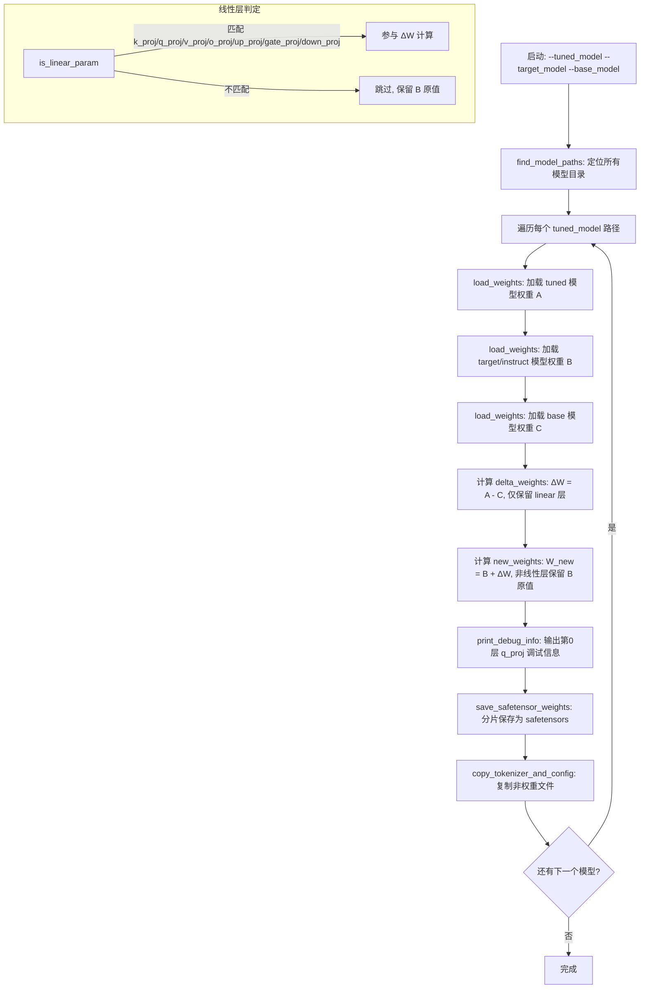
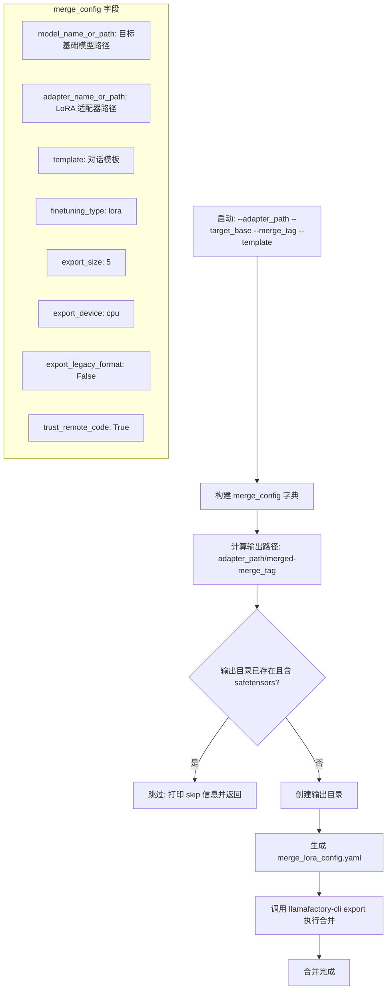

# Shadow-FT 代码实现深度解析

> 本文档基于 Shadow-FT（arXiv: 2505.12716）项目的三个核心脚本，采用"分-总-分"结构进行逐层剖析：首先深入各脚本实现细节，其次总结整体架构与设计模式，最后对关键函数进行逐行解读。

---

## 第一部分：三大核心脚本深度剖析

### 1. weight_similarity.py —— 权重相似度计算

**源文件**：[`/workspace/src/shadow/weight_similarity.py`](file:///workspace/src/shadow/weight_similarity.py)

该脚本实现了 Shadow-FT 论文 2.3 节中定义的相对差距比 σ（sigma），用于量化 Base 模型与 Instruct 模型之间的权重差异程度。其核心思想是：σ 越小，说明两个模型的权重越接近，则 ΔW 嫁接的效果越可预测。

#### 1.1 整体流程图

```mermaid
flowchart TD
    A[启动: 命令行传入 --B 和 --I] --> B[解析 Base 模型的 model.safetensors.index.json]
    B --> C[提取 layer_to_keys 映射: 按层号分组权重键]
    C --> D[遍历每一层 layer_idx = 0..N-1]
    D --> E[load_selected_weights_optimized: 从 Base 加载该层权重]
    E --> F[load_selected_weights_optimized: 从 Instruct 加载该层权重]
    F --> G[对每个 key 计算 sigma = Σ|w_A - w_B| / Σ|w_A| + Σ|w_B|]
    G --> H[收集当前层所有 sigma 值]
    H --> I{还有下一层?}
    I -->|是| D
    I -->|否| J[计算并输出所有张量的平均 sigma]
    E -.->|BF16→FP32 上转| G
    F -.->|BF16→FP32 上转| G
    H -.->|释放 A_weights, B_weights| I
```

#### 1.2 核心函数解析

##### `parse_safetensors_index(json_path)`

该函数解析 `model.safetensors.index.json` 文件，将权重键按 Transformer 层号进行分组，返回总层数与层号→键列表的映射。

```python
def parse_safetensors_index(json_path):
    with open(json_path, "r") as f:
        index_data = json.load(f)

    weight_map = index_data["weight_map"]
    layer_pattern = re.compile(r"model\.layers\.(\d+)\.")
    layers = set()
    layer_to_keys = {}

    for key in weight_map.keys():
        match = layer_pattern.search(key)
        if match:
            layer_idx = int(match.group(1))
            layers.add(layer_idx)
            if layer_idx not in layer_to_keys:
                layer_to_keys[layer_idx] = []
            layer_to_keys[layer_idx].append(key)

    total_layers = max(layers) + 1 if layers else 0
    return {
        "total_layers": total_layers,
        "layer_to_keys": layer_to_keys,
    }
```

**关键设计点**：
- 使用正则 `model\.layers\.(\d+)\.` 提取层号，兼容 LLaMA/Qwen 等主流模型命名规范
- `weight_map` 的值（分片文件名）在此处被忽略——因为后续加载时通过遍历所有 `.safetensors` 文件来查找键，而非依赖索引中的文件映射
- 返回 `total_layers = max(layers) + 1`，确保层号从 0 开始连续编号

##### `load_selected_weights_optimized(folder_path, selected_keys, device="cpu")`

按需加载权重，仅读取 `selected_keys` 中指定的键，并自动将 BF16 张量上转为 FP32。

```python
def load_selected_weights_optimized(folder_path, selected_keys, device="cpu"):
    weights = {}
    files = [f for f in os.listdir(folder_path) if f.endswith(".safetensors")]
    requested_keys = set(selected_keys)
    found_keys = set()

    for filename in files:
        full_path = os.path.join(folder_path, filename)
        try:
            with safe_open(full_path, framework="pt", device=device) as f:
                file_keys = set(f.keys())
                intersect = requested_keys & file_keys
                for key in intersect:
                    tensor = f.get_tensor(key)
                    if tensor.dtype == torch.bfloat16:
                        tensor = tensor.float()
                    weights[key] = tensor.cpu().numpy()
                    found_keys.add(key)
        except Exception as e:
            print(f"[Error] Failed to read {full_path}: {e}")

    not_found = requested_keys - found_keys
    if not_found:
        for key in sorted(not_found):
            print(f"    [missing] {key}")

    return weights
```

**关键设计点**：
- **按需加载**：通过集合交集 `requested_keys & file_keys` 确定每个分片中需要读取的键，避免全量加载
- **BF16→FP32 上转**：`tensor.float()` 将 bfloat16 精度提升为 float32，确保后续减法运算不会因 BF16 的低精度（仅 7 位尾数）而丢失有效差值信息
- **转为 NumPy**：最终以 `numpy.ndarray` 形式返回，与 `calculate_sigma` 中的 NumPy 运算无缝衔接
- **缺失键报告**：遍历结束后检查 `not_found`，对未找到的键逐一打印警告

##### `calculate_sigma(w_A, w_B)` 与 `calculate_sparsity_ratio(w_A, w_B, threshold=1e-5)`

```python
def calculate_sigma(w_A, w_B):
    diff = np.abs(w_A - w_B).sum()
    total = np.abs(w_A).sum() + np.abs(w_B).sum()
    return diff / total

def calculate_sparsity_ratio(w_A, w_B, threshold=1e-5):
    return np.mean(np.abs(w_A - w_B) < threshold)
```

- **σ 公式**：`σ = Σ|W_A - W_B| / (Σ|W_A| + Σ|W_B|)`，这是论文中的核心度量。σ ∈ [0, 1]，值越小表示两模型权重越相似
- **稀疏率**：计算差值绝对值小于阈值（默认 1e-5）的元素占比，衡量"几乎无变化"的参数比例。该函数在当前 `main` 流程中未被调用，但作为辅助度量保留

##### `main(base_model, instruct_model)`

```python
def main(base_model, instruct_model):
    folder_A = base_model
    folder_B = instruct_model
    index_json_name = "model.safetensors.index.json"

    json_path_A = os.path.join(folder_A, index_json_name)
    json_info = parse_safetensors_index(json_path_A)
    num_layers = json_info["total_layers"]
    layer_to_keys = json_info["layer_to_keys"]

    all_sigmas = []

    print(f"Total layers: {num_layers}")

    for layer_idx in range(num_layers):
        print(f"Processing Layer {layer_idx} ...")

        keys_in_layer = layer_to_keys.get(layer_idx, [])
        if not keys_in_layer:
            continue

        A_weights = load_selected_weights_optimized(folder_A, keys_in_layer.copy(), device="cpu")
        B_weights = load_selected_weights_optimized(folder_B, keys_in_layer.copy(), device="cpu")

        sigmas = []
        for key in keys_in_layer:
            if key in A_weights and key in B_weights:
                sigma = calculate_sigma(A_weights[key], B_weights[key])
                sigmas.append(sigma)
                print(f"key: {key}, sigma: {sigma}")

        all_sigmas.extend(sigmas)

        del A_weights, B_weights
        torch.cuda.empty_cache()

    print("Average sigma across all tensors:\n", np.mean(all_sigmas))
```

**逐层处理策略**：
1. 仅从 Base 模型目录解析索引（假设 Base 和 Instruct 共享相同的权重键结构）
2. 每处理完一层，立即 `del` 释放权重字典，并调用 `torch.cuda.empty_cache()` 清理 GPU 缓存
3. 最终输出所有张量的平均 σ 值，作为模型间差异的全局度量

**使用方式**：
```bash
python3 src/shadow/weight_similarity.py --B <base_model_dir> --I <instruct_model_dir>
# 示例：
# python3 src/shadow/weight_similarity.py --B Qwen3-8B-Base/ --I Qwen3-8B/
```

---

### 2. apply_diff.py —— Delta 嫁接核心

**源文件**：[`/workspace/src/shadow/apply_diff.py`](file:///workspace/src/shadow/apply_diff.py)

该脚本是 Shadow-FT 方法的核心实现，执行"Delta 嫁接"操作：从 SFT 微调模型中提取 ΔW = W_tuned - W_base，再将其叠加到 Instruct 模型上，得到 W_new = W_instruct + ΔW。

#### 2.1 整体流程图



#### 2.2 核心函数解析

##### `is_linear_param(name)`

```python
def is_linear_param(name):
    """Return True if the parameter belongs to a linear/projection layer."""
    patterns = [
        r"k_proj", r"q_proj", r"v_proj",
        r"o_proj", r"up_proj", r"gate_proj", r"down_proj"
    ]
    return any(re.search(pattern, name.lower()) for pattern in patterns)
```

**设计意图**：Shadow-FT 的核心假设是——微调产生的有效知识变更集中在线性投影层（注意力机制中的 Q/K/V/O 投影和 MLP 中的 up/gate/down 投影），而 LayerNorm、embedding 等非线性层的变更不应被嫁接。该函数通过正则匹配实现这一过滤逻辑。

**匹配的七种投影层**：
| 投影层 | 所属模块 | 作用 |
|--------|---------|------|
| `q_proj` | Self-Attention | 查询投影 |
| `k_proj` | Self-Attention | 键投影 |
| `v_proj` | Self-Attention | 值投影 |
| `o_proj` | Self-Attention | 输出投影 |
| `gate_proj` | MLP | 门控投影 |
| `up_proj` | MLP | 上投影 |
| `down_proj` | MLP | 下投影 |

##### `load_weights(model_path)`

```python
def load_weights(model_path):
    weights = {}

    safetensor_files = [
        os.path.join(model_path, f)
        for f in os.listdir(model_path)
        if f.endswith(".safetensors") and not f.endswith(".safetensors.index.json")
    ]

    pytorch_bin = os.path.join(model_path, "pytorch_model.bin")
    index_json = os.path.join(model_path, "pytorch_model.bin.index.json")

    if safetensor_files:
        for model_file_path in safetensor_files:
            with safe_open(model_file_path, framework="pt", device="cpu") as f:
                for k in f.keys():
                    weights[k] = f.get_tensor(k)
    elif os.path.exists(pytorch_bin):
        state_dict = torch.load(pytorch_bin, map_location="cpu")
        weights = state_dict
    elif os.path.exists(index_json):
        shard_files = sorted(
            os.path.join(model_path, f)
            for f in os.listdir(model_path)
            if re.match(r"pytorch_model-\d{5}-of-\d{5}\.bin", f)
        )
        for shard_path in shard_files:
            shard_dict = torch.load(shard_path, map_location="cpu")
            weights.update(shard_dict)
    else:
        raise FileNotFoundError(
            f"No .safetensors or pytorch_model.bin found in {model_path}")

    return weights
```

**三级兼容策略**：
1. **safetensors 分片**（优先）：遍历目录下所有 `.safetensors` 文件，逐个读取键值对
2. **单文件 pytorch_model.bin**：直接 `torch.load` 加载整个 state_dict
3. **分片 pytorch_model-NNNNN-of-MMMMM.bin**：按文件名排序后逐片加载并合并

注意：与 `weight_similarity.py` 不同，此处的 `load_weights` **全量加载**所有权重到内存中，不做按需加载。这是因为嫁接操作需要同时持有三个模型的完整权重进行逐键计算。

##### `save_safetensor_weights(model_path, weights, max_shard_size="5GB")`

```python
def save_safetensor_weights(model_path, weights, max_shard_size="5GB"):
    os.makedirs(model_path, exist_ok=True)

    save_torch_state_dict(
        state_dict=weights,
        save_directory=model_path,
        max_shard_size=max_shard_size,
        filename_pattern="model{suffix}.safetensors",
        safe_serialization=True,
    )
```

**关键点**：
- 使用 `huggingface_hub.save_torch_state_dict` 而非手动分片，该函数自动处理：
  - **共享张量**（如 tied embedding ↔ lm_head）：只存储一份，其余通过索引引用
  - **自动分片**：根据 `max_shard_size` 将大模型拆分为多个文件
  - **索引文件**：自动生成 `model.safetensors.index.json`
- `safe_serialization=True` 强制使用 safetensors 格式（而非 pickle），避免安全风险

##### `process_single_model(tuned_model, target_model, base_model)`

```python
def process_single_model(tuned_model, target_model, base_model):
    print(f"\n[+] Processing tuned model: {tuned_model}")

    a_weights = load_weights(tuned_model)
    b_weights = load_weights(target_model)
    c_weights = load_weights(base_model)

    delta_weights = {k: a_weights[k] - c_weights[k]
                     for k in a_weights if k in c_weights and is_linear_param(k)}

    new_weights = {k: (b_weights[k] + delta_weights[k]) if k in delta_weights else v
                   for k, v in b_weights.items()}

    delta_dir = os.path.join(tuned_model, "merged-B2I")
    os.makedirs(delta_dir, exist_ok=True)

    print_debug_info(a_weights, b_weights, c_weights, new_weights)

    print(f"[+] Saving merged weights to {delta_dir} (sharded safetensors…)")
    save_safetensor_weights(delta_dir, new_weights)
    copy_tokenizer_and_config(target_model, delta_dir)
    print(f"[✓] Finished processing {tuned_model} → {delta_dir}")
```

**Delta 嫁接的核心逻辑**（两行代码）：

```python
# 第一步：提取 ΔW（仅线性层）
delta_weights = {k: a_weights[k] - c_weights[k]
                 for k in a_weights if k in c_weights and is_linear_param(k)}

# 第二步：嫁接到 Instruct 模型
new_weights = {k: (b_weights[k] + delta_weights[k]) if k in delta_weights else v
               for k, v in b_weights.items()}
```

**变量映射**（与论文符号对应）：
| 代码变量 | 论文符号 | 含义 |
|---------|---------|------|
| `a_weights` | W_tuned | SFT 微调后的模型权重 |
| `b_weights` | W_instruct | 目标 Instruct 模型权重 |
| `c_weights` | W_base | 原始 Base 模型权重 |
| `delta_weights` | ΔW = W_tuned - W_base | 微调产生的权重差 |
| `new_weights` | W_new = W_instruct + ΔW | 嫁接后的最终权重 |

**输出路径**：嫁接结果保存在 `<tuned_model>/merged-B2I/` 目录下，其中 `B2I` 表示"Base-to-Instruct"嫁接方向。

##### `copy_tokenizer_and_config(src_dir, dst_dir)`

```python
def copy_tokenizer_and_config(src_dir, dst_dir):
    for filename in os.listdir(src_dir):
        if filename.endswith(".safetensors.index.json"):
            continue
        if filename.startswith((
                "config", "tokenizer", "special", "generation")) \
           or filename.endswith(('.md', '.json', '.py')):
            src_file = os.path.join(src_dir, filename)
            dst_file = os.path.join(dst_dir, filename)
            if os.path.isfile(src_file):
                shutil.copy2(src_file, dst_file)
```

**复制策略**：从 Instruct 模型（target_model）目录复制非权重文件到输出目录，包括：
- `config.json`、`generation_config.json`：模型配置
- `tokenizer.json`、`tokenizer_config.json`、`tokenizer.model`：分词器
- `special_tokens_map.json`：特殊 token 映射
- `.md`、`.json`、`.py` 文件：README、元数据等
- **排除** `.safetensors.index.json`：因为新模型的分片结构可能不同

##### `print_debug_info(a_weights, b_weights, c_weights, new_weights)`

```python
def print_debug_info(a_weights, b_weights, c_weights, new_weights):
    q_proj_weight_name = None

    for k in a_weights.keys():
        if re.search(r"layers\.0.*self_attn\.q_proj\.weight", k):
            q_proj_weight_name = k
            break

    if not q_proj_weight_name:
        print("[DEBUG] Could not find q_proj weight name – showing first 10 keys:")
        for i, k in enumerate(list(a_weights.keys())[:10]):
            print(f"  {i}: {k}")
        return

    print("===== DEBUG: first layer self_attn.q_proj =====")
    for tag, w in ("A", a_weights), ("B", b_weights), ("C", c_weights), ("NEW", new_weights):
        tensor = w.get(q_proj_weight_name)
        print(f"{tag} weight shape: {getattr(tensor, 'shape', 'N/A')}")
    if q_proj_weight_name in c_weights:
        delta_weight = a_weights[q_proj_weight_name] - c_weights[q_proj_weight_name]
        print("Delta weight mean (a-c):", delta_weight.mean().item())
        print("Abs delta weight mean (|a-c|):", delta_weight.abs().mean().item())
    print("==============================================")
```

**调试输出**：定位第 0 层的 `q_proj` 权重，打印四个模型（A/B/C/NEW）的权重形状，以及 ΔW 的均值和绝对值均值，用于快速验证嫁接逻辑是否正确。

##### `find_model_paths(parent_dir)`

```python
def find_model_paths(parent_dir):
    files = os.listdir(parent_dir)
    if any(f.endswith(".safetensors") for f in files) or "pytorch_model.bin" in files:
        return [parent_dir]
    model_paths = []
    for root, _, files in os.walk(parent_dir):
        if any(f.endswith(".safetensors") for f in files) or "pytorch_model.bin" in files:
            model_paths.append(root)
    return model_paths
```

**设计意图**：支持两种输入模式——
1. 直接指向一个模型目录（目录下有 safetensors/bin 文件）
2. 指向一个父目录，自动递归查找所有子模型目录（适用于批量处理多个 SFT 输出的场景）

**使用方式**：
```bash
python3 src/shadow/apply_diff.py --tuned_model <sft_output> --target_model <instruct> --base_model <base>
```

---

### 3. merge_lora.py —— LoRA 合并

**源文件**：[`/workspace/src/shadow/merge_lora.py`](file:///workspace/src/shadow/merge_lora.py)

该脚本将 LoRA 适配器合并回基础模型，是 Shadow-FT 流水线的前置步骤：先用 LoRA 对 Base 模型进行 SFT 微调，再通过此脚本将 LoRA 权重融合为完整模型，最后由 `apply_diff.py` 执行嫁接。

#### 3.1 整体流程图



#### 3.2 核心逻辑解析

##### 完整源码

```python
#!/usr/bin/env python3
# merge_lora.py

import argparse
import os
import subprocess
import yaml
from pathlib import Path

def main():
    parser = argparse.ArgumentParser()
    parser.add_argument("--adapter_path", required=True,
                        help="Path to the LoRA finetune output directory (no checkpoint-*).")
    parser.add_argument("--target_base", required=True,
                        help="Path to the base model to which we want to merge.")
    parser.add_argument("--merge_tag", required=True,
                        help="Tag of merged directory, e.g. B2I, I2I, etc.")
    parser.add_argument("--template", default="llama3", help="Template used in training.")
    args = parser.parse_args()

    # base config
    merge_config = {
        "model_name_or_path": args.target_base,
        "adapter_name_or_path": args.adapter_path,
        "template": args.template,
        "finetuning_type": "lora",
        "export_size": 5,
        "export_device": "cpu",
        "export_legacy_format": False,
        "trust_remote_code": True
    }
    adapter_dir = Path(args.adapter_path)
    merged_dir = adapter_dir / f"merged-{args.merge_tag}"

    if merged_dir.exists():
        if any(f.suffix == ".safetensors" for f in merged_dir.iterdir()):
            print(f"[skip] {merged_dir} alreadly has safetensors files and pass.")
            return

    merged_dir.mkdir(parents=True, exist_ok=True)

    merge_config["export_dir"] = str(merged_dir)

    config_file = merged_dir / "merge_lora_config.yaml"
    with open(config_file, "w") as f:
        yaml.dump(merge_config, f)

    # run llamafactory-cli export
    cmd = ["llamafactory-cli", "export", str(config_file)]
    print(f"[merging] adapter={args.adapter_path} => base={args.target_base}, output to {merged_dir}")
    subprocess.run(cmd, check=True)

if __name__ == "__main__":
    main()
```

##### 逐段分析

**参数定义**：

| 参数 | 必填 | 说明 |
|------|------|------|
| `--adapter_path` | 是 | LoRA 微调输出目录（不含 checkpoint-* 子目录） |
| `--target_base` | 是 | 要合并到的目标基础模型路径 |
| `--merge_tag` | 是 | 合并输出目录的标签，如 `B2I`（Base→Instruct）、`I2I`（Instruct→Instruct） |
| `--template` | 否 | 训练时使用的对话模板，默认 `llama3` |

**合并配置字典**：

```python
merge_config = {
    "model_name_or_path": args.target_base,      # 目标基础模型
    "adapter_name_or_path": args.adapter_path,    # LoRA 适配器路径
    "template": args.template,                     # 对话模板
    "finetuning_type": "lora",                     # 固定为 lora
    "export_size": 5,                              # 每个分片的最大 GB 数
    "export_device": "cpu",                        # 合并设备（避免 GPU OOM）
    "export_legacy_format": False,                 # 不使用旧格式
    "trust_remote_code": True                      # 允许执行远程代码
}
```

**跳过机制**：

```python
if merged_dir.exists():
    if any(f.suffix == ".safetensors" for f in merged_dir.iterdir()):
        print(f"[skip] {merged_dir} alreadly has safetensors files and pass.")
        return
```

如果输出目录已存在且包含 safetensors 文件，则跳过合并。这一设计对于批量流水线尤为重要——避免重复耗时的合并操作。

**CLI 调用**：

```python
cmd = ["llamafactory-cli", "export", str(config_file)]
subprocess.run(cmd, check=True)
```

通过 `subprocess.run` 调用 LLaMA-Factory 的 CLI 工具执行导出，`check=True` 确保命令失败时抛出异常。

**使用方式**：
```bash
python3 src/shadow/merge_lora.py --adapter_path <lora_output> --target_base <instruct> --merge_tag B2I --template llama3
```

---

## 第二部分：代码架构与设计模式总结

### 2.1 整体流水线架构

Shadow-FT 的三个脚本构成一条完整的执行流水线：

```
[LoRA SFT 微调] → merge_lora.py → apply_diff.py → [最终模型]
                        ↑                ↑
                 weight_similarity.py (辅助分析)
```

1. **merge_lora.py**：将 LoRA 适配器融合为完整模型（前置步骤）
2. **apply_diff.py**：执行核心的 Delta 嫁接（核心步骤）
3. **weight_similarity.py**：量化 Base 与 Instruct 的差异（分析步骤，可独立运行）

### 2.2 四大设计模式

#### 模式一：渐进式内存管理（Progressive Memory Management）

`weight_similarity.py` 采用了逐层加载-释放的策略：

```python
for layer_idx in range(num_layers):
    A_weights = load_selected_weights_optimized(folder_A, keys_in_layer.copy())
    B_weights = load_selected_weights_optimized(folder_B, keys_in_layer.copy())
    # ... 计算 ...
    del A_weights, B_weights
    torch.cuda.empty_cache()
```

这使得即使对于 70B+ 参数的模型，内存占用也仅为一层的权重量（约数 GB），而非全量加载的数十 GB。相比之下，`apply_diff.py` 采用全量加载策略——因为嫁接需要同时持有三个模型的完整权重进行逐键计算，无法按层释放。

#### 模式二：多格式兼容（Format Compatibility）

`apply_diff.py` 的 `load_weights` 函数实现了三级兼容：

```
safetensors 分片 → 单文件 pytorch_model.bin → 分片 pytorch_model-NNNNN-of-MMMMM.bin
```

这确保了脚本可以处理来自不同来源的模型权重——Hugging Face 新格式（safetensors）、旧格式（bin）、以及早期的分片格式。

#### 模式三：CLI 封装复用（CLI Wrapping）

`merge_lora.py` 没有重新实现 LoRA 合并逻辑，而是通过 YAML 配置驱动 `llamafactory-cli export`：

```python
config_file = merged_dir / "merge_lora_config.yaml"
with open(config_file, "w") as f:
    yaml.dump(merge_config, f)

cmd = ["llamafactory-cli", "export", str(config_file)]
subprocess.run(cmd, check=True)
```

这种"配置生成 + CLI 调用"的模式避免了重复实现复杂的合并算法，同时受益于 LLaMA-Factory 的持续维护和 bug 修复。

#### 模式四：配置驱动（Configuration-Driven）

整个 Shadow-FT 流水线通过命令行参数和 YAML 配置文件控制行为，而非硬编码：

- `merge_lora.py`：动态生成 `merge_lora_config.yaml`，控制合并目标、分片大小、设备等
- `apply_diff.py`：通过 `--max_shard_size` 控制输出分片大小
- `weight_similarity.py`：通过 `--B` 和 `--I` 指定待比较的模型对

---

## 第三部分：关键函数逐行解读

### 3.1 `parse_safetensors_index` 逐行解读

```python
def parse_safetensors_index(json_path):                    # L33: 入参为 index.json 的路径
    with open(json_path, "r") as f:                        # L34: 以文本模式打开
        index_data = json.load(f)                          # L35: 解析 JSON

    weight_map = index_data["weight_map"]                  # L37: 提取 weight_map 字段
                                                           #       key→shard_file 的映射
    layer_pattern = re.compile(r"model\.layers\.(\d+)\.")  # L38: 编译正则，捕获层号
    layers = set()                                         # L39: 层号集合
    layer_to_keys = {}                                     # L40: 层号→键列表映射

    for key in weight_map.keys():                          # L42: 遍历所有权重键
        match = layer_pattern.search(key)                  # L43: 尝试匹配层号
        if match:                                          # L44: 匹配成功
            layer_idx = int(match.group(1))                # L45: 提取层号（整数）
            layers.add(layer_idx)                          # L46: 加入集合
            if layer_idx not in layer_to_keys:             # L47: 首次出现该层号
                layer_to_keys[layer_idx] = []              # L48: 初始化键列表
            layer_to_keys[layer_idx].append(key)           # L49: 追加当前键

    total_layers = max(layers) + 1 if layers else 0       # L51: 总层数=最大层号+1
    return {                                               # L52: 返回结构化结果
        "total_layers": total_layers,                      # L53: 总层数
        "layer_to_keys": layer_to_keys,                    # L54: 层号→键列表
    }
```

**注意**：`weight_map` 的值（分片文件名）在此函数中被完全忽略。这是因为后续的 `load_selected_weights_optimized` 通过遍历所有分片文件来查找键，而非根据索引定位到特定分片。这是一种"简单但稍低效"的设计——对于超大模型（如 70B），每次加载一层时都要遍历所有分片文件。更优的做法是利用 `weight_map` 的值直接定位到目标分片。

### 3.2 `process_single_model` 逐行解读

```python
def process_single_model(tuned_model, target_model, base_model):  # L128: 三个模型路径
    print(f"\n[+] Processing tuned model: {tuned_model}")          # L129: 日志输出

    a_weights = load_weights(tuned_model)                           # L131: 加载 SFT 模型权重
    b_weights = load_weights(target_model)                          # L132: 加载 Instruct 模型权重
    c_weights = load_weights(base_model)                            # L133: 加载 Base 模型权重

    # L135-136: 计算 ΔW，仅保留线性层参数
    delta_weights = {k: a_weights[k] - c_weights[k]
                     for k in a_weights
                     if k in c_weights and is_linear_param(k)}
    # 条件1: k in c_weights — 确保 Base 模型也有该键（防御性检查）
    # 条件2: is_linear_param(k) — 仅对线性投影层计算差值

    # L138-139: 嫁接——线性层叠加 ΔW，非线性层保留 Instruct 原值
    new_weights = {k: (b_weights[k] + delta_weights[k]) if k in delta_weights else v
                   for k, v in b_weights.items()}
    # k in delta_weights → 线性层: W_new = W_instruct + ΔW
    # else → 非线性层: W_new = W_instruct（保持不变）

    delta_dir = os.path.join(tuned_model, "merged-B2I")             # L141: 输出路径
    os.makedirs(delta_dir, exist_ok=True)                           # L142: 创建目录

    print_debug_info(a_weights, b_weights, c_weights, new_weights)  # L144: 调试输出

    print(f"[+] Saving merged weights to {delta_dir} ...")          # L146: 日志
    save_safetensor_weights(delta_dir, new_weights)                 # L147: 保存权重
    copy_tokenizer_and_config(target_model, delta_dir)              # L148: 复制配置文件
    print(f"[✓] Finished processing {tuned_model} → {delta_dir}")   # L149: 完成日志
```

**核心数学表达**：

$$\Delta W = W_{\text{tuned}} - W_{\text{base}} \quad \text{(仅线性层)}$$

$$W_{\text{new}} = \begin{cases} W_{\text{instruct}} + \Delta W & \text{线性层} \\ W_{\text{instruct}} & \text{非线性层} \end{cases}$$

### 3.3 `merge_lora.py` 主函数逐行解读

```python
def main():                                                         # L10
    parser = argparse.ArgumentParser()                              # L11: 参数解析器
    parser.add_argument("--adapter_path", required=True, ...)       # L12: LoRA 适配器路径
    parser.add_argument("--target_base", required=True, ...)        # L14: 目标基础模型
    parser.add_argument("--merge_tag", required=True, ...)          # L16: 合并标签
    parser.add_argument("--template", default="llama3", ...)        # L18: 对话模板
    args = parser.parse_args()                                      # L19: 解析参数

    merge_config = {                                                # L22: 构建配置字典
        "model_name_or_path": args.target_base,                     # L23: 基础模型路径
        "adapter_name_or_path": args.adapter_path,                  # L24: 适配器路径
        "template": args.template,                                  # L25: 对话模板
        "finetuning_type": "lora",                                  # L26: 微调类型
        "export_size": 5,                                           # L27: 分片大小(GB)
        "export_device": "cpu",                                     # L28: 导出设备
        "export_legacy_format": False,                              # L29: 不用旧格式
        "trust_remote_code": True                                   # L30: 信任远程代码
    }
    adapter_dir = Path(args.adapter_path)                           # L32: Path 对象
    merged_dir = adapter_dir / f"merged-{args.merge_tag}"           # L33: 输出路径

    if merged_dir.exists():                                         # L35: 目录已存在
        if any(f.suffix == ".safetensors"                           # L36: 且含 safetensors
               for f in merged_dir.iterdir()):
            print(f"[skip] {merged_dir} alreadly has ...")          # L37: 跳过
            return                                                  # L38: 直接返回

    merged_dir.mkdir(parents=True, exist_ok=True)                   # L40: 创建目录

    merge_config["export_dir"] = str(merged_dir)                    # L42: 设置输出目录

    config_file = merged_dir / "merge_lora_config.yaml"             # L44: 配置文件路径
    with open(config_file, "w") as f:                               # L45: 写入配置
        yaml.dump(merge_config, f)                                  # L46: YAML 序列化

    cmd = ["llamafactory-cli", "export", str(config_file)]          # L49: 构建命令
    print(f"[merging] adapter=... => base=..., output to ...")      # L50: 日志
    subprocess.run(cmd, check=True)                                  # L51: 执行合并
```

---

## 附录：三脚本参数速查表

### weight_similarity.py

| 参数 | 类型 | 必填 | 说明 |
|------|------|------|------|
| `--B` | str | 是 | Base 模型目录路径 |
| `--I` | str | 是 | Instruct 模型目录路径 |

### apply_diff.py

| 参数 | 类型 | 必填 | 默认值 | 说明 |
|------|------|------|--------|------|
| `--tuned_model` | str | 是 | - | SFT 微调模型目录 |
| `--target_model` | str | 是 | - | Instruct 模型目录 |
| `--base_model` | str | 是 | - | Base 模型目录 |
| `--max_shard_size` | str | 否 | `2GB` | 输出分片最大大小 |

### merge_lora.py

| 参数 | 类型 | 必填 | 默认值 | 说明 |
|------|------|------|--------|------|
| `--adapter_path` | str | 是 | - | LoRA 适配器目录 |
| `--target_base` | str | 是 | - | 目标基础模型路径 |
| `--merge_tag` | str | 是 | - | 合并标签（如 B2I） |
| `--template` | str | 否 | `llama3` | 对话模板 |
