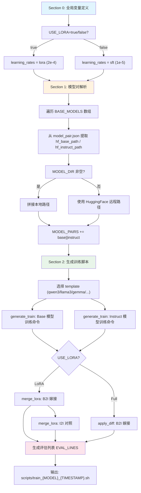
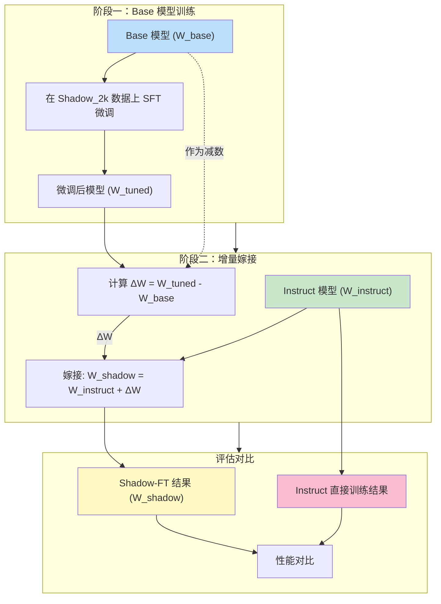
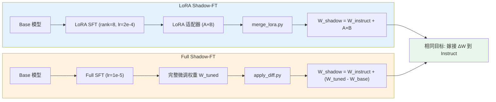

# 04 Shadow-FT 训练流程深度解析

> 本文档基于 `run.sh` 自动化脚本及其关联配置文件，采用"分-总-分"结构对 Shadow-FT 的训练流程进行逐层剖析：首先按阶段拆解 `run.sh` 的每个执行环节，其次总览完整的 Shadow-FT 实验工作流，最后深入关键配置与参数选择的内在逻辑。

---

## 第一部分：run.sh 各阶段详解

### 1.0 全局变量定义（Section 0: Globals）

**源文件**：[`/workspace/run.sh`](file:///workspace/run.sh)（第 1–37 行）

`run.sh` 的第 0 节定义了整个实验流程的全局控制变量，这些变量决定了后续所有训练脚本的生成行为：

```bash
WORKSPACE_DIR="$(cd "$(dirname "$0")" && pwd)"
RESULTS_DIR="$WORKSPACE_DIR/results"
SCRIPT_OUTPUT_DIR="$WORKSPACE_DIR/scripts"
mkdir -p "$RESULTS_DIR" "$SCRIPT_OUTPUT_DIR"

# --- LoRA 开关 ---
USE_LORA=true                   # false -> full SFT
is_lora()   { [[ "${USE_LORA,,}" == "true" ]]; }

lora_ranks=(8)
ratios=(0.5)
learning_rates_lora=(2e-4)
learning_rates_sft=(1e-5)

if is_lora; then
  learning_rates=$learning_rates_lora
else
  learning_rates=$learning_rates_sft
fi

MODEL_DIR="" # ""→HF
BASE_MODELS=(
  "Qwen3-0.6B-Base"
)
```

**关键设计要点**：

| 变量 | 默认值 | 作用 |
|------|--------|------|
| `USE_LORA` | `true` | 核心开关，控制 LoRA / Full SFT 两条路径的分叉 |
| `lora_ranks` | `(8)` | LoRA 秩，数组形式便于批量实验 |
| `ratios` | `(0.5)` | LoRA alpha 与 rank 的比值 |
| `learning_rates_lora` | `(2e-4)` | LoRA 模式学习率 |
| `learning_rates_sft` | `(1e-5)` | Full SFT 模式学习率 |
| `MODEL_DIR` | `""` | 为空则从 HuggingFace 下载，否则从本地路径加载 |
| `BASE_MODELS` | `("Qwen3-0.6B-Base")` | 待实验的模型名称数组，需与 `model_pair.json` 中的 `name` 匹配 |

`is_lora()` 函数是贯穿全脚本的条件判断核心，通过 `${USE_LORA,,}` 将变量转小写后与 `"true"` 比较，实现大小写不敏感的布尔判断。学习率的选择逻辑也由此函数驱动：LoRA 模式使用 `2e-4`，Full SFT 模式使用 `1e-5`，二者相差 20 倍，反映了参数高效微调与全参数微调对学习率量级的不同需求。

辅助函数 `sci2dec()` 将科学计数法转为小数形式（如 `2e-4` → `0.0002`），用于生成可读的目录名标签；`maybe_rel()` 处理相对/绝对路径；`add_eval()` 将评估条目追加到 `EVAL_LINES` 数组。

---

### 1.1 模型对解析（Section 1: Base-model resolution）

**源文件**：[`/workspace/run.sh`](file:///workspace/run.sh)（第 39–73 行）

此阶段从 `model_pair.json` 中提取每个模型名称对应的 Base 和 Instruct 路径：

```bash
MODEL_PAIR_FILE="$WORKSPACE_DIR/examples/model_pair.json"
MODEL_PAIRS=()                  # will contain "<base>||<instruct>"

for NAME in "${BASE_MODELS[@]}"; do
  BLOCK=$(awk -v n="\"$NAME\"" '
    $0~n {print; getline;
           while ($0 !~ /\}/) {print; getline}; print; exit}' \
    "$MODEL_PAIR_FILE")
  [[ -z $BLOCK ]] && { echo "ERROR: '$NAME' not found in JSON"; exit 1; }

  HF_BASE=$(printf '%s\n' "$BLOCK" | sed -n 's/.*"hf_base_path":[[:space:]]*"\([^"]*\)".*/\1/p')
  HF_INST=$(printf '%s\n' "$BLOCK" | sed -n 's/.*"hf_instruct_path":[[:space:]]*"\([^"]*\)".*/\1/p')

  if [[ -n $MODEL_DIR ]]; then
      REL_BASE=${HF_BASE#*/}
      REL_INST=${HF_INST#*/}
      BASE_PATH="$MODEL_DIR/$REL_BASE"
      INST_PATH="$MODEL_DIR/$REL_INST"
  else
      BASE_PATH=$HF_BASE
      INST_PATH=$HF_INST
  fi

  MODEL_PAIRS+=("${BASE_PATH}||${INST_PATH}")
done
```

**解析策略**：由于脚本不依赖 `jq`，而是使用 `awk` + `sed` 的纯 Shell 方式解析 JSON。`awk` 通过匹配模型名称定位到对应的 JSON 对象块，`sed` 则从块中提取 `hf_base_path` 和 `hf_instruct_path` 的值。这种无依赖设计增强了脚本的可移植性。

路径解析支持两种模式：当 `MODEL_DIR` 非空时，将 HuggingFace 路径的仓库部分（如 `Qwen/Qwen3-0.6B-Base` → `Qwen3-0.6B-Base`）拼接到本地目录；为空时直接使用 HuggingFace 远程路径，由框架自动下载。最终以 `||` 分隔符将 Base 和 Instruct 路径合并存入 `MODEL_PAIRS` 数组。

---

### 1.2 训练脚本生成（Section 2: Generate train scripts）

**源文件**：[`/workspace/run.sh`](file:///workspace/run.sh)（第 75–250 行）

这是 `run.sh` 的核心阶段，遍历每个模型对，生成完整的训练、合并与评估脚本。

#### 1.2.1 模板选择

脚本根据 Base 模型名称中的关键字自动匹配 LLaMA Factory 的对话模板：

```bash
case "$B_MODEL" in
  *Llama-3*)  template="llama3" ;;
  *Qwen2*)    template="qwen" ;;
  *Llama-2*)  template="llama2" ;;
  *Qwen3*)    template="qwen3" ;;
  *internlm2*)template="intern2" ;;
  *mistral_small*) template="mistral_small" ;;
  *Mistral*)  template="mistral" ;;
  *Falcon*)   template="falcon" ;;
  *gemma3*)   template="gemma3" ;;
  *gemma*)    template="gemma" ;;
  *Yi*)       template="yi" ;;
  *Baichuan*) template="baichuan2" ;;
  *) echo "ERROR: unknown template for $B_MODEL"; exit 1 ;;
esac
```

模板决定了训练数据的格式化方式（如系统提示、角色标记等），是确保模型正确理解指令的关键。

#### 1.2.2 训练常量

```bash
DEEPSPEED_CFG="$WORKSPACE_DIR/examples/deepspeed/ds_z3_config.json"
DATASET="Shadow_2k"
suffix_name="Shadow_2k"
cutoff_len=4096
samples=(2000)
logging_steps=1; save_steps=1000; per_device_train_batch_size=2
gradient_accumulation_steps=16; num_train_epochs=1
lr_scheduler_type="cosine"; warmup_ratio=0.1; bf16=true
val_size=0.01; per_device_eval_batch_size=1
eval_strategy="steps"; eval_steps=10000; overwrite_cache=false
```

这些常量对所有模型对统一生效，确保实验的公平可比性。

#### 1.2.3 generate_train() 函数

这是训练命令生成的核心函数，为每个模型路径生成一条完整的 `llamafactory-cli train` 命令：

```bash
generate_train() {
  local M_PATH=$1 TAG=$2 LR=$3
  local DEC=$(sci2dec "$LR")
  local LR_TAG="lr${DEC}"
  local OUT_ROOT="$RESULTS_DIR/${MONTHDAY}/result-${MODEL_BASE}-${MONTHDAY}"

  for MAX in "${samples[@]}"; do
    local K="$((MAX/1000))k"
    local DIR="${TAG}-${K}-$(is_lora && echo lora-rank${lora_ranks[0]} || echo sft)-${LR_TAG}-${suffix_name}"
    local OUTDIR="$OUT_ROOT/$DIR"

    echo "llamafactory-cli train \\"
    echo "  --model_name_or_path \"$M_PATH\" \\"
    echo "  --stage sft \\"
    echo "  --do_train true \\"
    if is_lora; then
      echo "  --finetuning_type lora --lora_rank ${lora_ranks[0]} \\"
    else
      echo "  --finetuning_type full \\"
    fi
    echo "  --deepspeed examples/deepspeed/ds_z3_config.json \\"
    echo "  --dataset \"$DATASET\" \\"
    echo "  --template \"$template\" \\"
    echo "  --cutoff_len $cutoff_len \\"
    echo "  --max_samples $MAX \\"
    echo "  --output_dir \"$OUTDIR\" \\"
    echo "  --per_device_train_batch_size $per_device_train_batch_size \\"
    echo "  --gradient_accumulation_steps $gradient_accumulation_steps \\"
    echo "  --learning_rate $LR \\"
    echo "  --num_train_epochs $num_train_epochs \\"
    echo "  --logging_steps $logging_steps \\"
    echo "  --save_steps $save_steps \\"
    echo "  --plot_loss true \\"
    echo "  --lr_scheduler_type $lr_scheduler_type \\"
    echo "  --warmup_ratio $warmup_ratio \\"
    echo "  --bf16 $bf16 \\"
    echo "  --val_size $val_size \\"
    echo "  --per_device_eval_batch_size $per_device_eval_batch_size \\"
    echo "  --eval_strategy $eval_strategy \\"
    echo "  --eval_steps $eval_steps \\"
    echo "  --trust_remote_code True \\"
    echo "  --flash_attn fa2 \\"
    echo "  --overwrite_cache $overwrite_cache"
  done
}
```

函数接收三个参数：`M_PATH`（模型路径）、`TAG`（`B` 或 `I`，标识 Base/Instruct）、`LR`（学习率）。输出目录命名规则为 `{TAG}-{样本量}-(lora-rank{N}|sft)-lr{学习率}-{数据集名}`，例如 `B-2k-lora-rank8-lr0.0002-Shadow_2k`。

调用时对每个学习率分别生成 Base 和 Instruct 的训练命令：

```bash
for LR in "${learning_rates[@]}"; do
  generate_train "$B_MODEL" B "$LR"
  generate_train "$I_MODEL" I "$LR"
done
```

#### 1.2.4 Delta 合并阶段

训练完成后，需要将 Base 模型上学到的增量嫁接到 Instruct 模型上。根据 `USE_LORA` 开关，分为两条路径：

**LoRA 路径**（`merge_lora()` 函数）：

```bash
merge_lora() {
  local SRC=$1 SRC_TAG=$2 TGT=$3 TGT_TAG=$4 LR=$5
  # ...
  echo "python3 $WORKSPACE_DIR/src/shadow/merge_lora.py \\"
  echo "  --adapter_path \"$ADAP\" \\"
  echo "  --target_base \"$TGT\" \\"
  echo "  --merge_tag \"$TAG\" \\"
  echo "  --template \"$template\""
}

for LR in "${learning_rates[@]}"; do
  merge_lora "$B_MODEL" B "$I_MODEL" I "$LR"   # B2I: 核心嫁接
  merge_lora "$I_MODEL" I "$I_MODEL" I "$LR"   # I2I: 对照实验
done
```

**Full SFT 路径**：

```bash
echo "python3 $WORKSPACE_DIR/src/shadow/apply_diff.py \\"
echo "  --tuned_model \"$B_DIR\" \\"
echo "  --target_model \"$I_MODEL\" \\"
echo "  --base_model \"$B_MODEL\""
```

值得注意的是，LoRA 路径同时生成了 `B2I`（核心 Shadow-FT 嫁接）和 `I2I`（Instruct 自身 LoRA 合并，作为对照实验），而 Full SFT 路径仅生成 `B2I`。

#### 1.2.5 评估列表生成

```bash
echo "##### Evaluation list #####"
for line in "${EVAL_LINES[@]}"; do
  echo "# $line"
done
```

`EVAL_LINES` 数组在训练和合并阶段通过 `add_eval()` 函数逐步填充，最终以注释形式写入脚本，方便后续批量评估。

---

### 1.3 run.sh 执行流程图



---

## 第二部分：Shadow-FT 完整实验工作流总览

### 2.1 从 run.sh 到实验闭环

`run.sh` 本质上是一个**实验脚本生成器**，而非直接执行训练的脚本。它的输出是一组可执行的 `.sh` 文件，每个文件包含了一个模型对从训练到合并的完整流程。整个 Shadow-FT 实验的工作流可以概括为以下步骤：

1. **配置阶段**：在 `run.sh` 中设定 `USE_LORA`、学习率、模型列表等全局参数
2. **解析阶段**：从 `model_pair.json` 读取模型对信息
3. **生成阶段**：为每个模型对生成独立的训练脚本
4. **训练阶段**：执行生成的脚本，分别在 Base 和 Instruct 模型上进行 SFT
5. **嫁接阶段**：将 Base 模型上学到的 ΔW 嫁接到 Instruct 模型
6. **评估阶段**：对比 Shadow-FT 结果与 Instruct 直接训练的效果

### 2.2 Shadow-FT 两阶段训练流程图



### 2.3 数据流全景

Shadow-FT 的数据流可以概括为三条并行的处理管线：

| 管线 | 输入 | 操作 | 输出 |
|------|------|------|------|
| **Base 训练** | Base 模型 + Shadow_2k 数据 | SFT 微调 | W_tuned |
| **增量嫁接** | W_tuned + W_base + W_instruct | ΔW 计算与加法 | W_shadow |
| **Instruct 对照** | Instruct 模型 + Shadow_2k 数据 | 直接 SFT | W_instruct_tuned |

其中 Base 训练和 Instruct 对照由 `generate_train()` 生成，增量嫁接由 `merge_lora()` 或 `apply_diff.py` 完成。评估阶段通过对比 W_shadow 与 W_instruct_tuned 的性能，验证 Shadow-FT 的有效性。

---

## 第三部分：关键配置与参数深度解析

### 3.1 模型对配置（model_pair.json）

**源文件**：[`/workspace/examples/model_pair.json`](file:///workspace/examples/model_pair.json）

该文件定义了 31 个 Base-Instruct 模型对，是 Shadow-FT 实验的模型注册表。每个条目格式为：

```json
{
  "name": "Qwen3-8B-Base",
  "hf_base_path": "Qwen/Qwen3-8B-Base",
  "hf_instruct_path": "Qwen/Qwen3-8B"
}
```

**模型家族覆盖**：

| 家族 | 规模范围 | 模型数量 | 示例 |
|------|----------|----------|------|
| Qwen3 | 0.6B – 30B | 6 | Qwen3-0.6B-Base, Qwen3-30B-A3B-Base |
| Qwen2.5 | 7B – 32B | 3 | Qwen2.5-7B, Qwen2.5-14B, Qwen2.5-32B |
| Falcon | 1B – 10B | 4 | Falcon3-1B, Falcon3-3B, Falcon3-7B, Falcon3-10B |
| Gemma | 1b – 27b | 6 | gemma-2-2b, gemma-3-1b, gemma-3-27b |
| InternLM2 | 1.8B – 20B | 5 | internlm2-1_8b, internlm2_5-20b |
| Yi | 1.5B – 9B | 3 | Yi-6B, Yi-Coder-1.5B, Yi-Coder-9B |
| Mistral | 7B | 1 | Mistral-7B-v0.1 |
| Baichuan | 7B | 1 | Baichuan2-7B |
| GLM-4 | 32B | 1 | GLM-4-32B-0414 |
| Seed-Coder | 8B | 1 | Seed-Coder-8B |

这种广泛的模型覆盖确保了 Shadow-FT 方法在不同架构、不同规模模型上的普适性验证。值得注意的是，`run.sh` 中的 `BASE_MODELS` 数组默认仅包含 `"Qwen3-0.6B-Base"`，这是快速验证的最小配置，研究者可根据需要扩展该数组。

### 3.2 训练参数配置详解

#### 3.2.1 序列长度与样本量

```bash
cutoff_len=4096
samples=(2000)
```

- **`cutoff_len=4096`**：输入序列的最大长度。4K 上下文是当前 SFT 的常用设置，在训练效率和长文本处理能力之间取得平衡。对于 Shadow-FT 的实验场景（2K 样本），4K 上下文足以覆盖绝大多数训练样本。
- **`max_samples=2000`**：最大训练样本数。Shadow-FT 的核心论点之一是**少量数据即可实现有效嫁接**，2K 样本的设定正是为了验证这一论点。这也解释了数据集命名为 `Shadow_2k` 的由来。

#### 3.2.2 批次与梯度累积

```bash
per_device_train_batch_size=2
gradient_accumulation_steps=16
```

有效批次大小 = `per_device_train_batch_size × gradient_accumulation_steps × GPU数量` = `2 × 16 × N`。在单 GPU 上有效批次为 32，8 卡则达 256。梯度累积策略允许在显存受限时通过增加累积步数来模拟大批次训练，是 DeepSpeed ZeRO-3 下的常见配置。

#### 3.2.3 学习率策略

```bash
learning_rates_lora=(2e-4)    # LoRA 模式
learning_rates_sft=(1e-5)     # Full SFT 模式
lr_scheduler_type="cosine"
warmup_ratio=0.1
```

LoRA 与 Full SFT 的学习率差异（20 倍）源于参数更新规模的差异：

- **LoRA** 仅更新低秩适配器参数（rank=8 时参数量极少），需要较大的学习率才能在有限的训练步数内产生足够的权重变化
- **Full SFT** 更新全部模型参数，较小的学习率可避免过拟合和训练不稳定

余弦退火（cosine）调度器配合 10% 预热比例，确保训练初期平稳起步、后期逐步衰减，是当前大模型微调的主流配置。

#### 3.2.4 DeepSpeed ZeRO-3 配置

**源文件**：[`/workspace/examples/deepspeed/ds_z3_config.json`](file:///workspace/examples/deepspeed/ds_z3_config.json)

```json
{
  "zero_optimization": {
    "stage": 3,
    "overlap_comm": false,
    "contiguous_gradients": true,
    "sub_group_size": 1e9,
    "reduce_bucket_size": "auto",
    "stage3_prefetch_bucket_size": "auto",
    "stage3_param_persistence_threshold": "auto",
    "stage3_max_live_parameters": 1e9,
    "stage3_max_reuse_distance": 1e9,
    "stage3_gather_16bit_weights_on_model_save": true
  }
}
```

ZeRO-3 是 DeepSpeed 最激进的内存优化阶段，将优化器状态、梯度和模型参数全部跨 GPU 分片。关键配置解读：

| 参数 | 值 | 含义 |
|------|----|------|
| `stage` | 3 | 启用 ZeRO Stage 3，参数、梯度、优化器状态全分片 |
| `contiguous_gradients` | true | 梯度存储为连续内存，减少内存碎片 |
| `stage3_gather_16bit_weights_on_model_save` | true | 保存检查点时收集完整 16 位权重，确保可恢复性 |
| `overlap_comm` | false | 关闭通信与计算重叠，降低实现复杂度 |

选择 ZeRO-3 而非 ZeRO-2 的原因在于：Shadow-FT 需要覆盖从 0.6B 到 32B 的模型规模，ZeRO-3 的大模型支持能力是必需的。项目同时提供了 `ds_z2_config.json`、`ds_z3_offload_config.json` 等备选配置，可根据硬件条件灵活选择。

#### 3.2.5 精度与注意力

```bash
bf16=true
# --flash_attn fa2
```

- **BF16**：Bfloat16 混合精度训练，相比 FP16 具有更大的动态范围（与 FP32 相同的指数位），减少数值溢出风险，特别适合大模型训练
- **Flash Attention 2**：通过 IO 感知的注意力计算优化，将注意力计算的内存复杂度从 O(N²) 降至 O(N)，显著加速长序列训练

#### 3.2.6 评估与保存

```bash
val_size=0.01
per_device_eval_batch_size=1
eval_strategy="steps"
eval_steps=10000
save_steps=1000
logging_steps=1
num_train_epochs=1
```

- **`val_size=0.01`**：仅用 1% 数据作为验证集，最大化训练数据利用率
- **`eval_steps=10000`**：评估间隔设为 10000 步，远大于训练总步数（2K 样本 × 1 epoch 在单 GPU 上约 60 步），意味着训练过程中不会触发评估，减少时间开销
- **`save_steps=1000`**：每 1000 步保存一次检查点，同样在训练步数较少时仅保存最终模型
- **`num_train_epochs=1`**：仅训练 1 个 epoch，与 Shadow-FT 的"少量数据、少量训练"理念一致

### 3.3 数据集配置

**源文件**：[`/workspace/data/dataset_info.json`](file:///workspace/data/dataset_info.json)

```json
"Shadow_2k": {
  "file_name": "Shadow_2k.parquet",
  "formatting": "sharegpt",
  "columns": {
    "messages": "conversations"
  }
}
```

Shadow_2k 数据集采用 **ShareGPT 格式**，以多轮对话形式组织训练数据。`columns.messages` 映射到 `conversations` 字段，与 LLaMA Factory 的 ShareGPT 数据加载器对接。Parquet 格式相比 JSON 具有更高的存储效率和更快的加载速度，适合大规模数据集。

### 3.4 LoRA Shadow-FT：merge_lora.py 深度解析

**源文件**：[`/workspace/src/shadow/merge_lora.py`](file:///workspace/src/shadow/merge_lora.py)

LoRA Shadow-FT 的嫁接过程通过 `merge_lora.py` 实现，其核心逻辑是调用 LLaMA Factory 的 `export` 子命令将 LoRA 适配器合并到目标基座模型：

```python
merge_config = {
    "model_name_or_path": args.target_base,     # Instruct 模型路径
    "adapter_name_or_path": args.adapter_path,   # LoRA 适配器路径
    "template": args.template,
    "finetuning_type": "lora",
    "export_size": 5,
    "export_device": "cpu",
    "export_legacy_format": False,
    "trust_remote_code": True
}

merged_dir = adapter_dir / f"merged-{args.merge_tag}"
merge_config["export_dir"] = str(merged_dir)

config_file = merged_dir / "merge_lora_config.yaml"
with open(config_file, "w") as f:
    yaml.dump(merge_config, f)

cmd = ["llamafactory-cli", "export", str(config_file)]
subprocess.run(cmd, check=True)
```

**工作原理**：LoRA 的权重增量 ΔW 可以分解为 `ΔW = A × B`（其中 A 和 B 是低秩矩阵），合并操作即 `W_shadow = W_instruct + A × B`。`llamafactory-cli export` 命令会加载 Instruct 模型权重，将 LoRA 适配器的增量矩阵乘法结果加到对应层上，然后导出为完整的 SafeTensors 格式模型。

脚本还包含跳过逻辑：如果目标目录已存在 `.safetensors` 文件，则跳过合并，避免重复计算。

### 3.5 Full Shadow-FT：apply_diff.py 深度解析

**源文件**：[`/workspace/src/shadow/apply_diff.py`](file:///workspace/src/shadow/apply_diff.py)

Full Shadow-FT 的嫁接过程通过 `apply_diff.py` 实现，其核心公式为：

$$W_{\text{shadow}} = W_{\text{instruct}} + (W_{\text{tuned}} - W_{\text{base}})$$

```python
def process_single_model(tuned_model, target_model, base_model):
    a_weights = load_weights(tuned_model)      # W_tuned
    b_weights = load_weights(target_model)      # W_instruct
    c_weights = load_weights(base_model)        # W_base

    delta_weights = {k: a_weights[k] - c_weights[k]
                     for k in a_weights if k in c_weights and is_linear_param(k)}

    new_weights = {k: (b_weights[k] + delta_weights[k]) if k in delta_weights else v
                   for k, v in b_weights.items()}

    save_safetensor_weights(delta_dir, new_weights)
    copy_tokenizer_and_config(target_model, delta_dir)
```

**关键设计**：

1. **仅对线性层计算增量**：`is_linear_param()` 函数通过正则匹配 `k_proj`、`q_proj`、`v_proj`、`o_proj`、`up_proj`、`gate_proj`、`down_proj` 等模式，仅对注意力投影层和 MLP 层计算 ΔW。这基于一个重要观察：指令对齐的权重变化主要集中在这些线性变换层，而嵌入层和 LayerNorm 层的变化较小。

2. **分片加载与保存**：`load_weights()` 支持 SafeTensors 分片、单文件 PyTorch bin、以及多分片 bin 三种格式，兼容不同来源的模型检查点。`save_safetensor_weights()` 使用 `huggingface_hub.save_torch_state_dict` 进行分片保存，自动处理共享张量（如 tied embeddings）和分片索引。

3. **Tokenizer 与配置复制**：`copy_tokenizer_and_config()` 将 Instruct 模型的 tokenizer、config 等文件复制到合并输出目录，确保合并后的模型可以独立使用。

4. **调试信息**：`print_debug_info()` 输出第一层 `q_proj` 的形状和增量统计信息，便于验证嫁接过程的正确性。

### 3.6 两种 Shadow-FT 变体对比



| 维度 | LoRA Shadow-FT | Full Shadow-FT |
|------|----------------|----------------|
| **训练方式** | LoRA 适配器微调 | 全参数微调 |
| **可训练参数量** | 极少（rank=8 时约 0.1% 参数） | 全部参数 |
| **学习率** | 2e-4（较大） | 1e-5（较小） |
| **训练速度** | 快（低秩分解减少计算量） | 慢（全参数更新） |
| **显存需求** | 较低 | 较高（需 ZeRO-3 支持） |
| **增量表示** | 隐式：A×B 低秩矩阵 | 显式：W_tuned - W_base 逐元素差 |
| **嫁接工具** | `merge_lora.py` → `llamafactory-cli export` | `apply_diff.py` → 直接权重运算 |
| **增量精度** | 受限于低秩近似 | 完整精度，无信息损失 |
| **适用场景** | 快速实验、资源受限 | 追求最优性能、资源充足 |
| **对照实验** | B2I + I2I | 仅 B2I |

**核心差异的本质**在于 ΔW 的表示方式：LoRA 将 ΔW 压缩为低秩形式 `A×B`，牺牲了一定的表达能力换取效率；Full SFT 保留完整的 ΔW，表达能力更强但开销更大。两种路径殊途同归——最终都是将 Base 模型上学到的增量嫁接到 Instruct 模型上，实现 Shadow-FT 的核心目标。

### 3.7 权重相似度分析（weight_similarity.py）

**源文件**：[`/workspace/src/shadow/weight_similarity.py`](file:///workspace/src/shadow/weight_similarity.py)

虽然 `weight_similarity.py` 不直接参与训练流程，但它是 Shadow-FT 实验分析的重要工具。该脚本实现了论文 2.3 节定义的相对差距比 σ：

$$\sigma(W_A, W_B) = \frac{\sum|W_A - W_B|}{\sum|W_A| + \sum|W_B|}$$

σ 值越小，说明 Base 与 Instruct 模型的权重越接近，ΔW 嫁接的效果越可预测。该脚本按层逐个加载权重（避免大模型内存溢出），并将 BF16 张量上转为 FP32 进行精确计算，是验证 Shadow-FT 理论假设的关键工具。

---

## 总结

Shadow-FT 的训练流程通过 `run.sh` 实现了从配置到脚本生成的完整自动化。其设计体现了三个核心原则：

1. **参数化驱动**：通过 `USE_LORA` 等全局变量控制实验路径，一处修改即可切换整个实验范式
2. **模型无关性**：`model_pair.json` + 模板自动匹配机制，使同一套流程覆盖 31 个不同架构的模型
3. **增量嫁接思想**：无论是 LoRA 的隐式低秩增量还是 Full SFT 的显式权重差，核心都是"在 Base 上学习、在 Instruct 上嫁接"，避免直接微调 Instruct 模型时对已有对齐能力的破坏

整个流程从 `run.sh` 的全局配置出发，经过模型对解析、训练命令生成、增量嫁接到评估列表输出，形成了一个完整的 Shadow-FT 实验闭环。研究者只需修改 `BASE_MODELS` 数组和 `USE_LORA` 开关，即可快速在不同模型和微调范式间切换，极大降低了实验的操作成本。
