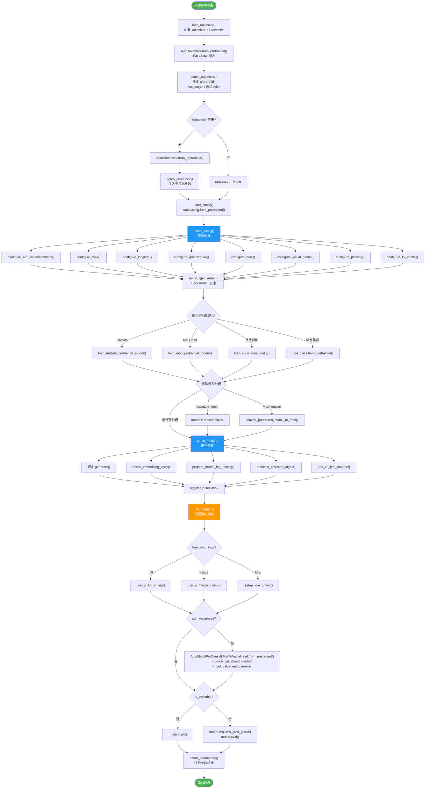
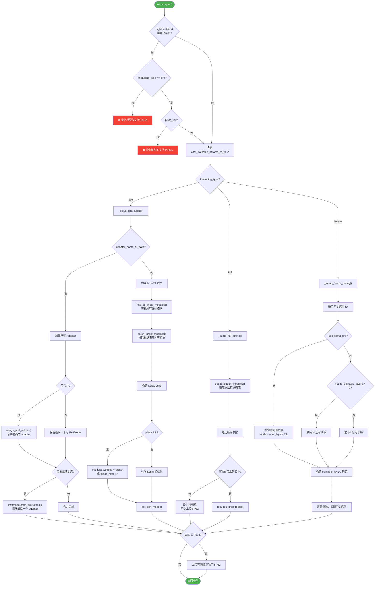

# 05 模型加载与适配

> 深度解析 LLaMA Factory 模型加载全流程，涵盖 Loader、Adapter、Patcher 三大子系统，并以 Shadow-FT 视角审视 Base 模型与 Instruct 模型的统一加载机制。

---

## 第一部分：分——Loader、Adapter、Patcher 各自的职责

### 1.1 Loader：模型加载入口

Loader 是模型初始化的总调度器，定义在 [file:///workspace/src/llamafactory/model/loader.py](file:///workspace/src/llamafactory/model/loader.py) 中。它对外暴露三个核心函数：`load_tokenizer()`、`load_config()`、`load_model()`，遵循严格的调用顺序完成从分词器到完整模型的构建。

#### 1.1.1 Tokenizer 加载

`load_tokenizer()` 负责 Tokenizer 和 Processor 的加载与修补：

```python
# file:///workspace/src/llamafactory/model/loader.py L75-L113
def load_tokenizer(model_args: "ModelArguments") -> "TokenizerModule":
    init_kwargs = _get_init_kwargs(model_args)
    try:
        tokenizer = AutoTokenizer.from_pretrained(
            model_args.model_name_or_path,
            use_fast=model_args.use_fast_tokenizer,
            split_special_tokens=model_args.split_special_tokens,
            padding_side="right",
            **init_kwargs,
        )
    except ValueError:  # try the fast one
        tokenizer = AutoTokenizer.from_pretrained(
            model_args.model_name_or_path,
            use_fast=True,
            padding_side="right",
            **init_kwargs,
        )
    except Exception as e:
        raise OSError("Failed to load tokenizer.") from e

    patch_tokenizer(tokenizer, model_args)
    try:
        processor = AutoProcessor.from_pretrained(model_args.model_name_or_path, **init_kwargs)
        patch_processor(processor, tokenizer, model_args)
    except Exception as e:
        logger.info_rank0(f"Failed to load processor: {e}.")
        processor = None

    if processor is not None and "Processor" not in processor.__class__.__name__:
        logger.debug("The loaded processor is not an instance of Processor. Dropping it.")
        processor = None

    return {"tokenizer": tokenizer, "processor": processor}
```

**关键设计点**：

- **Fast/Slow 回退机制**：优先使用 `use_fast_tokenizer` 参数指定的模式加载，若失败则回退到 Fast Tokenizer，确保兼容性。
- **padding_side 硬编码为 "right"**：训练时统一右填充，避免因果语言模型训练中的注意力掩码问题。
- **Processor 可选加载**：多模态模型需要 Processor 来处理图像/视频/音频输入，非多模态模型加载失败时静默降级为 `None`。
- **Processor 类型校验**：若加载的对象不是真正的 `Processor` 实例（例如某些模型返回的是 Tokenizer），则丢弃。

#### 1.1.2 Config 加载

`load_config()` 最为简洁，仅通过 `AutoConfig.from_pretrained` 加载配置对象：

```python
# file:///workspace/src/llamafactory/model/loader.py L116-L119
def load_config(model_args: "ModelArguments") -> "PretrainedConfig":
    init_kwargs = _get_init_kwargs(model_args)
    return AutoConfig.from_pretrained(model_args.model_name_or_path, **init_kwargs)
```

Config 对象随后会在 `patch_config()` 中被大量修改（注意力实现、RoPE 缩放、量化配置等），这是 Patcher 的职责。

#### 1.1.3 Model 加载

`load_model()` 是整个加载流程的核心，整合了 Config 修补、Liger Kernel 应用、模型实例化、Patcher 修补、Adapter 初始化、ValueHead 添加等全部步骤：

```python
# file:///workspace/src/llamafactory/model/loader.py L122-L219
def load_model(
    tokenizer: "PreTrainedTokenizer",
    model_args: "ModelArguments",
    finetuning_args: "FinetuningArguments",
    is_trainable: bool = False,
    add_valuehead: bool = False,
) -> "PreTrainedModel":
    init_kwargs = _get_init_kwargs(model_args)
    config = load_config(model_args)
    patch_config(config, tokenizer, model_args, init_kwargs, is_trainable)
    apply_liger_kernel(config, model_args, is_trainable, require_logits=(finetuning_args.stage not in ["pt", "sft"]))
    # ... 模型实例化与特殊处理 ...
    model = init_adapter(config, model, model_args, finetuning_args, is_trainable)
    if add_valuehead:
        model = AutoModelForCausalLMWithValueHead.from_pretrained(model)
        patch_valuehead_model(model)
        # ... 加载 ValueHead 权重 ...
    # ... 训练/推理模式设置 ...
    return model
```

**多模态模型自动检测**：根据 Config 类型自动选择正确的 `AutoModel` 子类：

```python
# file:///workspace/src/llamafactory/model/loader.py L150-L162
if type(config) in AutoModelForVision2Seq._model_mapping.keys():       # 图文模型
    load_class = AutoModelForVision2Seq
elif type(config) in AutoModelForImageTextToText._model_mapping.keys(): # 图文模型(新版)
    load_class = AutoModelForImageTextToText
elif type(config) in AutoModelForSeq2SeqLM._model_mapping.keys():      # 音频文本模型
    load_class = AutoModelForSeq2SeqLM
elif type(config) in AutoModelForTextToWaveform._model_mapping.keys():  # 音频生成(Qwen2.5-Omni)
    load_class = AutoModelForTextToWaveform
else:
    load_class = AutoModelForCausalLM                                     # 默认因果语言模型
```

**特殊模型处理**：

- **Qwen2.5-Omni**：加载后提取 `model.thinker`，仅使用其思考部分：
  ```python
  if getattr(model.config, "model_type", None) == "qwen2_5_omni":
      model = model.thinker  # use part of Omni model
  ```
- **MoD (Mixture-of-Depths) 模型**：支持 `load`（直接加载已转换的 MoD 模型）和 `convert`（将普通模型转换为 MoD 模型）两种模式。
- **Unsloth 加速**：通过 `load_unsloth_pretrained_model()` 使用 Unsloth 的优化加载路径，支持延迟加载（lazy_load）以配合 LoRA adapter。
- **从头训练**：`train_from_scratch=True` 时使用 `from_config` 而非 `from_pretrained`，跳过权重加载。
- **ValueHead**：PPO/RM 训练阶段在模型之上添加 `AutoModelForCausalLMWithValueHead`，并修补其权重绑定逻辑。

---

### 1.2 Adapter：微调适配器系统

Adapter 系统定义在 [file:///workspace/src/llamafactory/model/adapter.py](file:///workspace/src/llamafactory/model/adapter.py) 中，是 LLaMA Factory 微调范式的核心抽象。它通过统一的 `init_adapter()` 入口分发到三种微调策略。

#### 1.2.1 统一入口

```python
# file:///workspace/src/llamafactory/model/adapter.py L261-L306
def init_adapter(
    config: "PretrainedConfig",
    model: "PreTrainedModel",
    model_args: "ModelArguments",
    finetuning_args: "FinetuningArguments",
    is_trainable: bool,
) -> "PreTrainedModel":
    # 量化模型校验
    if is_trainable and getattr(model, "quantization_method", None) is not None:
        if finetuning_args.finetuning_type != "lora":
            raise ValueError("Quantized models can only be used for the LoRA tuning.")
        if finetuning_args.pissa_init:
            raise ValueError("Cannot initialize PiSSA adapter on quantized models.")

    # FP32 上传决策
    cast_trainable_params_to_fp32 = False
    if not is_trainable:
        pass
    elif finetuning_args.pure_bf16 or finetuning_args.use_badam:
        pass  # 保持半精度
    elif model_args.quantization_bit is None and is_deepspeed_zero3_enabled():
        pass  # ZeRO3 已在 FP32
    else:
        cast_trainable_params_to_fp32 = True

    # 分发到具体策略
    if finetuning_args.finetuning_type == "full":
        _setup_full_tuning(model, finetuning_args, is_trainable, cast_trainable_params_to_fp32)
    elif finetuning_args.finetuning_type == "freeze":
        _setup_freeze_tuning(model, finetuning_args, is_trainable, cast_trainable_params_to_fp32)
    elif finetuning_args.finetuning_type == "lora":
        model = _setup_lora_tuning(config, model, model_args, finetuning_args, is_trainable, cast_trainable_params_to_fp32)
    else:
        raise NotImplementedError(f"Unknown finetuning type: {finetuning_args.finetuning_type}.")
    return model
```

#### 1.2.2 Full Tuning（全参数微调）

```python
# file:///workspace/src/llamafactory/model/adapter.py L38-L54
def _setup_full_tuning(model, finetuning_args, is_trainable, cast_trainable_params_to_fp32):
    if not is_trainable:
        return
    logger.info_rank0("Fine-tuning method: Full")
    forbidden_modules = get_forbidden_modules(model.config, finetuning_args)
    for name, param in model.named_parameters():
        if not any(forbidden_module in name for forbidden_module in forbidden_modules):
            if cast_trainable_params_to_fp32:
                param.data = param.data.to(torch.float32)
        else:
            param.requires_grad_(False)
```

全参数微调的核心逻辑是 **黑名单冻结**：通过 `get_forbidden_modules()` 获取需要冻结的模块（主要是视觉塔和多模态投影器），将其余参数设为可训练并上传至 FP32。

#### 1.2.3 Freeze Tuning（冻结微调）

冻结微调支持更精细的层选择策略：

```python
# file:///workspace/src/llamafactory/model/adapter.py L57-L138
def _setup_freeze_tuning(model, finetuning_args, is_trainable, cast_trainable_params_to_fp32):
    # LlamaPRO 模式：均匀间隔选取可训练层
    if finetuning_args.use_llama_pro:
        stride = num_layers // finetuning_args.freeze_trainable_layers
        trainable_layer_ids = range(stride - 1, num_layers + stride - 1, stride)
    # 正数：最后 N 层可训练
    elif finetuning_args.freeze_trainable_layers > 0:
        trainable_layer_ids = range(max(0, num_layers - finetuning_args.freeze_trainable_layers), num_layers)
    # 负数：前 N 层可训练
    else:
        trainable_layer_ids = range(min(-finetuning_args.freeze_trainable_layers, num_layers))
```

**LlamaPRO** 是一种特殊的冻结策略，它将模型层均匀分组，每组中选取一层作为可训练的"扩展块"，其余层保持冻结。

#### 1.2.4 LoRA Tuning（LoRA 微调）

LoRA 微调是最复杂的适配器类型，支持 LoRA/DoRA/rsLoRA/PiSSA 等变体：

```python
# file:///workspace/src/llamafactory/model/adapter.py L141-L258
def _setup_lora_tuning(config, model, model_args, finetuning_args, is_trainable, cast_trainable_params_to_fp32):
    # 多 Adapter 合并逻辑
    if model_args.adapter_name_or_path is not None:
        # 判断是否可合并（量化模型/ZeRO3/Unsloth 不可合并）
        if (is_trainable and not finetuning_args.create_new_adapter) or (not is_mergeable):
            adapter_to_merge = model_args.adapter_name_or_path[:-1]
            adapter_to_resume = model_args.adapter_name_or_path[-1]
        else:
            adapter_to_merge = model_args.adapter_name_or_path

        for adapter in adapter_to_merge:
            model: LoraModel = PeftModel.from_pretrained(model, adapter, **init_kwargs)
            model = model.merge_and_unload()

        if adapter_to_resume is not None:
            model = PeftModel.from_pretrained(model, adapter_to_resume, is_trainable=is_trainable, **init_kwargs)

    # 创建新 LoRA 权重
    if is_trainable and adapter_to_resume is None:
        target_modules = find_all_linear_modules(model, finetuning_args.freeze_vision_tower)
        target_modules = patch_target_modules(model, finetuning_args, target_modules)

        peft_kwargs = {
            "r": finetuning_args.lora_rank,
            "target_modules": target_modules,
            "lora_alpha": finetuning_args.lora_alpha,
            "lora_dropout": finetuning_args.lora_dropout,
            "use_rslora": finetuning_args.use_rslora,
            "use_dora": finetuning_args.use_dora,
            "modules_to_save": finetuning_args.additional_target,
        }

        # PiSSA 初始化
        if finetuning_args.pissa_init:
            if finetuning_args.pissa_iter == -1:
                peft_kwargs["init_lora_weights"] = "pissa"
            else:
                peft_kwargs["init_lora_weights"] = f"pissa_niter_{finetuning_args.pissa_iter}"

        lora_config = LoraConfig(task_type=TaskType.CAUSAL_LM, inference_mode=False, **peft_kwargs)
        model = get_peft_model(model, lora_config)
```

**多 Adapter 合并机制**：当 `adapter_name_or_path` 包含多个路径时，前面的 adapter 依次通过 `merge_and_unload()` 合并回基础模型，最后一个 adapter 保留为 PeftModel 以支持继续训练。这种设计使得增量训练成为可能。

---

### 1.3 Patcher：模型修补系统

Patcher 定义在 [file:///workspace/src/llamafactory/model/patcher.py](file:///workspace/src/llamafactory/model/patcher.py) 中，负责在模型加载前后对 Config、Tokenizer、Model、Processor 进行各种修补，以适配不同的训练和推理场景。

#### 1.3.1 patch_config()

`patch_config()` 是配置修补的集散地，调用了 8 个子配置函数：

```python
# file:///workspace/src/llamafactory/model/patcher.py L92-L152
def patch_config(config, tokenizer, model_args, init_kwargs, is_trainable):
    configure_attn_implementation(config, model_args)   # 注意力实现
    configure_rope(config, model_args)                   # RoPE 缩放
    configure_longlora(config, model_args, is_trainable) # LongLoRA
    configure_quantization(config, tokenizer, model_args, init_kwargs)  # 量化
    configure_moe(config, model_args, is_trainable)     # MoE 模型
    configure_visual_model(config)                       # 视觉模型
    configure_packing(model_args, is_trainable)          # 序列打包
    configure_kv_cache(config, model_args, is_trainable) # KV 缓存
    # ... 特定模型修补 ...
```

#### 1.3.2 patch_tokenizer()

```python
# file:///workspace/src/llamafactory/model/patcher.py L50-L71
def patch_tokenizer(tokenizer, model_args):
    # 修复 pad 方法
    if "PreTrainedTokenizerBase" not in str(tokenizer._pad.__func__):
        tokenizer._pad = MethodType(PreTrainedTokenizerBase._pad, tokenizer)
    # 扩展最大长度
    if model_args.model_max_length is not None and tokenizer.model_max_length < model_args.model_max_length:
        tokenizer.model_max_length = model_args.model_max_length
    # 添加普通 token
    if model_args.add_tokens is not None:
        num_added_tokens = tokenizer.add_tokens(new_tokens=model_args.add_tokens, special_tokens=False)
    # 添加特殊 token
    if model_args.add_special_tokens is not None:
        num_added_special_tokens = tokenizer.add_tokens(new_tokens=model_args.add_special_tokens, special_tokens=True)
```

#### 1.3.3 patch_processor()

```python
# file:///workspace/src/llamafactory/model/patcher.py L74-L89
def patch_processor(processor, tokenizer, model_args):
    setattr(processor, "tokenizer", tokenizer)
    setattr(processor, "image_max_pixels", model_args.image_max_pixels)
    setattr(processor, "image_min_pixels", model_args.image_min_pixels)
    setattr(processor, "image_do_pan_and_scan", model_args.image_do_pan_and_scan)
    setattr(processor, "crop_to_patches", model_args.crop_to_patches)
    setattr(processor, "video_max_pixels", model_args.video_max_pixels)
    setattr(processor, "video_min_pixels", model_args.video_min_pixels)
    setattr(processor, "video_fps", model_args.video_fps)
    setattr(processor, "video_maxlen", model_args.video_maxlen)
    setattr(processor, "use_audio_in_video", model_args.use_audio_in_video)
    setattr(processor, "audio_sampling_rate", model_args.audio_sampling_rate)
```

Processor 修补通过 `setattr` 动态注入多模态参数，将图像/视频/音频的处理参数绑定到 Processor 实例上，使得后续数据处理流程可以直接访问这些配置。

#### 1.3.4 patch_model()

```python
# file:///workspace/src/llamafactory/model/patcher.py L154-L191
def patch_model(model, tokenizer, model_args, is_trainable, add_valuehead):
    # 修复 generate 方法
    if getattr(model.config, "model_type", None) not in ["minicpmv", "minicpmo"] \
       and "GenerationMixin" not in str(model.generate.__func__):
        model.generate = MethodType(PreTrainedModel.generate, model)
    # ValueHead 准备
    if add_valuehead:
        prepare_valuehead_model(model)
    # 词表扩展
    if model_args.resize_vocab:
        resize_embedding_layer(model, tokenizer)
    # 训练准备
    if is_trainable:
        prepare_model_for_training(model, model_args)
        autocast_projector_dtype(model, model_args)
        add_z3_leaf_module(model)
```

#### 1.3.5 patch_valuehead_model()

```python
# file:///workspace/src/llamafactory/model/patcher.py L194-L216
def patch_valuehead_model(model):
    # 修复 tie_weights / get_input_embeddings / get_output_embeddings / create_or_update_model_card
    ignore_modules = [name for name, _ in model.named_parameters() if "pretrained_model" in name]
    setattr(model, "_keys_to_ignore_on_save", ignore_modules)
    setattr(model, "tie_weights", MethodType(tie_weights, model))
    setattr(model, "get_input_embeddings", MethodType(get_input_embeddings, model))
    setattr(model, "get_output_embeddings", MethodType(get_output_embeddings, model))
    setattr(model, "create_or_update_model_card", MethodType(create_or_update_model_card, model))
```

ValueHead 修补的核心问题是 `AutoModelForCausalLMWithValueHead` 将原始模型包装为 `pretrained_model` 子模块，导致 `tie_weights`、`get_input_embeddings` 等方法无法正确代理到内部模型。修补通过方法替换解决这一问题，同时设置 `_keys_to_ignore_on_save` 避免保存时重复写入基础模型权重。

---

## 第二部分：总——模型初始化完整流程

### 2.1 完整加载流程图



### 2.2 Shadow-FT 视角下的加载流程

Shadow-FT 的核心公式为：

$$W_{\text{shadow}} = W_{\text{instruct}} + (W_{\text{tuned}} - W_{\text{base}})$$

从加载流程的角度看，**Base 模型和 Instruct 模型使用完全相同的加载管线**——相同的 `load_tokenizer()` → `load_config()` → `load_model()` → `init_adapter()` 流程。Shadow-FT 的差异不在于加载机制，而在于 **加载后的权重操作**：

1. **训练阶段**：在 Base 模型上执行标准微调（Full/Freeze/LoRA），得到 $W_{\text{tuned}}$。此时 `model_args.model_name_or_path` 指向 Base 模型路径。
2. **合并阶段**（LoRA 路径）：`merge_lora.py`（[file:///workspace/src/shadow/merge_lora.py](file:///workspace/src/shadow/merge_lora.py)）调用 `llamafactory-cli export` 命令，将 LoRA adapter 合并回 Base 模型，得到 $W_{\text{tuned}}$ 的完整权重。
3. **嫁接阶段**：`apply_diff.py`（[file:///workspace/src/shadow/apply_diff.py](file:///workspace/src/shadow/apply_diff.py)）直接操作权重文件，计算 $\Delta W = W_{\text{tuned}} - W_{\text{base}}$，然后 $W_{\text{shadow}} = W_{\text{instruct}} + \Delta W$。

```python
# file:///workspace/src/shadow/apply_diff.py L128-L149
def process_single_model(tuned_model, target_model, base_model):
    a_weights = load_weights(tuned_model)    # W_tuned
    b_weights = load_weights(target_model)   # W_instruct
    c_weights = load_weights(base_model)     # W_base

    delta_weights = {k: a_weights[k] - c_weights[k]
                     for k in a_weights if k in c_weights and is_linear_param(k)}

    new_weights = {k: (b_weights[k] + delta_weights[k]) if k in delta_weights else v
                   for k, v in b_weights.items()}
```

**关键观察**：`apply_diff.py` 仅对线性层（`q_proj`、`k_proj`、`v_proj`、`o_proj`、`up_proj`、`gate_proj`、`down_proj`）计算增量，非线性的 LayerNorm、Embedding 等层直接使用 Instruct 模型的原始权重。这与 LoRA 的设计哲学一致——微调主要改变线性变换的权重。

---

## 第三部分：分——各适配器类型的实现细节

### 3.1 Adapter 选择与初始化流程图



### 3.2 Full Tuning 深入

全参数微调看似简单——"所有参数都可训练"——但实际上需要处理多模态模型的冻结需求。`get_forbidden_modules()` 函数（定义在 [file:///workspace/src/llamafactory/model/model_utils/visual.py](file:///workspace/src/llamafactory/model/model_utils/visual.py)）根据 `COMPOSITE_MODELS` 注册表确定需要冻结的子模块：

```python
# file:///workspace/src/llamafactory/model/model_utils/visual.py L159-L179
def get_forbidden_modules(config, finetuning_args):
    model_type = getattr(config, "model_type", None)
    forbidden_modules = set()
    if model_type in COMPOSITE_MODELS:
        if finetuning_args.freeze_vision_tower:
            vision_model_keys = COMPOSITE_MODELS[model_type].vision_model_keys
            forbidden_modules.update(vision_model_keys)
        if finetuning_args.freeze_multi_modal_projector:
            projector_key = COMPOSITE_MODELS[model_type].projector_key
            forbidden_modules.add(projector_key)
        if finetuning_args.freeze_language_model:
            language_model_keys = COMPOSITE_MODELS[model_type].language_model_keys
            forbidden_modules.update(language_model_keys)
    return forbidden_modules
```

`COMPOSITE_MODELS` 是一个全局注册表，记录了每种多模态模型的组件结构。例如 `minicpmo` 的注册信息：

```python
# file:///workspace/src/llamafactory/model/model_utils/visual.py L242-L248
_register_composite_model(
    model_type="minicpmo",
    projector_key="resampler",
    vision_model_keys=["vpm", "apm", "audio_avg_pooler", "audio_projection_layer", "tts"],
    language_model_keys=["llm"],
    lora_conflict_keys=["audio_projection_layer"],
)
```

### 3.3 Freeze Tuning 深入

冻结微调的核心是 **层选择策略**，支持三种模式：

| 参数 | 模式 | 说明 |
|------|------|------|
| `use_llama_pro=True` | LlamaPRO | 均匀间隔选取可训练块 |
| `freeze_trainable_layers > 0` | 尾部微调 | 最后 N 层可训练 |
| `freeze_trainable_layers < 0` | 头部微调 | 前 |N| 层可训练 |

此外，`freeze_trainable_modules` 指定每层中哪些子模块可训练（如 `self_attn`、`mlp` 或 `all`），`freeze_extra_modules` 指定额外的非隐藏层模块（如 `embed_tokens`、`norm`）。

### 3.4 LoRA Tuning 深入

LoRA 微调是 LLaMA Factory 中最灵活的适配器，支持多种变体：

| 变体 | 参数 | 说明 |
|------|------|------|
| 标准 LoRA | 默认 | `init_lora_weights=True`（Kaiming 均匀初始化） |
| DoRA | `use_dora=True` | 分解权重为幅度和方向，仅微调方向 |
| rsLoRA | `use_rslora=True` | 使用 rank-stabilized 缩放因子 $\alpha / \sqrt{r}$ |
| PiSSA | `pissa_init=True` | 使用 SVD 初始化，主成分作为可训练部分 |

**目标模块自动发现**：当 `lora_target=["all"]` 时，`find_all_linear_modules()` 自动扫描模型中所有线性层：

```python
# file:///workspace/src/llamafactory/model/model_utils/misc.py L28-L52
def find_all_linear_modules(model, freeze_vision_tower):
    model_type = getattr(model.config, "model_type", None)
    forbidden_modules = {"lm_head"}
    if model_type in COMPOSITE_MODELS:
        forbidden_modules.add(COMPOSITE_MODELS[model_type].projector_key)
    if freeze_vision_tower and model_type in COMPOSITE_MODELS:
        forbidden_modules.update(COMPOSITE_MODELS[model_type].vision_model_keys)

    module_names = set()
    for name, module in model.named_modules():
        if any(forbidden_module in name for forbidden_module in forbidden_modules):
            continue
        if "Linear" in module.__class__.__name__ and "Embedding" not in module.__class__.__name__:
            module_names.add(name.split(".")[-1])
    return list(module_names)
```

**多模态 LoRA 冲突处理**：`patch_target_modules()` 将 `target_modules` 从模块类型名（如 `q_proj`）展开为完整路径名，并排除与 LoRA 不兼容的模块（如 `patch_embed`）：

```python
# file:///workspace/src/llamafactory/model/model_utils/visual.py L182-L199
def patch_target_modules(model, finetuning_args, target_modules):
    model_type = getattr(model.config, "model_type", None)
    if model_type in COMPOSITE_MODELS:
        forbidden_modules = get_forbidden_modules(model.config, finetuning_args)
        forbidden_modules.update(COMPOSITE_MODELS[model_type].lora_conflict_keys)
        module_names = []
        for name, _ in model.named_modules():
            if any(target_module in name for target_module in target_modules) \
               and not any(forbidden_module in name for forbidden_module in forbidden_modules):
                module_names.append(name)
        return module_names
    else:
        return target_modules
```

**词表扩展与 LoRA 联动**：当 `resize_vocab=True` 且 `additional_target` 未设置时，自动将输入/输出 Embedding 层加入 `modules_to_save`：

```python
# file:///workspace/src/llamafactory/model/adapter.py L215-L224
if model_args.resize_vocab and finetuning_args.additional_target is None:
    input_embeddings = model.get_input_embeddings()
    output_embeddings = model.get_output_embeddings()
    module_names = set()
    for name, module in model.named_modules():
        if module in [input_embeddings, output_embeddings]:
            module_names.add(name.split(".")[-1])
    finetuning_args.additional_target = module_names
```

---

### 3.5 Model Utils 子系统详解

#### 3.5.1 attention.py：注意力实现配置

[file:///workspace/src/llamafactory/model/model_utils/attention.py](file:///workspace/src/llamafactory/model/model_utils/attention.py)

支持四种注意力实现：

| 参数值 | 实现方式 | 说明 |
|--------|---------|------|
| `auto` | 框架默认 | 不修改 config |
| `fa2` | FlashAttention-2 | 需要 `flash_attn` 包 |
| `sdpa` | PyTorch SDPA | 需要 torch>=2.1.1 |
| `disabled` | Eager | 标准注意力实现 |

特殊处理：Gemma2 强制推荐 FA2（因为需要 soft-capping），InternLM2 使用 `attn_implementation` 而非 `_attn_implementation`，Kimi-VL 需要同时设置 vision 和 text 配置。

#### 3.5.2 quantization.py：量化配置

[file:///workspace/src/llamafactory/model/model_utils/quantization.py](file:///workspace/src/llamafactory/model/model_utils/quantization.py)

量化配置按优先级分为三层：

1. **PTQ 预量化模型**（最高优先级）：模型自带 `quantization_config`，支持 GPTQ/AWQ/AQLM
2. **AutoGPTQ 导出量化**：`export_quantization_bit` 触发，用于模型导出时在线量化
3. **即时量化**（最低优先级）：`quantization_bit` 触发，支持 BNB（4/8-bit）、HQQ（1-8-bit）、EETQ（8-bit）

```python
# BNB 4-bit 量化配置示例
init_kwargs["quantization_config"] = BitsAndBytesConfig(
    load_in_4bit=True,
    bnb_4bit_compute_dtype=model_args.compute_dtype,
    bnb_4bit_use_double_quant=model_args.double_quantization,
    bnb_4bit_quant_type=model_args.quantization_type,
    bnb_4bit_quant_storage=model_args.compute_dtype,  # FSDP+QLoRA 关键
)
```

#### 3.5.3 rope.py：RoPE 缩放

[file:///workspace/src/llamafactory/model/model_utils/rope.py](file:///workspace/src/llamafactory/model/model_utils/rope.py)

支持四种 RoPE 缩放策略：

| 策略 | 说明 |
|------|------|
| `linear` | 线性缩放，直接乘以因子 |
| `dynamic` | 动态 NTK 缩放（训练时可能不稳定） |
| `yarn` | YaRN 缩放 |
| `llama3` | Llama3 专用缩放（含低频/高频因子） |

缩放因子自动计算：`rope_factor = ceil(model_max_length / old_max_length)`。

#### 3.5.4 longlora.py：LongLoRA 支持

[file:///workspace/src/llamafactory/model/model_utils/longlora.py](file:///workspace/src/llamafactory/model/model_utils/longlora.py)

LongLoRA 通过 **Shift Short Attention (S²-Attn)** 实现长上下文训练。其核心思想是在训练时将注意力头分为两组，一组正常计算，另一组在序列维度上平移半个组长度，从而在不增加计算复杂度的情况下扩展上下文窗口。

实现方式是 Monkey-Patch Llama 的三种注意力前向传播函数（`LlamaAttention.forward`、`LlamaFlashAttention2.forward`、`LlamaSdpaAttention.forward`），在训练时插入 shift 操作：

```python
def configure_longlora(config, model_args, is_trainable):
    if not is_trainable or not model_args.shift_attn:
        return
    if getattr(config, "model_type", None) in SUPPORTED_CLASS_FOR_S2ATTN:
        setattr(config, "group_size_ratio", 0.25)
        _apply_llama_patch()
```

#### 3.5.5 moe.py：MoE 模型支持

[file:///workspace/src/llamafactory/model/model_utils/moe.py](file:///workspace/src/llamafactory/model/model_utils/moe.py)

MoE 支持两方面功能：

1. **辅助损失配置**：`configure_moe()` 设置 `output_router_logits=True` 和 `router_aux_loss_coef`，使 MoE 模型在训练时输出路由 logits 以计算负载均衡损失。
2. **ZeRO-3 叶子模块**：`add_z3_leaf_module()` 将 MoE 的稀疏块标记为叶子模块，避免 DeepSpeed ZeRO-3 对其进行参数分片，从而避免通信开销。支持 dbrx、deepseek_v2/v3、mixtral、qwen2_moe、qwen3_moe 等 11 种 MoE 架构。

#### 3.5.6 packing.py：序列打包

[file:///workspace/src/llamafactory/model/model_utils/packing.py](file:///workspace/src/llamafactory/model/model_utils/packing.py)

序列打包（Sequence Packing）通过 Block Diagonal Attention 将多个短序列打包为一个长序列，提高 GPU 利用率。实现方式是替换 `transformers.modeling_flash_attention_utils._get_unpad_data`：

```python
def configure_packing(model_args, is_trainable):
    if not is_trainable or not model_args.block_diag_attn:
        return
    import transformers.modeling_flash_attention_utils
    transformers.modeling_flash_attention_utils._get_unpad_data = get_unpad_data
```

#### 3.5.7 kv_cache.py：KV 缓存配置

[file:///workspace/src/llamafactory/model/model_utils/kv_cache.py](file:///workspace/src/llamafactory/model/model_utils/kv_cache.py)

训练时强制关闭 KV 缓存（`use_cache=False`），推理时根据 `model_args.use_cache` 决定是否启用。对于复合模型（如 Qwen2-VL），同时设置 `config.text_config.use_cache`。

#### 3.5.8 embedding.py：Embedding 层扩展

[file:///workspace/src/llamafactory/model/model_utils/embedding.py](file:///workspace/src/llamafactory/model/model_utils/embedding.py)

当词表扩展后，新增 token 的 Embedding 使用 **噪声均值初始化**：

```python
def _noisy_mean_initialization(embed_weight, num_new_tokens):
    embedding_dim = embed_weight.size(1)
    avg_weight = embed_weight[:-num_new_tokens].mean(dim=0, keepdim=True)
    noise_weight = torch.empty_like(embed_weight[-num_new_tokens:])
    noise_weight.normal_(mean=0, std=(1.0 / math.sqrt(embedding_dim)))
    embed_weight[-num_new_tokens:] = avg_weight + noise_weight
```

新增 token 的初始 Embedding = 已有 token 的均值 + 高斯噪声，确保新 token 有合理的初始表示。同时支持 DeepSpeed ZeRO-3 下的参数收集。

#### 3.5.9 visual.py：视觉模型处理

[file:///workspace/src/llamafactory/model/model_utils/visual.py](file:///workspace/src/llamafactory/model/model_utils/visual.py)

这是最复杂的工具模块，负责：

1. **复合模型注册**：`COMPOSITE_MODELS` 字典注册了 14 种多模态模型的组件结构（projector、vision_model、language_model、lora_conflict_keys）
2. **Yi-VL 投影器修补**：替换 `LlavaMultiModalProjector` 为自定义的 4 层投影器
3. **投影器精度转换**：`autocast_projector_dtype()` 在量化 VLM 微调时，通过 forward hook 将投影器输出转换为半精度
4. **视觉模型配置**：`configure_visual_model()` 为复合模型补全 `hidden_size` 属性
5. **LoRA 目标修补**：`patch_target_modules()` 展开并过滤 LoRA 目标模块

#### 3.5.10 valuehead.py：奖励模型头

[file:///workspace/src/llamafactory/model/model_utils/valuehead.py](file:///workspace/src/llamafactory/model/model_utils/valuehead.py)

ValueHead 是 PPO 训练中价值函数和 RM 训练中奖励模型的输出头。`load_valuehead_params()` 从 safetensors 或 pytorch_model.bin 加载 `v_head.summary.weight` 和 `v_head.summary.bias`。`prepare_valuehead_model()` 修复 llava/chatglm/internlm2 等模型的 `lm_head` 代理问题。

#### 3.5.11 unsloth.py：Unsloth 加速

[file:///workspace/src/llamafactory/model/model_utils/unsloth.py](file:///workspace/src/llamafactory/model/model_utils/unsloth.py)

Unsloth 提供三种加速路径：

- `load_unsloth_pretrained_model()`：使用 Unsloth 优化的模型加载
- `get_unsloth_peft_model()`：使用 Unsloth 优化的 LoRA 创建
- `load_unsloth_peft_model()`：使用 Unsloth 加载已有 LoRA adapter

Unsloth 的核心优化包括自定义梯度检查点（将隐藏状态卸载到 CPU 以节省 VRAM）和融合 CUDA 内核。

#### 3.5.12 liger_kernel.py：Liger Kernel 加速

[file:///workspace/src/llamafactory/model/model_utils/liger_kernel.py](file:///workspace/src/llamafactory/model/model_utils/liger_kernel.py)

Liger Kernel 通过融合 CUDA 内核加速训练，支持 17 种模型架构。在 `pt`/`sft` 阶段使用 `fused_linear_cross_entropy`（将线性层与交叉熵融合），在其他阶段（DPO/PPO 等）需要 logits 输出，因此退回到 `cross_entropy=True`：

```python
if require_logits and "fused_linear_cross_entropy" in inspect.signature(apply_liger_kernel).parameters:
    kwargs = {"fused_linear_cross_entropy": False, "cross_entropy": True}
```

#### 3.5.13 checkpointing.py：训练前准备

[file:///workspace/src/llamafactory/model/model_utils/checkpointing.py](file:///workspace/src/llamafactory/model/model_utils/checkpointing.py)

`prepare_model_for_training()` 执行三项准备：

1. **LayerNorm 上传 FP32**：`upcast_layernorm=True` 时将所有 LayerNorm 参数转为 FP32
2. **梯度检查点**：启用梯度检查点以节省 VRAM，支持 Unsloth 自定义梯度检查点（CPU 卸载）和仅对可训练层检查点的优化
3. **LM Head 输出上传 FP32**：`upcast_lmhead_output=True` 时通过 forward hook 将输出转为 FP32

自定义梯度检查点的关键优化——仅对包含可训练参数的层启用检查点：

```python
def custom_gradient_checkpointing_func(func, *args, **kwargs):
    has_grad = any(param.requires_grad for param in module.parameters())
    if has_grad:
        return gradient_checkpointing_func(func, *args, **kwargs)
    else:
        return func(*args, **kwargs)
```

#### 3.5.14 mod.py：Mixture-of-Depths

[file:///workspace/src/llamafactory/model/model_utils/mod.py](file:///workspace/src/llamafactory/model/model_utils/mod.py)

MoD（Mixture-of-Depths）允许模型动态跳过某些层的计算。支持两种模式：

- `load`：直接加载已转换为 MoD 的模型（通过 `AutoMoDModelForCausalLM`）
- `convert`：将普通模型转换为 MoD 模型（通过 `apply_mod_to_hf()`）

---

### 3.6 Shadow-FT 的 Adapter 交互

Shadow-FT 与 Adapter 系统的交互发生在两个层面：

**训练层面**：Shadow-FT 在 Base 模型上执行标准微调，使用与普通微调完全相同的 Adapter 初始化流程。无论是 Full、Freeze 还是 LoRA，`init_adapter()` 的行为没有任何区别。

**合并层面**：

1. **LoRA 路径**：`merge_lora.py` 调用 `llamafactory-cli export`，内部执行 `PeftModel.from_pretrained()` + `merge_and_unload()`，将 LoRA 权重合并回 Base 模型，得到完整的 $W_{\text{tuned}}$ 权重文件。

   ```python
   # file:///workspace/src/shadow/merge_lora.py L22-L51
   merge_config = {
       "model_name_or_path": args.target_base,
       "adapter_name_or_path": args.adapter_path,
       "template": args.template,
       "finetuning_type": "lora",
       "export_size": 5,
       "export_device": "cpu",
       "export_legacy_format": False,
       "trust_remote_code": True,
   }
   cmd = ["llamafactory-cli", "export", str(config_file)]
   subprocess.run(cmd, check=True)
   ```

2. **Full/Freeze 路径**：训练后直接得到完整权重，无需额外合并步骤。

3. **权重嫁接**：`apply_diff.py` 绕过 LLaMA Factory 的加载管线，直接操作 safetensors/pytorch_model.bin 权重文件，对线性层计算增量并嫁接。这意味着 Shadow-FT 的嫁接操作 **不经过 Loader/Adapter/Patcher**，而是在权重文件层面完成，具有更好的通用性和独立性。

---

## 小结

LLaMA Factory 的模型加载与适配系统采用 **Loader → Patcher → Adapter** 三段式架构：

- **Loader** 负责从磁盘加载 Tokenizer、Config、Model，并协调 Patcher 和 Adapter 的调用时机
- **Patcher** 负责修补配置和模型，使其适配特定的训练/推理场景（注意力实现、量化、RoPE、多模态等）
- **Adapter** 负责根据微调策略（Full/Freeze/LoRA）设置可训练参数，处理多 Adapter 合并与恢复

Shadow-FT 在此架构中的定位是 **加载流程的消费者而非修改者**——它复用相同的加载管线进行 Base 模型微调，然后在权重层面通过 `apply_diff.py` 完成增量嫁接，实现了对框架的零侵入集成。
