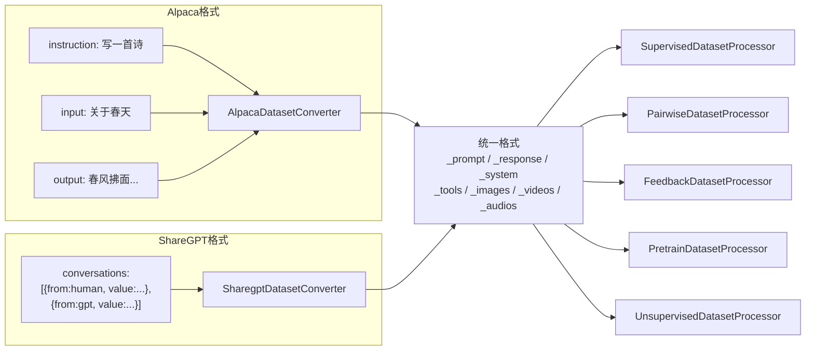
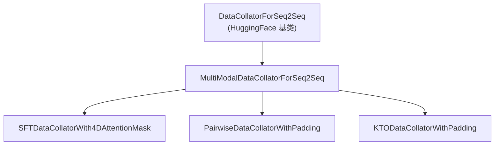
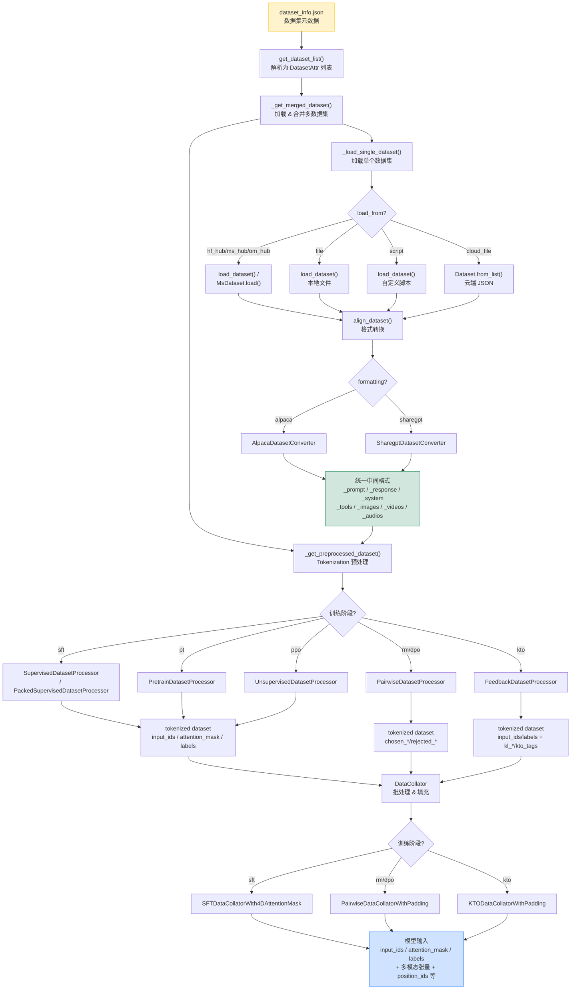
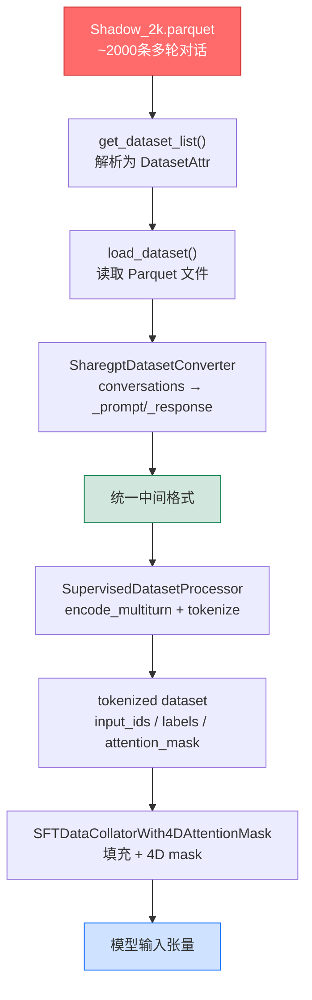

# 06 数据处理流水线

> 本文档深入剖析 LLaMA Factory 的数据处理流水线，采用"分-总-分"结构：首先分别介绍数据解析、加载、格式转换、模板系统、处理器和批处理器六大子模块，然后总结端到端数据流转全貌，最后以 Shadow_2k 数据集为例，从 Shadow-FT 视角深入分析数据需求与适配。

---

## 第一部分：各子模块深度剖析

### 1. 数据集解析（parser.py）

**源文件**：[`/workspace/src/llamafactory/data/parser.py`](file:///workspace/src/llamafactory/data/parser.py)

#### 1.1 DatasetAttr 数据类

`DatasetAttr` 是数据集属性的元数据容器，定义了数据集的来源、格式和列映射规则：

```python
@dataclass
class DatasetAttr:
    # 基础配置
    load_from: Literal["hf_hub", "ms_hub", "om_hub", "script", "file"]  # 数据来源
    dataset_name: str           # 数据集名称/路径
    formatting: Literal["alpaca", "sharegpt"] = "alpaca"  # 格式类型
    ranking: bool = False       # 是否为排序数据集（DPO/RM）

    # 扩展配置
    subset: Optional[str] = None   # 子集名称
    split: str = "train"           # 数据分片
    folder: Optional[str] = None  # 子目录
    num_samples: Optional[int] = None  # 采样数量限制

    # 通用列映射
    system: Optional[str] = None
    tools: Optional[str] = None
    images: Optional[str] = None
    videos: Optional[str] = None
    audios: Optional[str] = None

    # DPO 列映射
    chosen: Optional[str] = None
    rejected: Optional[str] = None
    kto_tag: Optional[str] = None

    # Alpaca 格式列映射
    prompt: Optional[str] = "instruction"
    query: Optional[str] = "input"
    response: Optional[str] = "output"
    history: Optional[str] = None

    # ShareGPT 格式列映射
    messages: Optional[str] = "conversations"
    # ShareGPT 角色标签
    role_tag: Optional[str] = "from"
    content_tag: Optional[str] = "value"
    user_tag: Optional[str] = "human"
    assistant_tag: Optional[str] = "gpt"
    observation_tag: Optional[str] = "observation"
    function_tag: Optional[str] = "function_call"
    system_tag: Optional[str] = "system"
```

**设计要点**：

1. **双格式支持**：`formatting` 字段决定使用 `AlpacaDatasetConverter` 还是 `SharegptDatasetConverter`
2. **列映射灵活性**：`columns` 和 `tags` 允许用户自定义数据集列名与框架内部字段的映射关系，无需修改原始数据
3. **多源加载**：`load_from` 支持 5 种数据来源，覆盖主流数据获取方式

#### 1.2 支持的数据来源

| 来源 | 标识 | 说明 | 加载方式 |
|------|------|------|----------|
| HuggingFace Hub | `hf_hub` | HuggingFace 模型仓库 | `load_dataset()` |
| ModelScope Hub | `ms_hub` | 魔搭社区 | `MsDataset.load()` |
| OpenMind Hub | `om_hub` | 昇思社区 | `OmDataset.load_dataset()` |
| 本地脚本 | `script` | 自定义加载脚本 | `load_dataset(path=local_path)` |
| 本地文件 | `file` | JSON/JSONL/Parquet 文件 | `load_dataset()` + 文件路径 |
| 云端文件 | `cloud_file` | S3/GCS 远程 JSON | `Dataset.from_list(read_cloud_json())` |

#### 1.3 get_dataset_list() 解析流程

```python
def get_dataset_list(dataset_names, dataset_dir):
    # 1. 读取 dataset_info.json
    if dataset_dir.startswith("REMOTE:"):
        config_path = hf_hub_download(repo_id=..., filename=DATA_CONFIG)
    else:
        config_path = os.path.join(dataset_dir, DATA_CONFIG)

    with open(config_path) as f:
        dataset_info = json.load(f)

    # 2. 为每个数据集名构建 DatasetAttr
    for name in dataset_names:
        if "hf_hub_url" in dataset_info[name]:
            dataset_attr = DatasetAttr("hf_hub", dataset_name=dataset_info[name]["hf_hub_url"])
        elif "ms_hub_url" in dataset_info[name]:
            dataset_attr = DatasetAttr("ms_hub", dataset_name=dataset_info[name]["ms_hub_url"])
        elif "om_hub_url" in dataset_info[name]:
            dataset_attr = DatasetAttr("om_hub", dataset_name=dataset_info[name]["om_hub_url"])
        elif "script_url" in dataset_info[name]:
            dataset_attr = DatasetAttr("script", dataset_name=dataset_info[name]["script_url"])
        elif "cloud_file_name" in dataset_info[name]:
            dataset_attr = DatasetAttr("cloud_file", dataset_name=dataset_info[name]["cloud_file_name"])
        else:
            dataset_attr = DatasetAttr("file", dataset_name=dataset_info[name]["file_name"])

        dataset_attr.join(dataset_info[name])  # 填充 columns/tags 等字段
        dataset_list.append(dataset_attr)
```

**解析优先级**：`hf_hub_url > ms_hub_url > om_hub_url > script_url > cloud_file_name > file_name`，优先使用 Hub 地址，最后回退到本地文件。

---

### 2. 数据加载（loader.py）

**源文件**：[`/workspace/src/llamafactory/data/loader.py`](file:///workspace/src/llamafactory/data/loader.py)

#### 2.1 _load_single_dataset()：单数据集加载

该函数是数据加载的原子操作，完成"读取原始数据 → 格式对齐"两步：

```python
def _load_single_dataset(dataset_attr, model_args, data_args, training_args):
    # 步骤1: 根据来源确定加载参数
    if dataset_attr.load_from in ["hf_hub", "ms_hub", "om_hub"]:
        data_path = dataset_attr.dataset_name
        data_name = dataset_attr.subset
    elif dataset_attr.load_from == "file":
        local_path = os.path.join(data_args.dataset_dir, dataset_attr.dataset_name)
        data_path = FILEEXT2TYPE.get(os.path.splitext(data_files[0])[-1][1:])

    # 步骤2: 调用对应加载器
    if dataset_attr.load_from == "ms_hub":
        dataset = MsDataset.load(dataset_name=data_path, ...)
    elif dataset_attr.load_from == "om_hub":
        dataset = OmDataset.load_dataset(path=data_path, ...)
    elif dataset_attr.load_from == "cloud_file":
        dataset = Dataset.from_list(read_cloud_json(data_path))
    else:  # hf_hub / script / file
        dataset = load_dataset(path=data_path, ...)

    # 步骤3: 采样限制
    if dataset_attr.num_samples is not None:
        indexes = np.random.permutation(len(dataset))[:target_num]
        dataset = dataset.select(indexes)

    # 步骤4: 格式对齐
    return align_dataset(dataset, dataset_attr, data_args, training_args)
```

**关键设计**：
- `FILEEXT2TYPE` 映射将文件扩展名（json/jsonl/parquet/csv/txt）转为 `load_dataset` 可识别的格式标识
- `num_samples` 支持过采样（当请求样本数大于数据集大小时，会随机复制补充）
- 流式模式下，本地文件会自动转为 `IterableDataset`

#### 2.2 _get_merged_dataset()：多数据集合并

```python
def _get_merged_dataset(dataset_names, model_args, data_args, training_args, stage, return_dict=False):
    datasets = {}
    for dataset_name, dataset_attr in zip(dataset_names, get_dataset_list(...)):
        # 校验：ranking 数据集只能用于 rm 阶段
        if (stage == "rm" and not dataset_attr.ranking) or (stage != "rm" and dataset_attr.ranking):
            raise ValueError("The dataset is not applicable in the current training stage.")

        datasets[dataset_name] = _load_single_dataset(dataset_attr, model_args, data_args, training_args)

    if return_dict:
        return datasets
    else:
        return merge_dataset(list(datasets.values()), data_args, seed=training_args.seed)
```

**合并策略**（在 `data_utils.py` 的 `merge_dataset` 中实现）：

| 策略 | 说明 |
|------|------|
| `concat` | 直接拼接（`concatenate_datasets`），非流式模式推荐 |
| `interleave_under` | 交错合并，首个数据集耗尽时停止 |
| `interleave_over` | 交错合并，所有数据集耗尽时停止 |

#### 2.3 _get_dataset_processor()：处理器选择

根据训练阶段选择对应的数据处理器：

```python
def _get_dataset_processor(data_args, stage, template, tokenizer, processor, do_generate=False):
    if stage == "pt":
        return PretrainDatasetProcessor(...)
    elif stage == "sft" and not do_generate:
        if data_args.packing:
            return PackedSupervisedDatasetProcessor(...)  # Packing SFT
        else:
            return SupervisedDatasetProcessor(...)        # 标准 SFT
    elif stage == "rm":
        return PairwiseDatasetProcessor(...)              # 排序（DPO/RM）
    elif stage == "kto":
        return FeedbackDatasetProcessor(...)              # KTO 反馈
    else:
        return UnsupervisedDatasetProcessor(...)          # 无监督（PPO）
```

**Shadow-FT 使用 `SupervisedDatasetProcessor`**，因为 Shadow-FT 的训练阶段为 `sft`。

#### 2.4 _get_preprocessed_dataset()：Tokenization 预处理

```python
def _get_preprocessed_dataset(dataset, data_args, training_args, stage, template, tokenizer, processor, is_eval=False):
    dataset_processor = _get_dataset_processor(...)

    column_names = list(next(iter(dataset)).keys())
    dataset = dataset.map(
        dataset_processor.preprocess_dataset,
        batched=True,
        batch_size=data_args.preprocessing_batch_size,
        remove_columns=column_names,
        **kwargs
    )

    # 打印示例
    if training_args.should_log:
        dataset_processor.print_data_example(next(iter(dataset)))

    return dataset
```

#### 2.5 get_dataset()：完整加载流程

```python
def get_dataset(template, model_args, data_args, training_args, stage, tokenizer, processor=None):
    # 路径1: 直接加载已 tokenized 的数据
    if data_args.tokenized_path is not None and has_tokenized_data(data_args.tokenized_path):
        tokenized_data = load_from_disk(data_args.tokenized_path)
        return get_dataset_module(tokenized_data)

    # 路径2: 完整加载流程
    with training_args.main_process_first(desc="load dataset"):
        dataset = _get_merged_dataset(data_args.dataset, model_args, data_args, training_args, stage)
        eval_dataset = _get_merged_dataset(data_args.eval_dataset, ..., return_dict=data_args.eval_on_each_dataset)

    with training_args.main_process_first(desc="pre-process dataset"):
        dataset = _get_preprocessed_dataset(dataset, ...)
        eval_dataset = _get_preprocessed_dataset(eval_dataset, ..., is_eval=True)
        dataset_dict = split_dataset(dataset, eval_dataset, data_args, seed=training_args.seed)

        # 可选: 保存 tokenized 数据到磁盘
        if data_args.tokenized_path is not None:
            dataset_dict.save_to_disk(data_args.tokenized_path)

    return get_dataset_module(dataset_dict)
```

**缓存机制**：`tokenized_path` 参数允许将 tokenization 结果持久化，避免重复预处理。`main_process_first` 确保分布式训练中仅主进程执行加载，其余进程等待。

---

### 3. 格式转换（converter.py）

**源文件**：[`/workspace/src/llamafactory/data/converter.py`](file:///workspace/src/llamafactory/data/converter.py)

#### 3.1 统一中间格式

无论输入是 Alpaca 还是 ShareGPT 格式，converter 的输出都是统一的 7 字段字典：

```python
{
    "_prompt":   [{"role": "user", "content": "..."}, ...],   # 对话历史 + 当前用户输入
    "_response": [{"role": "assistant", "content": "..."}],   # 模型回复（1条=普通, 2条=排序, 2条含空=KTO）
    "_system":   "系统提示词" | "",                             # 系统消息
    "_tools":    "工具描述JSON" | "",                           # 工具定义
    "_images":   [ImageObject, ...] | None,                    # 图像列表
    "_videos":   [VideoInput, ...] | None,                     # 视频列表
    "_audios":   [AudioInput, ...] | None,                     # 音频列表
}
```

#### 3.2 AlpacaDatasetConverter

将 Alpaca 格式（instruction/input/output）转换为统一格式：

```python
@dataclass
class AlpacaDatasetConverter(DatasetConverter):
    def __call__(self, example):
        prompt = []
        # 拼接历史对话
        if self.dataset_attr.history and isinstance(example[self.dataset_attr.history], list):
            for old_prompt, old_response in example[self.dataset_attr.history]:
                prompt.append({"role": Role.USER.value, "content": old_prompt})
                prompt.append({"role": Role.ASSISTANT.value, "content": old_response})

        # 拼接当前指令和输入
        query = []
        if self.dataset_attr.prompt and example[self.dataset_attr.prompt]:
            query.append(example[self.dataset_attr.prompt])
        if self.dataset_attr.query and example[self.dataset_attr.query]:
            query.append(example[self.dataset_attr.query])
        prompt.append({"role": Role.USER.value, "content": "\n".join(query)})

        # 根据训练类型构建 response
        if self.dataset_attr.kto_tag and isinstance(example[self.dataset_attr.kto_tag], bool):
            # KTO: response 包含 [实际回复, 空回复] 或 [空回复, 实际回复]
            response = [{"role": Role.ASSISTANT.value, "content": example[self.dataset_attr.response]}]
            if example[self.dataset_attr.kto_tag]:  # desirable
                response = response + [{"role": Role.ASSISTANT.value, "content": ""}]
            else:  # undesirable
                response = [{"role": Role.ASSISTANT.value, "content": ""}] + response
        elif self.dataset_attr.ranking:
            # Pairwise: response = [chosen, rejected]
            response = [
                {"role": Role.ASSISTANT.value, "content": example[self.dataset_attr.chosen]},
                {"role": Role.ASSISTANT.value, "content": example[self.dataset_attr.rejected]},
            ]
        elif self.dataset_attr.response:
            # 普通 SFT: response = [回复]
            response = [{"role": Role.ASSISTANT.value, "content": example[self.dataset_attr.response]}]
        else:
            response = []  # 无监督

        return {
            "_prompt": prompt, "_response": response,
            "_system": example[self.dataset_attr.system] if self.dataset_attr.system else "",
            "_tools": example[self.dataset_attr.tools] if self.dataset_attr.tools else "",
            "_images": self._find_medias(example[self.dataset_attr.images]) if self.dataset_attr.images else None,
            "_videos": self._find_medias(example[self.dataset_attr.videos]) if self.dataset_attr.videos else None,
            "_audios": self._find_medias(example[self.dataset_attr.audios]) if self.dataset_attr.audios else None,
        }
```

#### 3.3 SharegptDatasetConverter

将 ShareGPT 格式（conversations 列表）转换为统一格式：

```python
@dataclass
class SharegptDatasetConverter(DatasetConverter):
    def __call__(self, example):
        tag_mapping = {
            self.dataset_attr.user_tag: Role.USER.value,
            self.dataset_attr.assistant_tag: Role.ASSISTANT.value,
            self.dataset_attr.observation_tag: Role.OBSERVATION.value,
            self.dataset_attr.function_tag: Role.FUNCTION.value,
            self.dataset_attr.system_tag: Role.SYSTEM.value,
        }
        odd_tags = (self.dataset_attr.user_tag, self.dataset_attr.observation_tag)
        even_tags = (self.dataset_attr.assistant_tag, self.dataset_attr.function_tag)

        messages = example[self.dataset_attr.messages]

        # 提取系统消息
        if messages[0][self.dataset_attr.role_tag] == self.dataset_attr.system_tag:
            system = messages[0][self.dataset_attr.content_tag]
            messages = messages[1:]
        else:
            system = example[self.dataset_attr.system] if self.dataset_attr.system else ""

        # 角色标签对齐 + 交替校验
        aligned_messages = []
        for turn_idx, message in enumerate(messages):
            if message[self.dataset_attr.role_tag] not in accept_tags[turn_idx % 2]:
                broken_data = True; break
            aligned_messages.append({
                "role": tag_mapping[message[self.dataset_attr.role_tag]],
                "content": message[self.dataset_attr.content_tag],
            })

        # KTO / Pairwise / 普通分类处理（同 Alpaca）
        ...
```

#### 3.4 两种格式对比



**关键差异**：

| 维度 | Alpaca 格式 | ShareGPT 格式 |
|------|------------|--------------|
| 对话结构 | 扁平字段（instruction/input/output） | 嵌套列表（conversations） |
| 多轮支持 | 通过 `history` 字段 | 原生支持多轮对话 |
| 角色标签 | 固定（user/assistant） | 可自定义（human/gpt 等） |
| 系统消息 | 独立 `system` 列 | 首条消息或独立列 |
| 工具调用 | 不原生支持 | 支持 observation/function 角色 |
| Shadow_2k | — | ✅ 使用此格式 |

---

### 4. 模板系统（template.py）

**源文件**：[`/workspace/src/llamafactory/data/template.py`](file:///workspace/src/llamafactory/data/template.py)

#### 4.1 Template 数据类

```python
@dataclass
class Template:
    format_user: "Formatter"        # 用户消息格式化器
    format_assistant: "Formatter"   # 助手消息格式化器
    format_system: "Formatter"      # 系统消息格式化器
    format_function: "Formatter"    # 函数调用格式化器
    format_observation: "Formatter" # 观察结果格式化器
    format_tools: "Formatter"       # 工具描述格式化器
    format_prefix: "Formatter"      # 前缀格式化器
    default_system: str             # 默认系统提示词
    stop_words: list[str]           # 停止词列表
    thought_words: tuple[str, str]  # 思维链标记（开始/结束）
    efficient_eos: bool             # 是否高效 EOS（不重复添加 eos）
    replace_eos: bool               # 是否用 stop_word 替换 eos
    replace_jinja_template: bool    # 是否替换 tokenizer 的 jinja 模板
    enable_thinking: Optional[bool] # 是否启用思维链
    mm_plugin: "BasePlugin"         # 多模态插件
```

#### 4.2 编码方法

Template 提供两种编码方式：

**encode_oneturn**：将所有消息编码为单对 (prompt_ids, response_ids)

```python
def encode_oneturn(self, tokenizer, messages, system, tools):
    encoded_messages = self._encode(tokenizer, messages, system, tools)
    prompt_ids = []
    for encoded_ids in encoded_messages[:-1]:
        prompt_ids += encoded_ids
    response_ids = encoded_messages[-1]
    return prompt_ids, response_ids
```

**encode_multiturn**：将消息编码为多对 [(prompt_ids, response_ids), ...]

```python
def encode_multiturn(self, tokenizer, messages, system, tools):
    encoded_messages = self._encode(tokenizer, messages, system, tools)
    return [(encoded_messages[i], encoded_messages[i+1])
            for i in range(0, len(encoded_messages), 2)]
```

**_encode 核心逻辑**：

```python
def _encode(self, tokenizer, messages, system, tools):
    system = system or self.default_system
    encoded_messages = []
    for i, message in enumerate(messages):
        elements = []
        if i == 0:
            elements += self.format_prefix.apply()
            if system or tools:
                tool_text = self.format_tools.apply(content=tools)[0] if tools else ""
                elements += self.format_system.apply(content=(system + tool_text))

        if message["role"] == Role.USER:
            elements += self.format_user.apply(content=message["content"], idx=str(i // 2))
        elif message["role"] == Role.ASSISTANT:
            elements += self.format_assistant.apply(content=message["content"])
        elif message["role"] == Role.OBSERVATION:
            elements += self.format_observation.apply(content=message["content"])
        elif message["role"] == Role.FUNCTION:
            elements += self.format_function.apply(content=message["content"])

        encoded_messages.append(self._convert_elements_to_ids(tokenizer, elements))
    return encoded_messages
```

#### 4.3 Llama2Template：系统消息融合

Llama2 的特殊之处在于将系统消息融合到第一条用户消息中：

```python
@dataclass
class Llama2Template(Template):
    @override
    def _encode(self, tokenizer, messages, system, tools):
        for i, message in enumerate(messages):
            if message["role"] == Role.USER:
                # 系统消息直接拼接到用户消息前面
                elements += self.format_user.apply(content=system_text + message["content"])
            # ... 其他角色正常处理
```

#### 4.4 ReasoningTemplate：思维链支持

用于 DeepSeek-R1、Qwen3 等推理模型，支持 `<think>...</think>` 思维链标记：

```python
@dataclass
class ReasoningTemplate(Template):
    @override
    def encode_oneturn(self, tokenizer, messages, system, tools):
        messages = deepcopy(messages)
        # 移除中间轮次的思维链内容
        for i in range(1, len(messages) - 2, 2):
            messages[i]["content"] = self.remove_thought(messages[i]["content"])

        if self.enable_thinking is False:
            messages[-1]["content"] = self.remove_thought(messages[-1]["content"])

        prompt_ids, response_ids = super().encode_oneturn(tokenizer, messages, system, tools)

        # 如果最后一轮没有思维链标记，添加空的
        if thought_words not in messages[-1]["content"]:
            if not self.enable_thinking:  # 不计算 loss
                prompt_ids += self.get_thought_word_ids(tokenizer)
            else:  # 计算 loss
                response_ids = self.get_thought_word_ids(tokenizer) + response_ids

        return prompt_ids, response_ids
```

#### 4.5 模板架构图

```mermaid
graph TD
    subgraph "模板注册表 TEMPLATES"
        T1[alpaca] --> TC[Template]
        T2[qwen] --> TC
        T3[llama3] --> TC
        T4[chatml] --> TC
        T5[deepseek3] --> TC
        T6[llama2] --> LC[Llama2Template]
        T7[gemma] --> LC
        T8[mistral] --> LC
        T9[deepseekr1] --> RC[ReasoningTemplate]
        T10[qwen3] --> RC
        T11[mimo] --> RC
    end

    subgraph "格式化器 Formatter"
        F1[StringFormatter: 含 {{content}} 占位符]
        F2[EmptyFormatter: 无占位符]
        F3[FunctionFormatter: 工具调用格式化]
        F4[ToolFormatter: 工具描述格式化]
    end

    TC --> F1
    TC --> F2
    TC --> F3
    TC --> F4
    LC -->|继承| TC
    RC -->|继承| TC

    subgraph "多模态插件 MM Plugin"
        MP1[BasePlugin]
        MP2[Qwen2VLPlugin]
        MP3[LlavaPlugin]
        MP4[MllamaPlugin]
        MP5[MiniCPMVPlugin]
        MP6[InternVLPlugin]
        MP7[Gemma3Plugin]
    end

    TC --> MP1
```

**模板继承关系**：
- `Template`：基础模板，系统消息独立
- `Llama2Template(Template)`：系统消息融合到首条用户消息
- `ReasoningTemplate(Template)`：支持思维链 `<think>...</think>`

---

### 5. 数据处理器（processor/）

**源文件**：[`/workspace/src/llamafactory/data/processor/`](file:///workspace/src/llamafactory/data/processor/)

#### 5.1 基类 DatasetProcessor

```python
@dataclass
class DatasetProcessor(ABC):
    template: "Template"
    tokenizer: "PreTrainedTokenizer"
    processor: Optional["ProcessorMixin"]
    data_args: "DataArguments"

    @abstractmethod
    def preprocess_dataset(self, examples): ...

    @abstractmethod
    def print_data_example(self, example): ...
```

#### 5.2 SupervisedDatasetProcessor（Shadow-FT 使用）

```python
@dataclass
class SupervisedDatasetProcessor(DatasetProcessor):
    def _encode_data_example(self, prompt, response, system, tools, images, videos, audios):
        # 1. 多模态消息预处理
        messages = self.template.mm_plugin.process_messages(prompt + response, images, videos, audios, self.processor)
        input_ids, labels = self.template.mm_plugin.process_token_ids([], [], images, videos, audios, self.tokenizer, self.processor)

        # 2. 多轮编码
        encoded_pairs = self.template.encode_multiturn(self.tokenizer, messages, system, tools)

        # 3. 逐轮拼接，应用截断策略
        for turn_idx, (source_ids, target_ids) in enumerate(encoded_pairs):
            source_len, target_len = infer_seqlen(len(source_ids), len(target_ids), cutoff_len - total_length)
            source_ids = source_ids[:source_len]
            target_ids = target_ids[:target_len]

            # 标签构建：prompt 部分用 IGNORE_INDEX 遮蔽
            if self.data_args.train_on_prompt:
                source_label = source_ids
            else:
                source_label = [IGNORE_INDEX] * source_len

            # mask_history: 仅在最后一轮计算 loss
            if self.data_args.mask_history and turn_idx != 0:
                target_label = [IGNORE_INDEX] * target_len
            else:
                target_label = target_ids

            input_ids += source_ids + target_ids
            labels += source_label + target_label

        return input_ids, labels
```

**截断策略**（`infer_seqlen`）：

```python
def infer_seqlen(source_len, target_len, cutoff_len):
    if target_len * 2 < cutoff_len:       # target 较短，优先截断 source
        max_target_len = cutoff_len
    elif source_len * 2 < cutoff_len:     # source 较短，优先截断 target
        max_target_len = cutoff_len - source_len
    else:                                  # 两者都长，按比例截断
        max_target_len = int(cutoff_len * (target_len / (source_len + target_len)))

    new_target_len = min(max_target_len, target_len)
    max_source_len = max(cutoff_len - new_target_len, 0)
    new_source_len = min(max_source_len, source_len)
    return new_source_len, new_target_len
```

#### 5.3 PackedSupervisedDatasetProcessor

在标准 SFT 基础上增加 Packing 优化，使用贪心背包算法将多个短样本打包到同一个 `cutoff_len` 长度中：

```python
@dataclass
class PackedSupervisedDatasetProcessor(SupervisedDatasetProcessor):
    def preprocess_dataset(self, examples):
        # 1. 编码所有样本
        for i in range(len(examples["_prompt"])):
            input_ids, labels = self._encode_data_example(...)
            lengths.append(len(input_ids))
            length2indexes[length].append(valid_num)
            batch_input_ids.append(input_ids)

        # 2. 贪心背包打包
        knapsacks = greedy_knapsack(lengths, self.data_args.cutoff_len)

        # 3. 拼接打包后的样本
        for knapsack in knapsacks:
            packed_input_ids, packed_position_ids, packed_labels = [], [], []
            for i, length in enumerate(knapsack):
                index = length2indexes[length].pop()
                packed_input_ids += batch_input_ids[index]
                packed_position_ids += list(range(len(batch_input_ids[index])))
                packed_labels += batch_labels[index]

            # 填充到 cutoff_len
            pad_length = cutoff_len - len(packed_input_ids) + 1
            packed_input_ids += [pad_token_id] * pad_length
            packed_position_ids += [0] * pad_length
            packed_labels += [IGNORE_INDEX] * pad_length
```

#### 5.4 其他处理器

| 处理器 | 训练阶段 | 输出字段 |
|--------|---------|----------|
| `PretrainDatasetProcessor` | pt | `input_ids`, `attention_mask` |
| `SupervisedDatasetProcessor` | sft | `input_ids`, `attention_mask`, `labels`, `images/videos/audios` |
| `PackedSupervisedDatasetProcessor` | sft (packing) | + `position_ids` |
| `PairwiseDatasetProcessor` | rm/dpo | `chosen_input_ids/labels`, `rejected_input_ids/labels`, ... |
| `FeedbackDatasetProcessor` | kto | `input_ids/labels`, `kl_input_ids/labels`, `kto_tags` |
| `UnsupervisedDatasetProcessor` | ppo | `input_ids`, `labels`（同 input_ids） |

---

### 6. 批处理器（collator.py）

**源文件**：[`/workspace/src/llamafactory/data/collator.py`](file:///workspace/src/llamafactory/data/collator.py)

#### 6.1 继承体系



#### 6.2 MultiModalDataCollatorForSeq2Seq

核心批处理器，处理多模态输入的填充和特殊张量构建：

```python
@dataclass
class MultiModalDataCollatorForSeq2Seq(DataCollatorForSeq2Seq):
    template: Optional["Template"] = None
    processor: Optional["ProcessorMixin"] = None

    def __call__(self, features):
        # 1. 收集多模态数据
        batch_images, batch_videos, batch_audios = [], [], []
        for feature in features:
            images = feature.pop("images", None) or []
            batch_images.extend(images)
            # ... 同理 videos, audios

        # 2. 防止 ZeRO-3/FSDP 挂起：若无图像/音频则注入 fake 数据
        if self.template.mm_plugin.image_token and sum(batch_imglens) == 0:
            fake_messages = [{"role": "user", "content": IMAGE_PLACEHOLDER}]
            fake_images = [Image.new("RGB", (64, 64), (255, 255, 255))]
            # ... 处理 fake input_ids

        # 3. 获取多模态输入
        mm_inputs = self.template.mm_plugin.get_mm_inputs(
            batch_images, batch_videos, batch_audios,
            batch_imglens, batch_vidlens, batch_audlens,
            batch_input_ids, self.processor
        )

        # 4. 处理特殊模型需求
        if hasattr(self.model, "get_rope_index"):  # Qwen2-VL mRoPE
            features["position_ids"], features["rope_deltas"] = self.model.get_rope_index(...)
        if "cross_attention_mask" in mm_inputs:    # mllama
            # 对齐 cross_attention_mask 长度
        if "image_bound" in features:               # MiniCPM-V
            features["position_ids"] = torch.arange(seq_length).long().repeat(bsz, 1)
            return {"data": features, ...}

        # 5. 调用父类填充
        features = super().__call__(features)
        features.update(mm_inputs)
        return features
```

#### 6.3 SFTDataCollatorWith4DAttentionMask

在多模态批处理基础上增加 4D 注意力掩码支持（用于 Packing）：

```python
@dataclass
class SFTDataCollatorWith4DAttentionMask(MultiModalDataCollatorForSeq2Seq):
    block_diag_attn: bool = False
    attn_implementation: Literal["eager", "sdpa", "flash_attention_2"] = "eager"
    compute_dtype: torch.dtype = torch.float32

    def __call__(self, features):
        features = super().__call__(features)
        if self.block_diag_attn and self.attn_implementation != "flash_attention_2":
            features["attention_mask"] = prepare_4d_attention_mask(
                features["attention_mask"], self.compute_dtype
            )
        return features
```

**4D 注意力掩码**（`prepare_4d_attention_mask`）将 2D 掩进掩码扩展为 4D 形式，支持 Packing 场景下不同样本间的注意力隔离：

```
输入: [[1, 1, 2, 2, 2, 0]]  (1=样本1, 2=样本2, 0=padding)

输出: 下三角 + 同样本内可见 + padding 不可见
[[o, x, x, x, x, x],
 [o, o, x, x, x, x],
 [x, x, o, x, x, x],
 [x, x, o, o, x, x],
 [x, x, o, o, o, x],
 [x, x, x, x, x, x]]
```

#### 6.4 PairwiseDataCollatorWithPadding

将每个样本展开为 chosen 和 rejected 两个独立样本：

```python
@dataclass
class PairwiseDataCollatorWithPadding(MultiModalDataCollatorForSeq2Seq):
    def __call__(self, features):
        concatenated_features = []
        for key in ("chosen", "rejected"):
            for feature in features:
                target_feature = {
                    "input_ids": feature[f"{key}_input_ids"],
                    "attention_mask": feature[f"{key}_attention_mask"],
                    "labels": feature[f"{key}_labels"],
                    "images": feature["images"], ...
                }
                concatenated_features.append(target_feature)
        return super().__call__(concatenated_features)
```

#### 6.5 KTODataCollatorWithPadding

为 KTO 训练构建 target + KL 双批数据：

```python
@dataclass
class KTODataCollatorWithPadding(MultiModalDataCollatorForSeq2Seq):
    def __call__(self, features):
        target_features, kl_features, kto_tags = [], [], []
        for feature in features:
            target_features.append({...})  # 实际 input_ids/labels
            kl_features.append({...})       # KL 散度对照 input_ids/labels
            kto_tags.append(feature["kto_tags"])

        batch = super().__call__(target_features)
        kl_batch = super().__call__(kl_features)
        batch["kl_input_ids"] = kl_batch["input_ids"]
        batch["kl_attention_mask"] = kl_batch["attention_mask"]
        batch["kl_labels"] = kl_batch["labels"]
        batch["kto_tags"] = torch.tensor(kto_tags)
        return batch
```

---

## 第二部分：端到端数据流转总览

### 全流程图



### 流转步骤总结

| 步骤 | 函数 | 输入 | 输出 |
|------|------|------|------|
| 1. 解析 | `get_dataset_list()` | `dataset_info.json` + 数据集名列表 | `List[DatasetAttr]` |
| 2. 加载 | `_load_single_dataset()` | `DatasetAttr` | 原始 HuggingFace Dataset |
| 3. 对齐 | `align_dataset()` → Converter | 原始 Dataset | 统一中间格式 Dataset |
| 4. 合并 | `_get_merged_dataset()` | 多个已对齐 Dataset | 合并后的 Dataset |
| 5. 预处理 | `_get_preprocessed_dataset()` → Processor | 合并 Dataset | tokenized Dataset |
| 6. 批处理 | `DataCollator` | tokenized Dataset 批次 | 模型输入张量 |

---

## 第三部分：Shadow_2k 数据集与 Shadow-FT 数据需求深度分析

### 1. Shadow_2k 数据集配置

**配置文件**：[`/workspace/data/dataset_info.json`](file:///workspace/data/dataset_info.json)

```json
"Shadow_2k": {
  "file_name": "Shadow_2k.parquet",
  "formatting": "sharegpt",
  "columns": {
    "messages": "conversations"
  }
}
```

### 2. Shadow_2k 在流水线中的完整数据流



### 3. Shadow_2k 数据格式详解

Shadow_2k 使用 ShareGPT 格式，其原始数据结构为：

```json
{
  "conversations": [
    {"from": "human", "value": "请解释什么是机器学习"},
    {"from": "gpt", "value": "机器学习是人工智能的一个分支..."}
  ]
}
```

经过 `SharegptDatasetConverter` 转换后的中间格式：

```python
{
    "_prompt": [
        {"role": "user", "content": "请解释什么是机器学习"}
    ],
    "_response": [
        {"role": "assistant", "content": "机器学习是人工智能的一个分支..."}
    ],
    "_system": "",
    "_tools": "",
    "_images": None,
    "_videos": None,
    "_audios": None
}
```

对于多轮对话，`_prompt` 会包含历史对话：

```python
{
    "_prompt": [
        {"role": "user", "content": "什么是深度学习？"},
        {"role": "assistant", "content": "深度学习是..."},
        {"role": "user", "content": "它和机器学习有什么区别？"}
    ],
    "_response": [
        {"role": "assistant", "content": "主要区别在于..."}
    ],
    ...
}
```

### 4. Shadow-FT 对数据的关键约束

#### 4.1 格式兼容性

Shadow_2k 选择 ShareGPT 格式而非 Alpaca 格式，原因如下：

| 维度 | 分析 |
|------|------|
| 多轮支持 | ShareGPT 原生支持多轮对话，Alpaca 需额外 `history` 字段 |
| 角色标签 | ShareGPT 支持自定义 `from`/`value` 标签，灵活性更高 |
| 工具调用 | ShareGPT 支持 `observation`/`function_call` 角色，Alpaca 不支持 |
| 数据质量 | ShareGPT 格式更接近真实对话场景，适合 SFT 微调 |

#### 4.2 Shadow-FT 训练参数与数据的关系

Shadow-FT 的训练参数直接影响数据处理行为：

| 参数 | 值 | 对数据处理的影响 |
|------|-----|-----------------|
| `stage=sft` | 选择 `SupervisedDatasetProcessor` | 生成 `input_ids` + `labels`（prompt 部分用 `IGNORE_INDEX` 遮蔽） |
| `cutoff_len=4096` | 截断策略 | `infer_seqlen()` 按比例分配 prompt 和 response 的长度 |
| `train_on_prompt=False` | 默认不训练 prompt | `source_label = [IGNORE_INDEX] * source_len` |
| `packing=False` | 不使用 Packing | 每个样本独立，不拼接 |
| `template` | 根据 Base 模型选择 | 决定 token 化时的格式化模板 |

#### 4.3 Shadow-FT 数据处理的关键路径

Shadow-FT 的 Base 模型训练完整数据路径：

```
Shadow_2k.parquet
  → SharegptDatasetConverter: conversations → _prompt + _response
  → SupervisedDatasetProcessor._encode_data_example():
      1. mm_plugin.process_messages(prompt + response, images, videos, audios, processor)
         → Base 模型通常无多模态插件，直接返回
      2. template.encode_multiturn(tokenizer, messages, system, tools)
         → 使用 Base 模型对应的模板（如 qwen3、llama3）编码
      3. infer_seqlen() 截断
      4. 构建 labels: prompt → IGNORE_INDEX, response → 原始 token ids
  → SFTDataCollatorWith4DAttentionMask:
      1. 收集多模态数据（Shadow_2k 无多模态，注入 fake image 防止 ZeRO-3 挂起）
      2. 调用 DataCollatorForSeq2Seq 填充
      3. 若 block_diag_attn=True，生成 4D 注意力掩码
  → 模型输入: {input_ids, attention_mask, labels}
```

#### 4.4 Shadow_2k 数据集的设计考量

**为什么是 2000 条？**

Shadow-FT 论文的核心发现是：**少量高质量数据的微调增量（ΔW）即可有效迁移到 Instruct 模型**。2000 条数据是一个经过实验验证的平衡点：

1. **足够学习**：2000 条足以让模型学习到目标领域的知识模式
2. **避免过拟合**：数据量不大，在 Base 模型上微调不会过度偏移
3. **保持 ΔW 的"纯净性"**：少量数据产生的 ΔW 更集中、更可迁移

**为什么选择 ShareGPT 格式？**

Shadow_2k 需要支持多轮对话场景，ShareGPT 格式的 `conversations` 字段天然支持多轮对话结构，且角色标签可自定义，适配不同模型的对话格式需求。

**数据流转中的模板适配**

Shadow-FT 需要在不同 Base 模型上训练（Qwen3、Llama3、Gemma 等），每个模型对应不同的模板。数据流转时，`template` 参数决定了 tokenization 的格式化方式：

| Base 模型 | 模板 | 格式化示例 |
|-----------|------|-----------|
| Qwen3-8B-Base | `qwen3` (ReasoningTemplate) | `<\|im_start\|>user\n...<\|im_end\|>\n<\|im_start\|>assistant\n` |
| Llama-3-8B | `llama3` | `<\|start_header_id\|>user<\|end_header_id\|>\n\n...<\|eot_id\|>` |
| Gemma-3-27B | `gemma3` (Llama2Template) | `<start_of_turn>user\n...<end_of_turn>\n<start_of_turn>model\n` |

这意味着同一条 Shadow_2k 数据，在不同模型上训练时，会被格式化为不同的 token 序列，但语义内容保持一致。

### 5. Shadow-FT 视角下的数据流水线优化建议

#### 5.1 缓存复用

Shadow-FT 的实验流程中，同一数据集 `Shadow_2k` 会在 Base 和 Instruct 模型上分别训练。利用 `tokenized_path` 参数可以缓存 tokenization 结果，但由于不同模型的 tokenizer 和 template 不同，缓存不能跨模型复用。建议为每个模型对维护独立的缓存路径。

#### 5.2 数据质量保障

`SharegptDatasetConverter` 内置了数据校验逻辑：

```python
# 交替校验：奇数位必须是 user/observation，偶数位必须是 assistant/function
if message[self.dataset_attr.role_tag] not in accept_tags[turn_idx % 2]:
    broken_data = True

# 消息数量校验：普通 SFT 要求奇数条消息（最后一条是 assistant）
if not self.dataset_attr.ranking and len(aligned_messages) % 2 != 1:
    broken_data = True
```

对于 Shadow_2k 数据集，每条样本必须满足：对话以 user 开始，交替出现 user/assistant，且最后一条为 assistant。不满足条件的样本会被跳过并记录警告。

#### 5.3 与 Shadow-FT 增量嫁接的衔接

数据处理流水线的输出（tokenized dataset）直接进入训练循环，训练完成后保存模型权重。Shadow-FT 的增量嫁接操作（`apply_diff.py`）在权重层面进行，不涉及数据层面的修改。因此，数据流水线对 Shadow-FT 的支持是**透明的**——Shadow-FT 无需修改任何数据处理逻辑，只需确保训练数据通过标准 SFT 流水线正确处理即可。

这种设计体现了 Shadow-FT 的核心优势：**方法创新与数据流水线完全解耦**，增量嫁接操作纯粹在权重空间进行，数据处理完全复用 LLaMA Factory 的标准能力。
