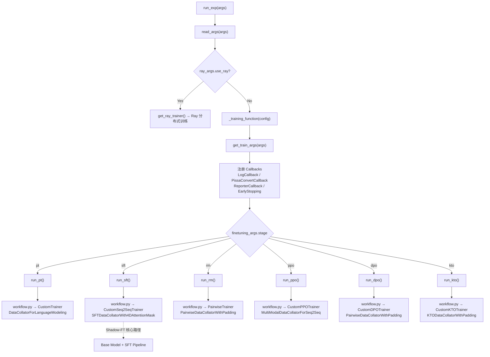
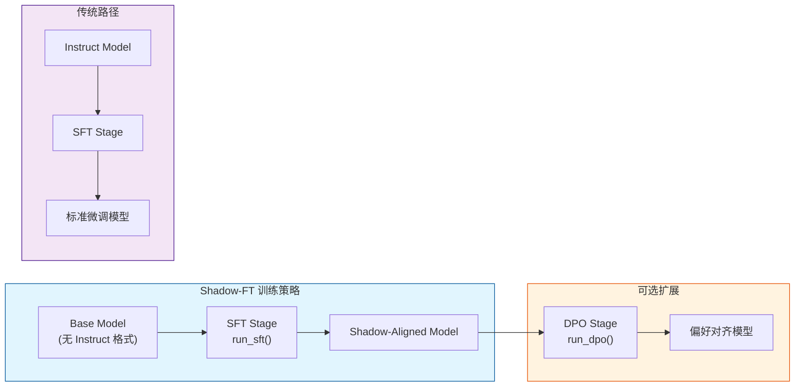
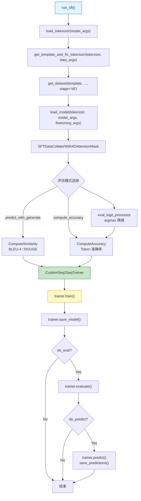

# 07 训练引擎

> 深度解析 LLaMA Factory 训练引擎架构，以 Shadow-FT 视角审视六种训练方法的统一调度与核心实现。

---

## 一、训练引擎总览

LLaMA Factory 的训练引擎采用 **统一入口 + 模块分发** 的架构设计。所有训练任务均由 `tuner.py` 作为唯一入口，根据 `finetuning_args.stage` 参数将训练流程分派到六种不同的训练方法中。每种方法由三个核心组件构成：

| 组件 | 职责 |
|------|------|
| `workflow.py` | 训练流程编排：加载分词器 → 构建模板 → 加载数据集 → 加载模型 → 创建 Trainer → 训练/评估 |
| `trainer.py` | 自定义 Trainer：继承 HuggingFace/TRL 基类，重写损失计算、优化器创建等核心逻辑 |
| `metric.py` | 评估指标（可选）：BLEU/ROUGE/准确率等 |

### 1.1 训练引擎选择与执行流程



### 1.2 统一入口：tuner.py

文件：[tuner.py](file:///workspace/src/llamafactory/train/tuner.py)

`_training_function` 是所有训练的真正执行函数，其核心逻辑是参数解析 → Callback 注册 → 阶段分派：

```python
def _training_function(config: dict[str, Any]) -> None:
    args = config.get("args")
    callbacks: list[Any] = config.get("callbacks")
    model_args, data_args, training_args, finetuning_args, generating_args = get_train_args(args)

    callbacks.append(LogCallback())
    if finetuning_args.pissa_convert:
        callbacks.append(PissaConvertCallback())
    if finetuning_args.use_swanlab:
        callbacks.append(get_swanlab_callback(finetuning_args))
    if finetuning_args.early_stopping_steps is not None:
        callbacks.append(EarlyStoppingCallback(early_stopping_patience=finetuning_args.early_stopping_steps))
    callbacks.append(ReporterCallback(model_args, data_args, finetuning_args, generating_args))

    if finetuning_args.stage == "pt":
        run_pt(model_args, data_args, training_args, finetuning_args, callbacks)
    elif finetuning_args.stage == "sft":
        run_sft(model_args, data_args, training_args, finetuning_args, generating_args, callbacks)
    elif finetuning_args.stage == "rm":
        run_rm(model_args, data_args, training_args, finetuning_args, callbacks)
    elif finetuning_args.stage == "ppo":
        run_ppo(model_args, data_args, training_args, finetuning_args, generating_args, callbacks)
    elif finetuning_args.stage == "dpo":
        run_dpo(model_args, data_args, training_args, finetuning_args, callbacks)
    elif finetuning_args.stage == "kto":
        run_kto(model_args, data_args, training_args, finetuning_args, callbacks)
```

**Shadow-FT 的关键路径**：当 `stage="sft"` 时，训练引擎进入 `run_sft()`，这正是 Shadow-FT 在 Base 模型上执行监督微调的入口。

---

## 二、六种训练方法详解

### 2.1 SFT（Supervised Fine-Tuning）—— Shadow-FT 的核心

> Shadow-FT 的核心训练阶段，在 Base 模型上使用 SFT 流水线完成指令微调。

#### 2.1.1 workflow.py：训练流程编排

文件：[sft/workflow.py](file:///workspace/src/llamafactory/train/sft/workflow.py)

SFT 的训练流程遵循标准五步范式：

```python
def run_sft(
    model_args, data_args, training_args, finetuning_args, generating_args, callbacks=None,
):
    # Step 1: 加载分词器
    tokenizer_module = load_tokenizer(model_args)
    tokenizer = tokenizer_module["tokenizer"]
    # Step 2: 获取模板并修正分词器
    template = get_template_and_fix_tokenizer(tokenizer, data_args)
    # Step 3: 加载数据集
    dataset_module = get_dataset(template, model_args, data_args, training_args, stage="sft", **tokenizer_module)
    # Step 4: 加载模型
    model = load_model(tokenizer, model_args, finetuning_args, training_args.do_train)
    # Step 5: 创建数据整理器
    data_collator = SFTDataCollatorWith4DAttentionMask(
        template=template,
        model=model if not training_args.predict_with_generate else None,
        pad_to_multiple_of=8 if training_args.do_train else None,
        label_pad_token_id=IGNORE_INDEX if data_args.ignore_pad_token_for_loss else tokenizer.pad_token_id,
        block_diag_attn=model_args.block_diag_attn,
        attn_implementation=getattr(model.config, "_attn_implementation", None),
        compute_dtype=model_args.compute_dtype,
        **tokenizer_module,
    )
    # Step 6: 配置评估指标
    metric_module = {}
    if training_args.predict_with_generate:
        metric_module["compute_metrics"] = ComputeSimilarity(tokenizer=tokenizer)
    elif finetuning_args.compute_accuracy:
        metric_module["compute_metrics"] = ComputeAccuracy()
        metric_module["preprocess_logits_for_metrics"] = eval_logit_processor
    # Step 7: 创建 Trainer 并训练
    trainer = CustomSeq2SeqTrainer(
        model=model, args=training_args, finetuning_args=finetuning_args,
        data_collator=data_collator, callbacks=callbacks, gen_kwargs=gen_kwargs,
        **dataset_module, **tokenizer_module, **metric_module,
    )
    if training_args.do_train:
        train_result = trainer.train(resume_from_checkpoint=training_args.resume_from_checkpoint)
        trainer.save_model()
```

**Shadow-FT 的关键点**：Shadow-FT 在 Base 模型（无 Instruct 格式对齐）上调用此 SFT 流水线，利用 `SFTDataCollatorWith4DAttentionMask` 处理多轮对话的注意力掩码，并通过 `IGNORE_INDEX` 屏蔽 prompt 部分的损失，确保模型仅在 response 部分计算损失。

#### 2.1.2 CustomSeq2SeqTrainer：SFT 训练器

文件：[sft/trainer.py](file:///workspace/src/llamafactory/train/sft/trainer.py)

`CustomSeq2SeqTrainer` 继承自 HuggingFace 的 `Seq2SeqTrainer`，进行了以下关键扩展：

```python
class CustomSeq2SeqTrainer(Seq2SeqTrainer):
    r"""Inherits Seq2SeqTrainer to compute generative metrics such as BLEU and ROUGE."""

    def __init__(self, finetuning_args, processor, gen_kwargs=None, **kwargs):
        super().__init__(**kwargs)
        if processor is not None:
            self.model_accepts_loss_kwargs = False  # 避免梯度累积下的错误损失
        self.finetuning_args = finetuning_args
        if gen_kwargs is not None:
            self._gen_kwargs = gen_kwargs
        if processor is not None:
            self.add_callback(SaveProcessorCallback(processor))
        if finetuning_args.use_badam:
            from badam import BAdamCallback, clip_grad_norm_old_version
            self.accelerator.clip_grad_norm_ = MethodType(clip_grad_norm_old_version, self.accelerator)
            self.add_callback(BAdamCallback)
```

**核心方法解析**：

1. **`prediction_step`**：在生成模式下移除 prompt 部分，仅保留模型生成的 token：

```python
@override
def prediction_step(self, model, inputs, prediction_loss_only, ignore_keys=None, **gen_kwargs):
    if self.args.predict_with_generate:
        labels = inputs.pop("labels", None)  # 生成时不传入 labels
    else:
        labels = inputs.get("labels")

    loss, generated_tokens, _ = super().prediction_step(
        model, inputs, prediction_loss_only=prediction_loss_only, ignore_keys=ignore_keys, **gen_kwargs
    )
    if generated_tokens is not None and self.args.predict_with_generate:
        # 将 prompt 部分替换为 pad_token_id，只保留生成部分
        generated_tokens[:, : inputs["input_ids"].size(-1)] = self.processing_class.pad_token_id
        generated_tokens = generated_tokens.contiguous()
    return loss, generated_tokens, labels
```

2. **`save_predictions`**：将预测结果保存为 JSONL 格式，包含 prompt、predict、label 三元组。

3. **自定义优化器与调度器**：支持 GaLore、APOLLO、LoRA+、BAdam、Adam-mini、Muon 等优化器：

```python
@override
def create_optimizer(self):
    if self.optimizer is None:
        self.optimizer = create_custom_optimizer(self.model, self.args, self.finetuning_args)
    return super().create_optimizer()

@override
def create_scheduler(self, num_training_steps, optimizer=None):
    create_custom_scheduler(self.args, num_training_steps, optimizer)
    return super().create_scheduler(num_training_steps, optimizer)
```

#### 2.1.3 评估指标

文件：[sft/metric.py](file:///workspace/src/llamafactory/train/sft/metric.py)

SFT 支持两种评估模式：

**生成模式**（`predict_with_generate=True`）使用 `ComputeSimilarity`，计算 BLEU-4 和 ROUGE 指标：

```python
@dataclass
class ComputeSimilarity:
    tokenizer: "PreTrainedTokenizer"

    def __call__(self, eval_preds, compute_result=True):
        preds, labels = numpify(eval_preds.predictions), numpify(eval_preds.label_ids)
        preds = np.where(preds != IGNORE_INDEX, preds, self.tokenizer.pad_token_id)
        labels = np.where(labels != IGNORE_INDEX, labels, self.tokenizer.pad_token_id)
        decoded_preds = self.tokenizer.batch_decode(preds, skip_special_tokens=True)
        decoded_labels = self.tokenizer.batch_decode(labels, skip_special_tokens=True)
        for pred, label in zip(decoded_preds, decoded_labels):
            hypothesis = list(jieba.cut(pred))
            reference = list(jieba.cut(label))
            rouge = Rouge()
            scores = rouge.get_scores(" ".join(hypothesis), " ".join(reference))
            bleu_score = sentence_bleu([list(label)], list(pred), smoothing_function=SmoothingFunction().method3)
```

**准确率模式**（`compute_accuracy=True`）使用 `ComputeAccuracy`，直接比较预测 token 与标签 token：

```python
@dataclass
class ComputeAccuracy:
    def __call__(self, eval_preds, compute_result=True):
        preds, labels = numpify(eval_preds.predictions), numpify(eval_preds.label_ids)
        for i in range(len(preds)):
            pred, label = preds[i, :-1], labels[i, 1:]
            label_mask = label != IGNORE_INDEX
            self.score_dict["accuracy"].append(np.mean(pred[label_mask] == label[label_mask]))
```

其中 `eval_logit_processor` 负责将 logits 转为预测 token，减少内存占用：

```python
def eval_logit_processor(logits, labels):
    if isinstance(logits, (list, tuple)):
        if logits[0].dim() == 3:
            logits = logits[0]
        else:  # MoE 模型有辅助损失
            logits = logits[1]
    return torch.argmax(logits, dim=-1)
```

#### 2.1.4 SFTDataCollatorWith4DAttentionMask

SFT 专用的数据整理器，关键特性包括：

- **4D 注意力掩码**：支持 `block_diag_attn`（块对角注意力），在多轮对话中确保每轮只能注意到当前轮及之前的内容
- **`pad_to_multiple_of=8`**：训练时对齐到 8 的倍数，优化 Shift Short Attention 的计算效率
- **`label_pad_token_id=IGNORE_INDEX`**：默认忽略 padding token 的损失，确保损失计算不受填充影响

---

### 2.2 DPO（Direct Preference Optimization）—— Shadow-FT 扩展

> Shadow-FT + DPO 构成两阶段策略：先在 Base 模型上 SFT，再进行偏好对齐。

#### 2.2.1 workflow.py：DPO 训练流程

文件：[dpo/workflow.py](file:///workspace/src/llamafactory/train/dpo/workflow.py)

DPO 的流程与 SFT 类似，但增加了**参考模型**的创建：

```python
def run_dpo(model_args, data_args, training_args, finetuning_args, callbacks=None):
    tokenizer_module = load_tokenizer(model_args)
    tokenizer = tokenizer_module["tokenizer"]
    template = get_template_and_fix_tokenizer(tokenizer, data_args)
    dataset_module = get_dataset(template, model_args, data_args, training_args, stage="rm", **tokenizer_module)
    model = load_model(tokenizer, model_args, finetuning_args, training_args.do_train)

    data_collator = PairwiseDataCollatorWithPadding(
        template=template, model=model, pad_to_multiple_of=8,
        label_pad_token_id=IGNORE_INDEX if data_args.ignore_pad_token_for_loss else tokenizer.pad_token_id,
        **tokenizer_module,
    )

    # 创建参考模型
    if finetuning_args.use_ref_model:
        if finetuning_args.ref_model is None and (not training_args.do_train):
            ref_model = model  # 推理时使用模型自身
        else:
            ref_model = create_ref_model(model_args, finetuning_args)
    else:
        ref_model = None  # LoRA 模式下无需独立参考模型

    trainer = CustomDPOTrainer(
        model=model, ref_model=ref_model, args=training_args,
        finetuning_args=finetuning_args, data_collator=data_collator, callbacks=callbacks,
        **dataset_module, **tokenizer_module,
    )
```

#### 2.2.2 CustomDPOTrainer：DPO 训练器

文件：[dpo/trainer.py](file:///workspace/src/llamafactory/train/dpo/trainer.py)

`CustomDPOTrainer` 继承自 TRL 的 `DPOTrainer`，核心扩展包括：

**参考模型管理**：支持三种参考模型模式：

```python
# 1. 独立参考模型：use_ref_model=True 且 ref_model 指定路径
ref_model = create_ref_model(model_args, finetuning_args)

# 2. 自身参考模型：推理模式下 ref_model = model
if finetuning_args.ref_model is None and (not training_args.do_train):
    ref_model = model

# 3. LoRA 参考模型：ref_model=None，通过 disable_adapter() 获取参考分布
# 在 compute_reference_log_probs 中实现：
if self.ref_model is None:
    ref_model = model
    ref_context = self.accelerator.unwrap_model(model).disable_adapter()
```

**偏好损失计算**：支持 DPO、ORPO、SimPO 三种损失类型：

```python
def compute_preference_loss(self, policy_chosen_logps, policy_rejected_logps,
                            reference_chosen_logps, reference_rejected_logps):
    if not self.finetuning_args.use_ref_model:
        if self.loss_type == "orpo":
            losses = self.odds_ratio_loss(policy_chosen_logps, policy_rejected_logps)
        elif self.loss_type == "simpo":
            losses = self.simpo_loss(policy_chosen_logps, policy_rejected_logps)
    else:
        losses, chosen_rewards, rejected_rewards = self.dpo_loss(
            policy_chosen_logps, policy_rejected_logps,
            reference_chosen_logps, reference_rejected_logps
        )
```

**ORPO 损失**：将 SFT 损失与优势比损失结合：

```python
def odds_ratio_loss(self, chosen_logps, rejected_logps):
    log_odds = (chosen_logps - rejected_logps) - (
        torch.log1p(-torch.exp(chosen_logps)) - torch.log1p(-torch.exp(rejected_logps))
    )
    sft_loss = -chosen_logps
    odds_ratio_loss = -F.logsigmoid(log_odds)
    orpo_loss = sft_loss + self.beta * odds_ratio_loss
    return orpo_loss
```

**SimPO 损失**：无需参考模型的简化偏好优化：

```python
def simpo_loss(self, chosen_logps, rejected_logps):
    pi_logratios = chosen_logps - rejected_logps
    gamma_logratios = self.simpo_gamma / self.beta
    logits = pi_logratios - gamma_logratios
    simpo_loss = -F.logsigmoid(self.beta * logits)
    return simpo_loss
```

**SFT 正则化**：通过 `ftx_gamma` 参数将 SFT 损失加入偏好损失：

```python
sft_loss = -policy_chosen_logps_avg
if self.ftx_gamma > 1e-6:
    losses += self.ftx_gamma * sft_loss
```

#### 2.2.3 参考模型创建

文件：[trainer_utils.py](file:///workspace/src/llamafactory/train/trainer_utils.py)

`create_ref_model()` 根据微调类型决定参考模型的创建策略：

```python
def create_ref_model(model_args, finetuning_args, add_valuehead=False):
    if finetuning_args.ref_model is not None:
        # 指定了独立参考模型路径
        ref_model_args = ModelArguments.copyfrom(model_args, model_name_or_path=finetuning_args.ref_model, ...)
        ref_model = load_model(tokenizer, ref_model_args, ref_finetuning_args, is_trainable=False, ...)
    else:
        if finetuning_args.finetuning_type == "lora":
            ref_model = None  # LoRA 模式：通过 disable_adapter() 获取参考分布
        else:
            # Full 微调：创建模型副本作为参考
            ref_model = load_model(tokenizer, ref_model_args, ref_finetuning_args, is_trainable=False, ...)
    return ref_model
```

#### 2.2.4 PairwiseDataCollatorWithPadding

DPO 使用成对数据整理器，将 chosen 和 rejected 样本拼接为一个 batch，输入模型后在前向传播中按 `batch_size // 2` 拆分：

```python
# concatenated_forward 中的拆分逻辑
batch_size = batch["input_ids"].size(0) // 2
chosen_logps, rejected_logps = all_logps.split(batch_size, dim=0)
```

---

### 2.3 KTO（Kahneman-Tversky Optimization）

> KTO 不要求成对偏好数据，而是使用带标签的偏好数据（desirable/undesirable），更贴近真实场景。

#### 2.3.1 workflow.py

文件：[kto/workflow.py](file:///workspace/src/llamafactory/train/kto/workflow.py)

KTO 的流程与 DPO 类似，但使用 `KTODataCollatorWithPadding` 和 `stage="kto"` 的数据集：

```python
def run_kto(model_args, data_args, training_args, finetuning_args, callbacks=None):
    tokenizer_module = load_tokenizer(model_args)
    tokenizer = tokenizer_module["tokenizer"]
    template = get_template_and_fix_tokenizer(tokenizer, data_args)
    dataset_module = get_dataset(template, model_args, data_args, training_args, stage="kto", **tokenizer_module)
    model = load_model(tokenizer, model_args, finetuning_args, training_args.do_train)

    data_collator = KTODataCollatorWithPadding(
        template=template, model=model, pad_to_multiple_of=8,
        label_pad_token_id=IGNORE_INDEX if data_args.ignore_pad_token_for_loss else tokenizer.pad_token_id,
        **tokenizer_module,
    )

    # 创建参考模型（KTO 始终需要参考模型来计算 KL 散度）
    if finetuning_args.ref_model is None and (not training_args.do_train):
        ref_model = model
    else:
        ref_model = create_ref_model(model_args, finetuning_args)
```

#### 2.3.2 CustomKTOTrainer

文件：[kto/trainer.py](file:///workspace/src/llamafactory/train/kto/trainer.py)

KTO 的核心区别在于** KL 散度项**和**非对称损失权重**：

```python
class CustomKTOTrainer(KTOTrainer):
    def __init__(self, model, ref_model, finetuning_args, processor, disable_dropout=True, **kwargs):
        # KTO 超参数
        self.beta = finetuning_args.pref_beta
        self.desirable_weight = finetuning_args.kto_chosen_weight
        self.undesirable_weight = finetuning_args.kto_rejected_weight
        self.ftx_gamma = finetuning_args.pref_ftx
```

**前向传播**：KTO 需要同时计算目标分布和 KL 散度项的 log 概率：

```python
@override
def forward(self, model, batch, prefix=""):
    batch = nested_detach(batch, clone=True)
    model_inputs = {"input_ids": batch[f"{prefix}input_ids"], "attention_mask": batch[f"{prefix}attention_mask"]}
    # ... 处理多模态输入 ...
    logits = model(**model_inputs, return_dict=True, use_cache=False).logits.to(torch.float32)
    logps, valid_length = get_batch_logps(logits=logits, labels=batch[f"{prefix}labels"])
    return logits, logps, logps / valid_length

@override
def concatenated_forward(self, model, batch):
    target_logits, target_logps, target_logps_avg = self.forward(model, batch)
    with torch.no_grad():
        _, kl_logps, _ = self.forward(model, batch, prefix="kl_")  # KL 散度项
    # 通过 kto_tags 区分 desirable/undesirable
    chosen_logits = target_logits[batch["kto_tags"]]
    chosen_logps = target_logps[batch["kto_tags"]]
    rejected_logits = target_logits[~batch["kto_tags"]]
    rejected_logps = target_logps[~batch["kto_tags"]]
    return chosen_logps, rejected_logps, chosen_logits, rejected_logits, kl_logps, chosen_logps_avg
```

**KTODataCollatorWithPadding**：为 KTO 格式数据提供整理功能，额外处理 `kto_tags`（布尔标签标记 desirable/undesirable）和 `kl_` 前缀的 KL 散度项数据。

---

### 2.4 PPO（Proximal Policy Optimization）

> PPO 是最复杂的训练方法，涉及策略模型、参考模型、奖励模型三者的协同。

#### 2.4.1 workflow.py

文件：[ppo/workflow.py](file:///workspace/src/llamafactory/train/ppo/workflow.py)

PPO 的流程需要加载带 ValueHead 的模型，并创建参考模型和奖励模型：

```python
def run_ppo(model_args, data_args, training_args, finetuning_args, generating_args, callbacks=None):
    tokenizer_module = load_tokenizer(model_args)
    tokenizer = tokenizer_module["tokenizer"]
    template = get_template_and_fix_tokenizer(tokenizer, data_args)
    dataset_module = get_dataset(template, model_args, data_args, training_args, stage="ppo", **tokenizer_module)
    # 加载带 ValueHead 的模型
    model = load_model(tokenizer, model_args, finetuning_args, training_args.do_train, add_valuehead=True)

    tokenizer.padding_side = "left"  # 生成时使用左填充
    data_collator = MultiModalDataCollatorForSeq2Seq(template=template, model=model, **tokenizer_module)

    # 创建参考模型和奖励模型
    ref_model = create_ref_model(model_args, finetuning_args, add_valuehead=True)
    reward_model = create_reward_model(model, model_args, finetuning_args)

    ppo_trainer = CustomPPOTrainer(
        model_args=model_args, training_args=training_args, finetuning_args=finetuning_args,
        generating_args=generating_args, callbacks=callbacks,
        model=model, reward_model=reward_model, ref_model=ref_model,
        data_collator=data_collator, **dataset_module, **tokenizer_module,
    )
```

#### 2.4.2 CustomPPOTrainer

文件：[ppo/trainer.py](file:///workspace/src/llamafactory/train/ppo/trainer.py)

`CustomPPOTrainer` 同时继承 `PPOTrainer` 和 `Trainer`，实现了完整的 PPO 训练循环：

**PPO 训练循环**：

```python
def ppo_train(self, resume_from_checkpoint=None):
    for step in tqdm(range(max_steps)):
        batch = next(dataiter)
        # 1. 生成阶段：模型生成响应
        self.model.eval()
        queries, responses, rewards = [], [], []
        for idx in range(0, self.config.batch_size, self.config.mini_batch_size):
            mini_batch = {
                "input_ids": batch["input_ids"][idx : idx + self.config.mini_batch_size],
                "attention_mask": batch["attention_mask"][idx : idx + self.config.mini_batch_size],
            }
            mini_batch_queries, mini_batch_responses = self.get_inputs(mini_batch)
            mini_batch_rewards = self.get_rewards(mini_batch_queries, mini_batch_responses)
            queries.extend(mini_batch_queries)
            responses.extend(mini_batch_responses)
            rewards.extend(mini_batch_rewards)

        # 2. 训练阶段：PPO 更新
        self.model.train()
        stats = self.step(queries, responses, rewards)
```

**自回归生成**：

```python
@torch.no_grad()
def get_inputs(self, batch):
    with unwrap_model_for_generation(self.model, self.accelerator) as unwrapped_model:
        if self.model_args.upcast_layernorm:
            layernorm_params = dump_layernorm(unwrapped_model)
        generate_output = unwrapped_model.generate(
            generation_config=self.generation_config,
            logits_processor=get_logits_processor(), **batch
        )
        if self.model_args.upcast_layernorm:
            restore_layernorm(unwrapped_model, layernorm_params)
    # 处理生成结果，去除 padding
    query = batch["input_ids"].detach().cpu()
    response = generate_output[:, batch["input_ids"].size(-1) :].detach().cpu()
```

**奖励计算**：支持三种奖励模型类型：

```python
@torch.no_grad()
def get_rewards(self, queries, responses):
    if self.finetuning_args.reward_model_type == "api":
        # API 模式：调用远程奖励服务器
        return get_rewards_from_server(self.reward_model, messages)
    elif self.finetuning_args.reward_model_type == "lora":
        # LoRA 模式：切换 LoRA 适配器
        replace_model(unwrapped_model, target="reward")
        reward_model = self.model
    else:
        # Full 模式：使用独立奖励模型
        reward_model = self.reward_model

    values = reward_model(**batch, return_dict=True, use_cache=False)[-1]
    rewards = values.gather(dim=-1, index=(batch["attention_mask"].sum(dim=-1, keepdim=True) - 1))
```

#### 2.4.3 奖励模型创建

文件：[trainer_utils.py](file:///workspace/src/llamafactory/train/trainer_utils.py)

`create_reward_model()` 支持三种奖励模型来源：

```python
def create_reward_model(model, model_args, finetuning_args):
    if finetuning_args.reward_model_type == "api":
        # API 模式：返回 URL 字符串
        return finetuning_args.reward_model
    elif finetuning_args.reward_model_type == "lora":
        # LoRA 模式：加载 LoRA 适配器到同一模型
        model.pretrained_model.load_adapter(finetuning_args.reward_model, "reward")
        vhead_params = load_valuehead_params(finetuning_args.reward_model, model_args)
        model.register_buffer("reward_head_weight", vhead_params["v_head.summary.weight"], persistent=False)
        model.register_buffer("reward_head_bias", vhead_params["v_head.summary.bias"], persistent=False)
        return None
    else:
        # Full 模式：加载独立奖励模型
        reward_model = load_model(tokenizer, reward_model_args, reward_finetuning_args,
                                  is_trainable=False, add_valuehead=True)
        return reward_model
```

#### 2.4.4 PPO 辅助工具

文件：[ppo/ppo_utils.py](file:///workspace/src/llamafactory/train/ppo/ppo_utils.py)

- **`replace_model()`**：在 LoRA 模式下切换默认/奖励适配器，同时替换 ValueHead 权重
- **`dump_layernorm()` / `restore_layernorm()`**：在生成前将 LayerNorm 参数降精度，生成后恢复，避免 bf16 精度问题
- **`get_rewards_from_server()`**：通过 HTTP API 调用远程奖励模型

---

### 2.5 RM（Reward Model Training）

> RM 训练奖励模型，为 PPO 提供奖励信号。

#### 2.5.1 workflow.py

文件：[rm/workflow.py](file:///workspace/src/llamafactory/train/rm/workflow.py)

```python
def run_rm(model_args, data_args, training_args, finetuning_args, callbacks=None):
    tokenizer_module = load_tokenizer(model_args)
    tokenizer = tokenizer_module["tokenizer"]
    template = get_template_and_fix_tokenizer(tokenizer, data_args)
    dataset_module = get_dataset(template, model_args, data_args, training_args, stage="rm", **tokenizer_module)
    # 加载带 ValueHead 的模型
    model = load_model(tokenizer, model_args, finetuning_args, training_args.do_train, add_valuehead=True)
    data_collator = PairwiseDataCollatorWithPadding(
        template=template, model=model, pad_to_multiple_of=8, **tokenizer_module
    )
    trainer = PairwiseTrainer(
        model=model, args=training_args, finetuning_args=finetuning_args,
        data_collator=data_collator, callbacks=callbacks,
        compute_metrics=ComputeAccuracy(), **dataset_module, **tokenizer_module,
    )
```

#### 2.5.2 PairwiseTrainer

文件：[rm/trainer.py](file:///workspace/src/llamafactory/train/rm/trainer.py)

`PairwiseTrainer` 继承自 `Trainer`，核心是成对损失计算：

```python
class PairwiseTrainer(Trainer):
    @override
    def compute_loss(self, model, inputs, return_outputs=False, **kwargs):
        _, _, values = model(**inputs, output_hidden_states=True, return_dict=True, use_cache=False)
        batch_size = inputs["input_ids"].size(0) // 2
        chosen_masks, rejected_masks = torch.split(inputs["attention_mask"], batch_size, dim=0)
        chosen_rewards, rejected_rewards = torch.split(values, batch_size, dim=0)
        # 取序列最后一个 token 的奖励值
        chosen_scores = chosen_rewards.gather(dim=-1, index=(chosen_masks.sum(dim=-1, keepdim=True) - 1))
        rejected_scores = rejected_rewards.gather(dim=-1, index=(rejected_masks.sum(dim=-1, keepdim=True) - 1))
        # Bradley-Terry 损失
        loss = -torch.nn.functional.logsigmoid(chosen_scores.float() - rejected_scores.float()).mean()
        if return_outputs:
            return loss, (loss, chosen_scores, rejected_scores)
        else:
            return loss
```

RM 使用 Bradley-Terry 模型：损失为 `-log σ(r_chosen - r_rejected)`，其中 `r` 是 ValueHead 输出的标量奖励值。

#### 2.5.3 评估指标

文件：[rm/metric.py](file:///workspace/src/llamafactory/train/rm/metric.py)

RM 的 `ComputeAccuracy` 比较 chosen 和 rejected 的分数：

```python
@dataclass
class ComputeAccuracy:
    def __call__(self, eval_preds, compute_result=True):
        chosen_scores, rejected_scores = numpify(eval_preds.predictions[0]), numpify(eval_preds.predictions[1])
        for i in range(len(chosen_scores)):
            self.score_dict["accuracy"].append(chosen_scores[i] > rejected_scores[i])
```

---

### 2.6 PT（Pre-training）

> PT 是最简单的训练流程，用于纯文本的继续预训练。

#### 2.6.1 workflow.py

文件：[pt/workflow.py](file:///workspace/src/llamafactory/train/pt/workflow.py)

```python
def run_pt(model_args, data_args, training_args, finetuning_args, callbacks=None):
    tokenizer_module = load_tokenizer(model_args)
    tokenizer = tokenizer_module["tokenizer"]
    template = get_template_and_fix_tokenizer(tokenizer, data_args)
    dataset_module = get_dataset(template, model_args, data_args, training_args, stage="pt", **tokenizer_module)
    model = load_model(tokenizer, model_args, finetuning_args, training_args.do_train)
    # 使用标准语言模型数据整理器（非 MLM）
    data_collator = DataCollatorForLanguageModeling(tokenizer=tokenizer, mlm=False)

    trainer = CustomTrainer(
        model=model, args=training_args, finetuning_args=finetuning_args,
        data_collator=data_collator, callbacks=callbacks,
        **dataset_module, **tokenizer_module,
    )
```

PT 的关键特点：

- **数据整理器**：使用 HuggingFace 标准的 `DataCollatorForLanguageModeling`，`mlm=False` 表示因果语言建模（CLM）
- **数据处理器**：使用 `PretrainDatasetProcessor` 处理纯文本数据，默认启用 Packing
- **评估**：计算困惑度（Perplexity）指标

```python
# 评估时计算困惑度
if training_args.do_eval:
    metrics = trainer.evaluate(metric_key_prefix="eval")
    try:
        perplexity = math.exp(metrics["eval_loss"])
    except OverflowError:
        perplexity = float("inf")
    metrics["eval_perplexity"] = perplexity
```

#### 2.6.2 CustomTrainer

文件：[pt/trainer.py](file:///workspace/src/llamafactory/train/pt/trainer.py)

`CustomTrainer` 是最精简的 Trainer，仅继承 `Trainer` 并添加自定义优化器支持：

```python
class CustomTrainer(Trainer):
    r"""Inherit Trainer for custom optimizer."""

    def __init__(self, finetuning_args, processor, **kwargs):
        super().__init__(**kwargs)
        if processor is not None:
            self.model_accepts_loss_kwargs = False
        self.finetuning_args = finetuning_args
        if processor is not None:
            self.add_callback(SaveProcessorCallback(processor))
        if finetuning_args.use_badam:
            from badam import BAdamCallback, clip_grad_norm_old_version
            self.accelerator.clip_grad_norm_ = MethodType(clip_grad_norm_old_version, self.accelerator)
            self.add_callback(BAdamCallback)
```

---

## 三、统一训练模式与 Shadow-FT 的关系

### 3.1 六种方法的统一模式

尽管六种训练方法各有差异，但它们遵循统一的训练模式：

| 维度 | PT | SFT | RM | PPO | DPO | KTO |
|------|-----|------|------|------|------|------|
| **基类 Trainer** | Trainer | Seq2SeqTrainer | Trainer | PPOTrainer+Trainer | DPOTrainer | KTOTrainer |
| **数据整理器** | DataCollatorForLM | SFTDataCollator | PairwiseDataCollator | MultiModalDataCollator | PairwiseDataCollator | KTODataCollator |
| **参考模型** | ✗ | ✗ | ✗ | ✓ | 可选 | ✓ |
| **ValueHead** | ✗ | ✗ | ✓ | ✓ | ✗ | ✗ |
| **损失类型** | CLM Loss | SFT Loss | Bradley-Terry | PPO Loss | DPO/ORPO/SimPO | KTO Loss |
| **评估指标** | Perplexity | BLEU/ROUGE/Acc | Accuracy | Reward | Rewards/Acc | Rewards/KL |

**统一流程**：

```
load_tokenizer → get_template → get_dataset → load_model → create_data_collator → create_trainer → train/evaluate
```

每个 Trainer 的共同扩展点：
1. **`create_custom_optimizer()`**：支持 GaLore、APOLLO、LoRA+、BAdam、Adam-mini、Muon
2. **`create_custom_scheduler()`**：支持 warmup_stable_decay 调度器
3. **`_get_train_sampler()`**：支持 `disable_shuffling` 顺序采样
4. **BAdam 支持**：通过 Callback 注入块级优化

### 3.2 Shadow-FT 在训练引擎中的定位



Shadow-FT 的核心洞察：**Base 模型 + SFT 流水线** 可以产生与 Instruct 模型微调不同且互补的效果。在训练引擎层面：

1. **Shadow-FT 使用 `stage="sft"`**：直接复用 SFT 的全部基础设施，无需修改训练引擎
2. **Shadow-FT 的模型选择**：`load_model()` 加载 Base 模型而非 Instruct 模型，这是唯一的区别点
3. **Shadow-FT + DPO 两阶段**：先 SFT 再 DPO，两阶段分别调用 `run_sft()` 和 `run_dpo()`

---

## 四、SFT Trainer 深度剖析（Shadow-FT 核心训练阶段）

### 4.1 SFT 训练流程图



### 4.2 损失计算机制

SFT 的损失计算由 `Seq2SeqTrainer` 的标准交叉熵损失实现，关键在于 **label 机制**：

- **`IGNORE_INDEX = -100`**：prompt 部分的 label 设为 `-100`，`CrossEntropyLoss` 的 `ignore_index` 参数自动忽略这些位置
- **多轮对话**：每轮对话中，system/human 部分的 token label 为 `-100`，仅 assistant 部分参与损失计算
- **Label Smoothing**：通过 `training_args.label_smoothing_factor` 参数支持标签平滑

在 `SFTDataCollatorWith4DAttentionMask` 中，`label_pad_token_id` 默认为 `IGNORE_INDEX`，确保 padding token 不影响损失：

```python
data_collator = SFTDataCollatorWith4DAttentionMask(
    ...
    label_pad_token_id=IGNORE_INDEX if data_args.ignore_pad_token_for_loss else tokenizer.pad_token_id,
    ...
)
```

### 4.3 4D 注意力掩码与块对角注意力

`SFTDataCollatorWith4DAttentionMask` 是 SFT 的核心数据整理器，其名称中的 "4D Attention Mask" 指的是形状为 `[batch_size, 1, seq_len, seq_len]` 的注意力掩码，用于：

1. **因果注意力**：标准的下三角掩码
2. **块对角注意力**（`block_diag_attn=True`）：在多轮对话中，确保每个 response 只能注意到当前轮及之前的所有内容，防止跨轮信息泄漏
3. **Shift Short Attention**：`pad_to_multiple_of=8` 对齐序列长度，优化 Flash Attention 的计算效率

### 4.4 生成评估 vs 准确率评估

SFT 支持两种评估模式，互斥使用：

| 模式 | 触发条件 | 指标 | 适用场景 |
|------|----------|------|----------|
| 生成评估 | `predict_with_generate=True` | BLEU-4, ROUGE-1/2/L | 开放式生成任务 |
| 准确率评估 | `compute_accuracy=True` | Token Accuracy | 分类/选择类任务 |

生成评估模式下，`prediction_step` 会调用 `model.generate()` 自回归生成，并通过 `eval_logit_processor` 将 logits 转为 token ID 以减少内存占用。

### 4.5 Shadow-FT 在 SFT 中的特殊考量

Shadow-FT 使用 Base 模型进行 SFT 训练，与标准 SFT（在 Instruct 模型上微调）的关键差异：

1. **模板差异**：Base 模型没有内置的对话模板，`get_template_and_fix_tokenizer()` 需要为 Base 模型显式指定模板
2. **分词器修正**：Base 模型的分词器可能缺少特殊 token（如 `<|im_start|>`），`fix_tokenizer()` 会自动添加
3. **注意力机制**：Base 模型的注意力实现可能与 Instruct 模型不同，`SFTDataCollatorWith4DAttentionMask` 通过 `attn_implementation` 参数适配

---

## 五、回调系统

文件：[callbacks.py](file:///workspace/src/llamafactory/train/callbacks.py)

回调系统为训练过程提供可插拔的扩展机制，所有 Trainer 共享以下回调：

### 5.1 LogCallback：训练日志

```python
class LogCallback(TrainerCallback):
    r"""A callback for logging training and evaluation status."""

    def on_log(self, args, state, control, **kwargs):
        self._timing(cur_steps=state.global_step)
        logs = dict(
            current_steps=self.cur_steps,
            total_steps=self.max_steps,
            loss=state.log_history[-1].get("loss"),
            eval_loss=state.log_history[-1].get("eval_loss"),
            reward=state.log_history[-1].get("reward"),
            accuracy=state.log_history[-1].get("rewards/accuracies"),
            lr=state.log_history[-1].get("learning_rate"),
            epoch=state.log_history[-1].get("epoch"),
            percentage=round(self.cur_steps / self.max_steps * 100, 2),
            elapsed_time=self.elapsed_time,
            remaining_time=self.remaining_time,
        )
```

LogCallback 的关键特性：
- **异步写入**：使用 `ThreadPoolExecutor` 异步写入日志文件，避免阻塞训练
- **WebUI 集成**：通过 `LLAMABOARD_ENABLED` 环境变量启用 WebUI 模式，支持 SIGABRT 信号中断训练
- **VRAM 监控**：通过 `RECORD_VRAM` 环境变量记录 GPU 显存使用情况
- **吞吐量统计**：计算 `throughput`（tokens/sec）和 `total_tokens`

### 5.2 PissaConvertCallback：PiSSA 适配器转换

```python
class PissaConvertCallback(TrainerCallback):
    @override
    def on_train_begin(self, args, state, control, **kwargs):
        # 保存 PiSSA 初始适配器
        pissa_init_dir = os.path.join(args.output_dir, "pissa_init")
        if isinstance(model, PeftModel):
            init_lora_weights = getattr(model.peft_config["default"], "init_lora_weights")
            setattr(model.peft_config["default"], "init_lora_weights", True)
            model.save_pretrained(pissa_init_dir, safe_serialization=args.save_safetensors)
            setattr(model.peft_config["default"], "init_lora_weights", init_lora_weights)

    @override
    def on_train_end(self, args, state, control, **kwargs):
        # 转换 PiSSA 适配器为标准 LoRA 适配器
        model.save_pretrained(pissa_convert_dir, path_initial_model_for_weight_conversion=pissa_init_dir)
```

PiSSA（Principal Singular values and Singular vectors Adaptation）是一种特殊的 LoRA 初始化方式，训练结束后需要将适配器从 PiSSA 格式转换为标准 LoRA 格式。

### 5.3 ReporterCallback：参数上报

```python
class ReporterCallback(TrainerCallback):
    @override
    def on_train_begin(self, args, state, control, **kwargs):
        if "wandb" in args.report_to:
            wandb.config.update({
                "model_args": self.model_args.to_dict(),
                "data_args": self.data_args.to_dict(),
                "finetuning_args": self.finetuning_args.to_dict(),
                "generating_args": self.generating_args.to_dict(),
            })
        if self.finetuning_args.use_swanlab:
            swanlab.config.update({...})
```

### 5.4 fix_valuehead_checkpoint：ValueHead 检查点修复

```python
def fix_valuehead_checkpoint(model, output_dir, safe_serialization):
    r"""Fix the valuehead checkpoint files.

    三种情况：
    1. full tuning without ds_zero3: state_dict = {"model.layers.*": ..., "v_head.summary.*": ...}
    2. lora tuning without ds_zero3: state_dict = {"v_head.summary.*": ...}
    3. under deepspeed zero3: state_dict = {"pretrained_model.model.layers.*": ..., "v_head.summary.*": ...}
    """
    decoder_state_dict, v_head_state_dict = {}, {}
    for name, param in state_dict.items():
        if name.startswith("v_head."):
            v_head_state_dict[name] = param
        else:
            decoder_state_dict[name.replace("pretrained_model.", "", 1)] = param

    model.pretrained_model.save_pretrained(output_dir, state_dict=decoder_state_dict, ...)
    save_file(v_head_state_dict, os.path.join(output_dir, V_HEAD_SAFE_WEIGHTS_NAME), ...)
```

此函数解决 ValueHead 模型保存时权重混合的问题，将 decoder 权重和 v_head 权重分离保存。PPO 和 RM 训练中通过 `FixValueHeadModelCallback` 在每次保存时自动调用。

### 5.5 SaveProcessorCallback：处理器保存

```python
class SaveProcessorCallback(TrainerCallback):
    def on_save(self, args, state, control, **kwargs):
        if args.should_save:
            output_dir = os.path.join(args.output_dir, f"{PREFIX_CHECKPOINT_DIR}-{state.global_step}")
            self.processor.save_pretrained(output_dir)

    def on_train_end(self, args, state, control, **kwargs):
        if args.should_save:
            self.processor.save_pretrained(args.output_dir)
```

当模型使用多模态 Processor（而非纯 Tokenizer）时，需要在保存检查点时同时保存 Processor。

---

## 六、总结

LLaMA Factory 的训练引擎通过 **统一入口（tuner.py）+ 模块分发（六种 stage）+ 共享基础设施（callbacks/optimizer/scheduler）** 的架构，实现了六种训练方法的高效组织。每种方法遵循 `workflow.py → trainer.py → metric.py` 的三层结构，既保持了代码的一致性，又允许各方法有独立的定制逻辑。

**Shadow-FT 在此架构中的定位**：

- Shadow-FT **复用 SFT 训练引擎的全部基础设施**，唯一区别在于加载 Base 模型而非 Instruct 模型
- Shadow-FT + DPO 的两阶段策略通过**顺序调用** `run_sft()` 和 `run_dpo()` 实现，无需修改训练引擎
- SFT 引擎的 `SFTDataCollatorWith4DAttentionMask`、`ComputeSimilarity`/`ComputeAccuracy`、`CustomSeq2SeqTrainer` 等组件为 Shadow-FT 提供了完整的训练支持

这种架构设计使得 Shadow-FT 可以零侵入地接入 LLaMA Factory 的训练体系，也验证了训练引擎的扩展性——任何新的训练策略只需关注模型选择和数据构造，无需修改底层的训练流程。
