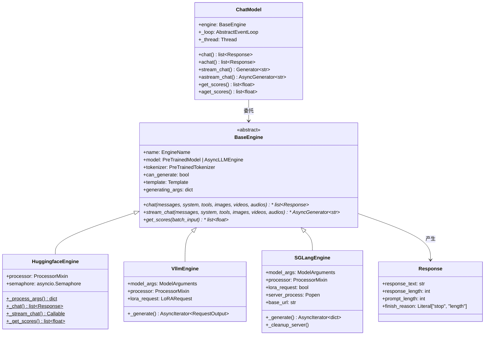
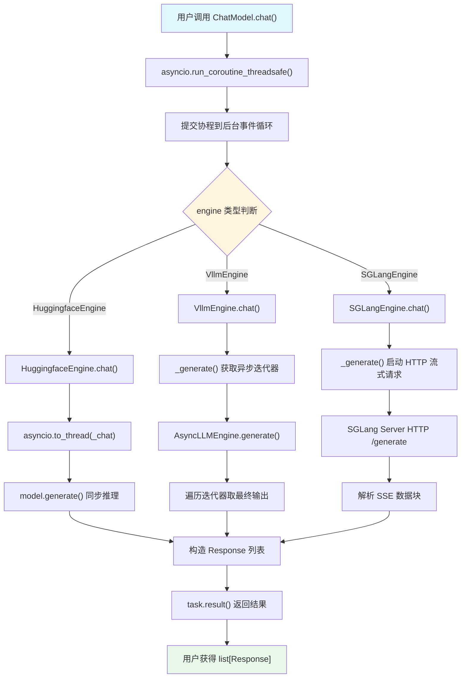

# 08 推理引擎

> 深度解析 LLaMA Factory 推理引擎架构，涵盖 BaseEngine 抽象基类、HuggingfaceEngine / VllmEngine / SGLangEngine 三大实现、ChatModel 门面模式的统一调度机制，并以 Shadow-FT 视角审视推理阶段对 Shadow-FT 模型的透明兼容性。

---

## 第一部分：分——三大推理引擎各自的设计与实现

### 1.1 推理引擎类层次总览

LLaMA Factory 的推理子系统位于 [file:///workspace/src/llamafactory/chat/](file:///workspace/src/llamafactory/chat/) 目录下，由一个抽象基类 `BaseEngine` 和三个具体实现类 `HuggingfaceEngine`、`VllmEngine`、`SGLangEngine` 构成，通过 `ChatModel` 门面类对外提供统一的同步/异步调用接口。



**类层次设计要点**：

- **BaseEngine** 定义了三个核心异步方法 `chat()`、`stream_chat()`、`get_scores()`，所有子类必须实现
- **Response** 是统一的数据类，封装推理结果（文本、长度、结束原因），无论底层引擎如何，上层始终拿到相同结构
- **ChatModel** 不继承 BaseEngine，而是通过组合模式持有 `engine: BaseEngine`，实现门面（Facade）模式

### 1.2 BaseEngine 抽象基类

定义于 [file:///workspace/src/llamafactory/chat/base_engine.py](file:///workspace/src/llamafactory/chat/base_engine.py)，是整个推理子系统的契约层。

#### 1.2.1 Response 数据类

```python
# file:///workspace/src/llamafactory/chat/base_engine.py L31-L36
@dataclass
class Response:
    response_text: str
    response_length: int
    prompt_length: int
    finish_reason: Literal["stop", "length"]
```

`Response` 是一个纯数据类，四个字段语义清晰：

| 字段 | 类型 | 含义 |
|------|------|------|
| `response_text` | `str` | 模型生成的文本内容 |
| `response_length` | `int` | 生成部分的 token 数（不含 prompt） |
| `prompt_length` | `int` | 输入 prompt 的 token 数 |
| `finish_reason` | `Literal["stop", "length"]` | 结束原因：正常停止 / 达到最大长度 |

这一数据结构被所有引擎共享，是上层 API（OpenAI 兼容接口、WebUI、CLI）消费推理结果的基础。

#### 1.2.2 BaseEngine 接口定义

```python
# file:///workspace/src/llamafactory/chat/base_engine.py L39-L98
class BaseEngine(ABC):
    r"""Base class for inference engine of chat models.

    Must implements async methods: chat(), stream_chat() and get_scores().
    """

    name: "EngineName"
    model: Union["PreTrainedModel", "AsyncLLMEngine"]
    tokenizer: "PreTrainedTokenizer"
    can_generate: bool
    template: "Template"
    generating_args: dict[str, Any]

    @abstractmethod
    def __init__(
        self,
        model_args: "ModelArguments",
        data_args: "DataArguments",
        finetuning_args: "FinetuningArguments",
        generating_args: "GeneratingArguments",
    ) -> None: ...

    @abstractmethod
    async def chat(
        self,
        messages: list[dict[str, str]],
        system: Optional[str] = None,
        tools: Optional[str] = None,
        images: Optional[list["ImageInput"]] = None,
        videos: Optional[list["VideoInput"]] = None,
        audios: Optional[list["AudioInput"]] = None,
        **input_kwargs,
    ) -> list["Response"]: ...

    @abstractmethod
    async def stream_chat(
        self,
        messages: list[dict[str, str]],
        system: Optional[str] = None,
        tools: Optional[str] = None,
        images: Optional[list["ImageInput"]] = None,
        videos: Optional[list["VideoInput"]] = None,
        audios: Optional[list["AudioInput"]] = None,
        **input_kwargs,
    ) -> AsyncGenerator[str, None]: ...

    @abstractmethod
    async def get_scores(
        self,
        batch_input: list[str],
        **input_kwargs,
    ) -> list[float]: ...
```

**接口设计分析**：

1. **统一参数签名**：`chat()` 和 `stream_chat()` 共享完全相同的参数列表——`messages`、`system`、`tools`、`images`、`videos`、`audios`，加上 `**input_kwargs` 接收运行时覆盖参数（如 `temperature`、`top_p`、`max_new_tokens` 等）。这种设计确保上层调用者无需感知引擎差异。

2. **异步优先**：三个核心方法全部声明为 `async`，这是为了兼容 vLLM / SGLang 的原生异步推理模型。HuggingfaceEngine 通过 `asyncio.to_thread()` 桥接到同步的 `model.generate()`。

3. **`can_generate` 互斥守卫**：该布尔标志由 `finetuning_args.stage` 决定——`stage == "sft"` 时为 `True`（可生成），否则为 `False`（仅可打分）。各引擎在 `chat()` / `stream_chat()` 入口检查此标志，若模型不具备生成能力则抛出 `ValueError`。

4. **`get_scores()` 的差异化支持**：仅 HuggingfaceEngine 实现了此方法（用于奖励模型推理），VllmEngine 和 SGLangEngine 直接抛出 `NotImplementedError`。这是因为 vLLM / SGLang 专注于生成式推理，不支持 ValueHead 打分。

### 1.3 HuggingfaceEngine：基于 Transformers 的推理引擎

定义于 [file:///workspace/src/llamafactory/chat/hf_engine.py](file:///workspace/src/llamafactory/chat/hf_engine.py)，是最基础的推理引擎，直接使用 HuggingFace Transformers 的 `model.generate()` 进行推理。

#### 1.3.1 初始化流程

```python
# file:///workspace/src/llamafactory/chat/hf_engine.py L45-L70
class HuggingfaceEngine(BaseEngine):
    def __init__(
        self,
        model_args: "ModelArguments",
        data_args: "DataArguments",
        finetuning_args: "FinetuningArguments",
        generating_args: "GeneratingArguments",
    ) -> None:
        self.name = EngineName.HF
        self.can_generate = finetuning_args.stage == "sft"
        tokenizer_module = load_tokenizer(model_args)
        self.tokenizer = tokenizer_module["tokenizer"]
        self.processor = tokenizer_module["processor"]
        self.tokenizer.padding_side = "left" if self.can_generate else "right"
        self.template = get_template_and_fix_tokenizer(self.tokenizer, data_args)
        self.model = load_model(
            self.tokenizer, model_args, finetuning_args, is_trainable=False, add_valuehead=(not self.can_generate)
        )
        self.generating_args = generating_args.to_dict()
        try:
            asyncio.get_event_loop()
        except RuntimeError:
            logger.warning_rank0_once("There is no current event loop, creating a new one.")
            loop = asyncio.new_event_loop()
            asyncio.set_event_loop(loop)

        self.semaphore = asyncio.Semaphore(int(os.getenv("MAX_CONCURRENT", "1")))
```

**初始化关键步骤**：

1. **Tokenizer / Processor 加载**：调用 `load_tokenizer()` 获取分词器和多模态处理器
2. **padding_side 动态切换**：生成模式使用 `"left"` 填充（确保右对齐以连续生成），打分模式使用 `"right"` 填充
3. **Template 绑定**：通过 `get_template_and_fix_tokenizer()` 获取与模型匹配的对话模板
4. **模型加载**：`load_model()` 以 `is_trainable=False` 加载，若为奖励模型（`not can_generate`）则添加 ValueHead
5. **并发控制**：`asyncio.Semaphore` 限制并发请求数，默认为 1，可通过 `MAX_CONCURRENT` 环境变量调整

#### 1.3.2 参数预处理：_process_args()

`_process_args()` 是一个静态方法，负责将高层对话参数转换为 `model.generate()` 所需的底层张量输入：

```python
# file:///workspace/src/llamafactory/chat/hf_engine.py L72-L208
@staticmethod
def _process_args(
    model: "PreTrainedModel",
    tokenizer: "PreTrainedTokenizer",
    processor: Optional["ProcessorMixin"],
    template: "Template",
    generating_args: dict[str, Any],
    messages: list[dict[str, str]],
    system: Optional[str] = None,
    tools: Optional[str] = None,
    images: Optional[list["ImageInput"]] = None,
    videos: Optional[list["VideoInput"]] = None,
    audios: Optional[list["AudioInput"]] = None,
    input_kwargs: Optional[dict[str, Any]] = {},
) -> tuple[dict[str, Any], int]:
```

其核心处理流程为：

1. **多模态占位符注入**：若 `images` / `videos` / `audios` 非空但消息中未包含对应占位符，则自动在首条消息前插入

```python
# file:///workspace/src/llamafactory/chat/hf_engine.py L88-L101
if images is not None:
    mm_input_dict.update({"images": images, "imglens": [len(images)]})
    if not any(IMAGE_PLACEHOLDER in message["content"] for message in messages):
        messages[0]["content"] = IMAGE_PLACEHOLDER * len(images) + messages[0]["content"]
```

2. **模板编码**：调用 `template.mm_plugin.process_messages()` 处理多模态消息，再通过 `template.encode_oneturn()` 将对话编码为 token ID 序列

```python
# file:///workspace/src/llamafactory/chat/hf_engine.py L103-L117
messages = template.mm_plugin.process_messages(
    messages, mm_input_dict["images"], mm_input_dict["videos"], mm_input_dict["audios"], processor
)
paired_messages = messages + [{"role": "assistant", "content": ""}]
prompt_ids, _ = template.encode_oneturn(tokenizer, paired_messages, system, tools)
prompt_ids, _ = template.mm_plugin.process_token_ids(
    prompt_ids, None, mm_input_dict["images"], mm_input_dict["videos"], mm_input_dict["audios"],
    tokenizer, processor,
)
```

3. **生成参数合并**：将 `input_kwargs` 中的运行时参数与 `generating_args` 默认值合并，构造 `GenerationConfig`

```python
# file:///workspace/src/llamafactory/chat/hf_engine.py L121-L178
do_sample: Optional[bool] = input_kwargs.pop("do_sample", None)
temperature: Optional[float] = input_kwargs.pop("temperature", None)
top_p: Optional[float] = input_kwargs.pop("top_p", None)
# ... 更多参数
generating_args = generating_args.copy()
generating_args.update(
    dict(
        do_sample=do_sample if do_sample is not None else generating_args["do_sample"],
        temperature=temperature if temperature is not None else generating_args["temperature"],
        # ...
        eos_token_id=template.get_stop_token_ids(tokenizer),
        pad_token_id=tokenizer.pad_token_id,
    )
)
```

4. **多模态输入张量化**：调用 `template.mm_plugin.get_mm_inputs()` 获取多模态特征张量，统一转为 `torch.Tensor` 并移至模型设备

#### 1.3.3 同步推理：_chat()

`_chat()` 是同步的完整推理方法，使用 `@torch.inference_mode()` 装饰器禁用梯度计算：

```python
# file:///workspace/src/llamafactory/chat/hf_engine.py L210-L263
@staticmethod
@torch.inference_mode()
def _chat(
    model, tokenizer, processor, template, generating_args,
    messages, system=None, tools=None, images=None, videos=None, audios=None,
    input_kwargs={},
) -> list["Response"]:
    gen_kwargs, prompt_length = HuggingfaceEngine._process_args(...)
    generate_output = model.generate(**gen_kwargs)
    if isinstance(generate_output, tuple):
        generate_output = generate_output[1][0]  # post-process the minicpm_o output

    response_ids = generate_output[:, prompt_length:]
    response = tokenizer.batch_decode(
        response_ids,
        skip_special_tokens=getattr(gen_kwargs["generation_config"], "skip_special_tokens", True),
        clean_up_tokenization_spaces=True,
    )
    results = []
    for i in range(len(response)):
        eos_index = (response_ids[i] == tokenizer.eos_token_id).nonzero()
        response_length = (eos_index[0].item() + 1) if len(eos_index) else len(response_ids[i])
        results.append(
            Response(
                response_text=response[i],
                response_length=response_length,
                prompt_length=prompt_length,
                finish_reason="stop" if len(eos_index) else "length",
            )
        )
    return results
```

**finish_reason 判定逻辑**：通过检查 `response_ids` 中是否包含 `eos_token_id` 来判断——若包含则为 `"stop"`（正常结束），否则为 `"length"`（达到最大长度截断）。

#### 1.3.4 流式推理：_stream_chat()

流式推理使用 Transformers 的 `TextIteratorStreamer`，在独立线程中运行 `model.generate()`，主线程逐 token 读取输出：

```python
# file:///workspace/src/llamafactory/chat/hf_engine.py L265-L310
@staticmethod
@torch.inference_mode()
def _stream_chat(
    model, tokenizer, processor, template, generating_args,
    messages, system=None, tools=None, images=None, videos=None, audios=None,
    input_kwargs={},
) -> Callable[[], str]:
    gen_kwargs, _ = HuggingfaceEngine._process_args(...)
    streamer = TextIteratorStreamer(
        tokenizer,
        skip_prompt=True,
        skip_special_tokens=getattr(gen_kwargs["generation_config"], "skip_special_tokens", True),
    )
    gen_kwargs["streamer"] = streamer
    thread = Thread(target=model.generate, kwargs=gen_kwargs, daemon=True)
    thread.start()

    def stream():
        try:
            return streamer.__next__()
        except StopIteration:
            raise StopAsyncIteration()

    return stream
```

**流式实现要点**：

- `TextIteratorStreamer` 是 Transformers 提供的迭代器，`model.generate()` 每生成一个 token 就通过队列推送
- 生成过程在守护线程中执行，避免阻塞事件循环
- 返回的 `stream()` 函数每次调用返回一个新 token 文本片段，`StopIteration` 被转换为 `StopAsyncIteration` 以适配异步生成器

#### 1.3.5 异步桥接

`chat()` 和 `stream_chat()` 的异步版本通过 `asyncio.to_thread()` 将同步方法调度到线程池执行：

```python
# file:///workspace/src/llamafactory/chat/hf_engine.py L334-L399
@override
async def chat(self, messages, system=None, tools=None, images=None, videos=None, audios=None, **input_kwargs):
    if not self.can_generate:
        raise ValueError("The current model does not support `chat`.")
    input_args = (self.model, self.tokenizer, self.processor, self.template,
                  self.generating_args, messages, system, tools, images, videos, audios, input_kwargs)
    async with self.semaphore:
        return await asyncio.to_thread(self._chat, *input_args)

@override
async def stream_chat(self, messages, system=None, tools=None, images=None, videos=None, audios=None, **input_kwargs):
    if not self.can_generate:
        raise ValueError("The current model does not support `stream_chat`.")
    input_args = (self.model, self.tokenizer, self.processor, self.template,
                  self.generating_args, messages, system, tools, images, videos, audios, input_kwargs)
    async with self.semaphore:
        stream = self._stream_chat(*input_args)
        while True:
            try:
                yield await asyncio.to_thread(stream)
            except StopAsyncIteration:
                break
```

**信号量的作用**：`asyncio.Semaphore` 确保同一时刻只有一个推理请求占用 GPU，避免多个 `model.generate()` 并发导致显存溢出。

#### 1.3.6 奖励模型打分：_get_scores()

```python
# file:///workspace/src/llamafactory/chat/hf_engine.py L312-L332
@staticmethod
@torch.inference_mode()
def _get_scores(
    model: "PreTrainedModelWrapper",
    tokenizer: "PreTrainedTokenizer",
    batch_input: list[str],
    input_kwargs: Optional[dict[str, Any]] = {},
) -> list[float]:
    max_length: Optional[int] = input_kwargs.pop("max_length", None)
    device = getattr(model.pretrained_model, "device", "cuda")
    inputs: dict[str, torch.Tensor] = tokenizer(
        batch_input, padding=True, truncation=True,
        max_length=max_length or getattr(model.config, "max_position_embeddings", 1024),
        return_tensors="pt", add_special_tokens=False,
    ).to(device)
    values: torch.Tensor = model(**inputs, return_dict=True, use_cache=False)[-1]
    scores = values.gather(dim=-1, index=(inputs["attention_mask"].sum(dim=-1, keepdim=True) - 1))
    return scores
```

此方法仅适用于带 ValueHead 的奖励模型。它取最后一个非填充位置的 value 值作为分数——这是 RLHF 中 PPO 训练所需奖励信号的来源。

### 1.4 VllmEngine：基于 vLLM 的高吞吐推理引擎

定义于 [file:///workspace/src/llamafactory/chat/vllm_engine.py](file:///workspace/src/llamafactory/chat/vllm_engine.py)，利用 vLLM 的 `AsyncLLMEngine` 实现高吞吐异步推理。

#### 1.4.1 初始化与引擎配置

```python
# file:///workspace/src/llamafactory/chat/vllm_engine.py L45-L101
class VllmEngine(BaseEngine):
    def __init__(self, model_args, data_args, finetuning_args, generating_args) -> None:
        self.name = EngineName.VLLM
        self.model_args = model_args
        config = load_config(model_args)
        if getattr(config, "quantization_config", None):
            quantization_config = getattr(config, "quantization_config", None)
            quant_method = quantization_config.get("quant_method", "")
            if quant_method == QuantizationMethod.GPTQ and model_args.infer_dtype == "auto":
                model_args.infer_dtype = "float16"

        self.can_generate = finetuning_args.stage == "sft"
        tokenizer_module = load_tokenizer(model_args)
        self.tokenizer = tokenizer_module["tokenizer"]
        self.processor = tokenizer_module["processor"]
        self.tokenizer.padding_side = "left"
        self.template = get_template_and_fix_tokenizer(self.tokenizer, data_args)
        self.template.mm_plugin.expand_mm_tokens = False  # for vllm generate
        self.generating_args = generating_args.to_dict()

        engine_args = {
            "model": model_args.model_name_or_path,
            "trust_remote_code": model_args.trust_remote_code,
            "download_dir": model_args.cache_dir,
            "dtype": model_args.infer_dtype,
            "max_model_len": model_args.vllm_maxlen,
            "tensor_parallel_size": get_device_count() or 1,
            "gpu_memory_utilization": model_args.vllm_gpu_util,
            "disable_log_stats": True,
            "disable_log_requests": True,
            "enforce_eager": model_args.vllm_enforce_eager,
            "enable_lora": model_args.adapter_name_or_path is not None,
            "max_lora_rank": model_args.vllm_max_lora_rank,
        }
        if self.template.mm_plugin.__class__.__name__ != "BasePlugin":
            engine_args["limit_mm_per_prompt"] = {"image": 4, "video": 2, "audio": 2}

        if isinstance(model_args.vllm_config, dict):
            engine_args.update(model_args.vllm_config)

        self.model = AsyncLLMEngine.from_engine_args(AsyncEngineArgs(**engine_args))
        if model_args.adapter_name_or_path is not None:
            self.lora_request = LoRARequest("default", 1, model_args.adapter_name_or_path[0])
        else:
            self.lora_request = None
```

**与 HuggingfaceEngine 的关键差异**：

| 维度 | HuggingfaceEngine | VllmEngine |
|------|-------------------|------------|
| 模型类型 | `PreTrainedModel` | `AsyncLLMEngine` |
| 推理方式 | `model.generate()` 同步调用 | `AsyncLLMEngine.generate()` 异步迭代器 |
| 并发模型 | Semaphore 限制为串行 | vLLM 内部 continuous batching 并发 |
| LoRA 支持 | 合并到模型权重 | `LoRARequest` 动态加载 |
| 多模态 token 展开 | `expand_mm_tokens = True`（默认） | `expand_mm_tokens = False` |

**vLLM 特有配置项**（来自 [file:///workspace/src/llamafactory/hparams/model_args.py](file:///workspace/src/llamafactory/hparams/model_args.py)）：

- `vllm_maxlen`：最大序列长度，默认 4096
- `vllm_gpu_util`：GPU 显存利用率，默认 0.7
- `vllm_enforce_eager`：是否禁用 CUDA Graph，默认 False
- `vllm_max_lora_rank`：LoRA 最大秩，默认 32
- `vllm_config`：自定义 vLLM 引擎配置，支持 JSON 字符串

#### 1.4.2 异步生成核心：_generate()

```python
# file:///workspace/src/llamafactory/chat/vllm_engine.py L103-L208
async def _generate(
    self, messages, system=None, tools=None, images=None, videos=None, audios=None, **input_kwargs,
) -> AsyncIterator["RequestOutput"]:
    request_id = f"chatcmpl-{uuid.uuid4().hex}"
    # ... 多模态占位符注入、模板编码（与 HF 类似）...

    sampling_params = SamplingParams(
        n=num_return_sequences,
        repetition_penalty=...,
        temperature=...,
        top_p=...,
        top_k=...,
        stop=stop,
        stop_token_ids=self.template.get_stop_token_ids(self.tokenizer),
        max_tokens=max_tokens,
        skip_special_tokens=...,
    )

    # 多模态数据正则化
    if images is not None:
        multi_modal_data = {
            "image": self.template.mm_plugin._regularize_images(
                images, image_max_pixels=..., image_min_pixels=...,
            )["images"]
        }
    elif videos is not None:
        multi_modal_data = {
            "video": self.template.mm_plugin._regularize_videos(videos, ...)["videos"]
        }
    elif audios is not None:
        audio_data = self.template.mm_plugin._regularize_audios(audios, ...)
        multi_modal_data = {"audio": zip(audio_data["audios"], audio_data["sampling_rates"])}
    else:
        multi_modal_data = None

    result_generator = self.model.generate(
        {"prompt_token_ids": prompt_ids, "multi_modal_data": multi_modal_data},
        sampling_params=sampling_params,
        request_id=request_id,
        lora_request=self.lora_request,
    )
    return result_generator
```

**核心设计**：

1. **请求标识**：每个请求分配唯一的 `request_id`（格式 `chatcmpl-{uuid}`），便于 vLLM 内部追踪
2. **SamplingParams**：vLLM 使用独立的采样参数对象，而非 Transformers 的 `GenerationConfig`
3. **多模态数据正则化**：通过 `mm_plugin._regularize_images/videos/audios()` 将原始输入转为 vLLM 可消费的格式
4. **LoRA 动态加载**：通过 `lora_request` 参数将 LoRA 适配器传递给 vLLM，支持运行时切换

#### 1.4.3 chat() 与 stream_chat() 实现

```python
# file:///workspace/src/llamafactory/chat/vllm_engine.py L210-L256
@override
async def chat(self, messages, system=None, tools=None, images=None, videos=None, audios=None, **input_kwargs):
    final_output = None
    generator = await self._generate(messages, system, tools, images, videos, audios, **input_kwargs)
    async for request_output in generator:
        final_output = request_output

    results = []
    for output in final_output.outputs:
        results.append(
            Response(
                response_text=output.text,
                response_length=len(output.token_ids),
                prompt_length=len(final_output.prompt_token_ids),
                finish_reason=output.finish_reason,
            )
        )
    return results

@override
async def stream_chat(self, messages, system=None, tools=None, images=None, videos=None, audios=None, **input_kwargs):
    generated_text = ""
    generator = await self._generate(messages, system, tools, images, videos, audios, **input_kwargs)
    async for result in generator:
        delta_text = result.outputs[0].text[len(generated_text):]
        generated_text = result.outputs[0].text
        yield delta_text
```

**流式增量提取**：vLLM 的 `AsyncIterator[RequestOutput]` 每次迭代返回的是**完整的累积文本**，而非增量。因此 `stream_chat()` 通过 `result.outputs[0].text[len(generated_text):]` 计算增量部分，只 yield 新增的文本片段。

**get_scores() 不支持**：

```python
# file:///workspace/src/llamafactory/chat/vllm_engine.py L257-L263
@override
async def get_scores(self, batch_input, **input_kwargs):
    raise NotImplementedError("vLLM engine does not support `get_scores`.")
```

vLLM 专注于生成式推理，不支持 ValueHead 打分，因此直接抛出 `NotImplementedError`。

### 1.5 SGLangEngine：基于 SGLang 的推理引擎

定义于 [file:///workspace/src/llamafactory/chat/sglang_engine.py](file:///workspace/src/llamafactory/chat/sglang_engine.py)，采用 HTTP 服务器模式与 SGLang 交互，区别于 VllmEngine 的进程内调用。

#### 1.5.1 服务器启动与生命周期管理

```python
# file:///workspace/src/llamafactory/chat/sglang_engine.py L58-L128
class SGLangEngine(BaseEngine):
    def __init__(self, model_args, data_args, finetuning_args, generating_args) -> None:
        self.name = EngineName.SGLANG
        # ... tokenizer/template 初始化（与 VllmEngine 类似）...

        launch_cmd = [
            "python3 -m sglang.launch_server",
            f"--model-path {model_args.model_name_or_path}",
            f"--dtype {model_args.infer_dtype}",
            f"--context-length {model_args.sglang_maxlen}",
            f"--mem-fraction-static {model_args.sglang_mem_fraction}",
            f"--tp-size {model_args.sglang_tp_size if model_args.sglang_tp_size != -1 else get_device_count() or 1}",
            f"--download-dir {model_args.cache_dir}",
            "--log-level error",
        ]
        if self.lora_request:
            launch_cmd.extend([
                "--max-loras-per-batch 1",
                f"--lora-backend {model_args.sglang_lora_backend}",
                f"--lora-paths lora0={model_args.adapter_name_or_path[0]}",
                "--disable-radix-cache",
            ])
        launch_cmd = " ".join(launch_cmd)
        logger.info_rank0(f"Starting SGLang server with command: {launch_cmd}")
        try:
            torch_gc()
            self.server_process, port = launch_server_cmd(launch_cmd)
            self.base_url = f"http://localhost:{port}"
            atexit.register(self._cleanup_server)
            wait_for_server(self.base_url, timeout=300)
        except Exception as e:
            logger.error(f"Failed to start SGLang server: {str(e)}")
            self._cleanup_server()
            raise RuntimeError(f"SGLang server initialization failed: {str(e)}.")
```

**与 VllmEngine 的架构差异**：

| 维度 | VllmEngine | SGLangEngine |
|------|------------|--------------|
| 通信方式 | 进程内 Python API | HTTP REST API |
| 生命周期 | 随引擎对象创建/销毁 | 独立子进程，需显式清理 |
| LoRA 加载 | `LoRARequest` 对象 | 命令行参数 `--lora-paths` |
| 启动等待 | 无需等待 | `wait_for_server()` 轮询就绪 |

**服务器清理机制**：SGLangEngine 注册了 `atexit` 回调和 `__del__` 析构函数双重保障：

```python
# file:///workspace/src/llamafactory/chat/sglang_engine.py L130-L138
def _cleanup_server(self):
    if hasattr(self, "server_process") and self.server_process:
        try:
            logger.info("Terminating SGLang server process")
            terminate_process(self.server_process)
        except Exception as e:
            logger.warning(f"Error terminating SGLang server: {str(e)}")

def __del__(self):
    self._cleanup_server()
    try:
        atexit.unregister(self._cleanup_server)
    except Exception:
        pass
```

#### 1.5.2 HTTP 流式生成：_generate()

```python
# file:///workspace/src/llamafactory/chat/sglang_engine.py L140-L229
async def _generate(
    self, messages, system=None, tools=None, images=None, videos=None, audios=None, **input_kwargs,
) -> AsyncIterator[dict[str, Any]]:
    # ... 多模态占位符注入、模板编码 ...
    # ... 采样参数构建 ...

    def stream_request():
        json_data = {
            "input_ids": prompt_ids,
            "sampling_params": sampling_params,
            "stream": True,
        }
        if self.lora_request:
            json_data["lora_request"] = ["lora0"]
        response = requests.post(f"{self.base_url}/generate", json=json_data, stream=True)
        if response.status_code != 200:
            raise RuntimeError(f"SGLang server error: {response.status_code}, {response.text}")

        for chunk in response.iter_lines(decode_unicode=False):
            chunk = str(chunk.decode("utf-8"))
            if chunk == "data: [DONE]":
                break
            if chunk and chunk.startswith("data:"):
                yield json.loads(chunk[5:].strip("\n"))

    return await asyncio.to_thread(stream_request)
```

**SSE 流式协议**：SGLang 服务器采用 Server-Sent Events (SSE) 协议，每个数据块以 `data:` 前缀开头，以 `data: [DONE]` 标记结束。`stream_request()` 在线程中执行同步 HTTP 请求，通过 `asyncio.to_thread()` 桥接到异步上下文。

#### 1.5.3 chat() 与 stream_chat() 实现

```python
# file:///workspace/src/llamafactory/chat/sglang_engine.py L231-L273
@override
async def chat(self, messages, system=None, tools=None, images=None, videos=None, audios=None, **input_kwargs):
    final_output = None
    generator = await self._generate(messages, system, tools, images, videos, audios, **input_kwargs)
    for request_output in generator:
        final_output = request_output

    results = [
        Response(
            response_text=final_output["text"],
            response_length=final_output["meta_info"]["completion_tokens"],
            prompt_length=final_output["meta_info"]["prompt_tokens"],
            finish_reason="stop" if final_output["meta_info"]["finish_reason"] == "stop" else "length",
        )
    ]
    return results

@override
async def stream_chat(self, messages, system=None, tools=None, images=None, videos=None, audios=None, **input_kwargs):
    generated_text = ""
    generator = await self._generate(messages, system, tools, images, videos, audios, **input_kwargs)
    for result in generator:
        delta_text = result["text"][len(generated_text):]
        generated_text = result["text"]
        yield delta_text
```

**与 VllmEngine 的对比**：

- VllmEngine 的 `request_output` 是 vLLM 的 `RequestOutput` Python 对象，通过属性访问（`.outputs[0].text`）
- SGLangEngine 的 `request_output` 是 JSON 字典，通过键访问（`["text"]`、`["meta_info"]`）
- 两者都采用"累积文本 + 增量提取"的流式策略

**限制**：SGLangEngine 不支持 `num_return_sequences > 1`（仅支持 n=1），也不支持 `get_scores()`。

---

## 第二部分：总——统一接口设计

### 2.1 三引擎统一抽象

三大推理引擎虽然底层实现截然不同，但通过 `BaseEngine` 抽象基类实现了接口统一。上层调用者（ChatModel、API 层、WebUI）只需面向 `BaseEngine` 编程，无需关心底层是 Transformers、vLLM 还是 SGLang。

**统一性体现**：

1. **参数签名一致**：`chat()` / `stream_chat()` 的参数列表完全相同——`messages`、`system`、`tools`、`images`、`videos`、`audios`、`**input_kwargs`
2. **返回类型一致**：`chat()` 返回 `list[Response]`，`stream_chat()` 返回 `AsyncGenerator[str, None]`
3. **Response 结构一致**：无论底层引擎如何，上层始终拿到包含 `response_text`、`response_length`、`prompt_length`、`finish_reason` 的统一数据类

**差异性保留**：

| 能力 | HuggingfaceEngine | VllmEngine | SGLangEngine |
|------|-------------------|------------|--------------|
| chat() | ✅ | ✅ | ✅ |
| stream_chat() | ✅ | ✅ | ✅ |
| get_scores() | ✅ | ❌ | ❌ |
| 多返回序列 (n>1) | ✅ | ✅ | ❌ |
| LoRA 动态加载 | 合并权重 | LoRARequest | 命令行参数 |
| 多模态 | ✅ | ✅ | ✅ |
| 推理吞吐 | 低 | 高 | 高 |

### 2.2 EngineName 枚举

引擎类型通过枚举类 `EngineName` 定义于 [file:///workspace/src/llamafactory/extras/constants.py](file:///workspace/src/llamafactory/extras/constants.py)：

```python
# file:///workspace/src/llamafactory/extras/constants.py L106-L109
class EngineName(str, Enum):
    HF = "huggingface"
    VLLM = "vllm"
    SGLANG = "sglang"
```

该枚举继承自 `str` 和 `Enum`，因此既可以用 `EngineName.HF` 也可以用字符串 `"huggingface"` 进行比较，方便从命令行参数或配置文件中解析。

### 2.3 公共初始化流程

三个引擎的初始化遵循相同的步骤序列，差异仅在模型加载方式：

1. 加载 Config → 检查量化配置 → 修正 `infer_dtype`
2. 加载 Tokenizer / Processor
3. 设置 `padding_side`（生成模式 "left"，打分模式 "right"）
4. 获取 Template 并修正 Tokenizer
5. 加载模型（HF: `load_model()` / vLLM: `AsyncLLMEngine.from_engine_args()` / SGLang: `launch_server_cmd()`）
6. 处理 LoRA 适配器（若 `adapter_name_or_path` 非空）
7. 保存 `generating_args` 字典

---

## 第三部分：分——ChatModel 门面模式与 Shadow-FT 推理

### 3.1 ChatModel 门面模式

定义于 [file:///workspace/src/llamafactory/chat/chat_model.py](file:///workspace/src/llamafactory/chat/chat_model.py)，`ChatModel` 是推理子系统的门面类，封装了引擎选择、同步/异步桥接和后台事件循环管理。

#### 3.1.1 引擎选择逻辑

```python
# file:///workspace/src/llamafactory/chat/chat_model.py L50-L59
class ChatModel:
    def __init__(self, args: Optional[dict[str, Any]] = None) -> None:
        model_args, data_args, finetuning_args, generating_args = get_infer_args(args)
        if model_args.infer_backend == EngineName.HF:
            self.engine: BaseEngine = HuggingfaceEngine(model_args, data_args, finetuning_args, generating_args)
        elif model_args.infer_backend == EngineName.VLLM:
            self.engine: BaseEngine = VllmEngine(model_args, data_args, finetuning_args, generating_args)
        elif model_args.infer_backend == EngineName.SGLANG:
            self.engine: BaseEngine = SGLangEngine(model_args, data_args, finetuning_args, generating_args)
        else:
            raise NotImplementedError(f"Unknown backend: {model_args.infer_backend}")
```

引擎选择由 `model_args.infer_backend` 决定，默认值为 `EngineName.HF`（即 `"huggingface"`）。用户通过 `--infer_backend huggingface|vllm|sglang` 命令行参数指定。

#### 3.1.2 后台事件循环

```python
# file:///workspace/src/llamafactory/chat/chat_model.py L61-L63
        self._loop = asyncio.new_event_loop()
        self._thread = Thread(target=_start_background_loop, args=(self._loop,), daemon=True)
        self._thread.start()
```

```python
# file:///workspace/src/llamafactory/chat/chat_model.py L37-L39
def _start_background_loop(loop: "asyncio.AbstractEventLoop") -> None:
    asyncio.set_event_loop(loop)
    loop.run_forever()
```

ChatModel 创建一个独立的守护线程运行事件循环。这是因为：

1. **同步调用者兼容**：CLI、WebUI 等同步调用者无法直接 `await` 异步方法
2. **跨线程安全**：`asyncio.run_coroutine_threadsafe()` 可以从任意线程向事件循环提交协程
3. **生命周期管理**：守护线程随主进程退出，无需显式关闭

#### 3.1.3 同步/异步方法对

ChatModel 为每个操作提供同步和异步两个版本：

| 同步方法 | 异步方法 | 说明 |
|----------|----------|------|
| `chat()` | `achat()` | 获取完整响应 |
| `stream_chat()` | `astream_chat()` | 流式获取响应 |
| `get_scores()` | `aget_scores()` | 获取奖励分数 |

**同步 → 异步桥接**：

```python
# file:///workspace/src/llamafactory/chat/chat_model.py L65-L79
def chat(self, messages, system=None, tools=None, images=None, videos=None, audios=None, **input_kwargs):
    task = asyncio.run_coroutine_threadsafe(
        self.achat(messages, system, tools, images, videos, audios, **input_kwargs), self._loop
    )
    return task.result()
```

`asyncio.run_coroutine_threadsafe()` 将协程提交到后台事件循环，`task.result()` 阻塞等待结果返回。这是从同步上下文调用异步代码的标准模式。

**异步方法直接委托**：

```python
# file:///workspace/src/llamafactory/chat/chat_model.py L81-L92
async def achat(self, messages, system=None, tools=None, images=None, videos=None, audios=None, **input_kwargs):
    return await self.engine.chat(messages, system, tools, images, videos, audios, **input_kwargs)
```

异步方法直接委托给底层引擎，无额外开销。

**流式同步桥接**：

```python
# file:///workspace/src/llamafactory/chat/chat_model.py L94-L111
def stream_chat(self, messages, system=None, tools=None, images=None, videos=None, audios=None, **input_kwargs):
    generator = self.astream_chat(messages, system, tools, images, videos, audios, **input_kwargs)
    while True:
        try:
            task = asyncio.run_coroutine_threadsafe(generator.__anext__(), self._loop)
            yield task.result()
        except StopAsyncIteration:
            break
```

流式同步方法通过循环调用 `generator.__anext__()` 逐个获取 token，每次提交一个微任务到事件循环，阻塞等待单个 token 返回后 yield 给调用者。

#### 3.1.4 ChatModel 调用流程图



### 3.2 Shadow-FT 模型推理

#### 3.2.1 Shadow-FT 推理的透明性

Shadow-FT 的核心公式为：

$$W_{\text{shadow}} = W_{\text{instruct}} + \Delta W, \quad \Delta W = W_{\text{tuned}} - W_{\text{base}}$$

嫁接（grafting）操作发生在训练完成之后、推理之前。嫁接后的模型权重 $W_{\text{shadow}}$ 在结构上与原始 Instruct 模型完全一致——没有额外的适配器层、没有特殊的权重标记、没有修改模型配置。这意味着：

**Shadow-FT 模型在推理阶段就是一个标准模型，可以使用任何推理引擎，无需任何特殊处理。**

#### 3.2.2 全参数 Shadow-FT 推理

全参数 Shadow-FT 的嫁接通过 `src/shadow/apply_diff.py` 完成，直接修改模型权重文件：

```
W_shadow = W_instruct + (W_tuned - W_base)
```

嫁接后保存的模型是一个标准的 HuggingFace 格式模型，可以直接用 `model_name_or_path` 指向嫁接后的目录，三种引擎均可正常加载：

```yaml
# 使用 HuggingfaceEngine 推理
--model_name_or_path ./shadow-merged-model
--infer_backend huggingface

# 使用 VllmEngine 推理
--model_name_or_path ./shadow-merged-model
--infer_backend vllm

# 使用 SGLangEngine 推理
--model_name_or_path ./shadow-merged-model
--infer_backend sglang
```

#### 3.2.3 LoRA Shadow-FT 推理

LoRA Shadow-FT 的嫁接通过 `src/shadow/merge_lora.py` 完成，将 LoRA 增量合并到 Instruct 模型：

```
W_shadow = W_instruct + (W_base + LoRA_tuned - W_base)
         = W_instruct + LoRA_tuned
```

合并后同样是标准模型权重。若用户希望保留 LoRA 格式以利用 vLLM 的动态 LoRA 加载能力，也可以选择不合并，而是通过 `--adapter_name_or_path` 指定 LoRA 路径：

```yaml
# vLLM 动态 LoRA 推理
--model_name_or_path ./instruct-model
--adapter_name_or_path ./shadow-lora-adapter
--infer_backend vllm
```

此时 VllmEngine 会创建 `LoRARequest("default", 1, adapter_path)`，vLLM 在推理时动态应用 LoRA 权重。

#### 3.2.4 推理引擎选择对 Shadow-FT 的影响

由于 Shadow-FT 模型在推理时与标准模型无异，引擎选择完全取决于性能需求：

| 场景 | 推荐引擎 | 原因 |
|------|----------|------|
| 开发调试 / 少量推理 | HuggingfaceEngine | 无需额外依赖，加载最快 |
| 生产部署 / 高并发 | VllmEngine | continuous batching 高吞吐 |
| 长上下文 / 多模态 | SGLangEngine | RadixAttention 优化前缀缓存 |
| 奖励模型打分 | HuggingfaceEngine | 仅 HF 支持 ValueHead |

**Shadow-FT 的设计哲学**在推理阶段体现为"嫁接即遗忘"——一旦增量嫁接完成，Shadow-FT 的痕迹即被消除，推理引擎无需感知模型是否经过 Shadow-FT 训练。这种透明性是 Shadow-FT 相较于其他需要特殊推理逻辑的方法（如某些 MoE 合并方法）的重要优势。

### 3.3 CLI 交互式推理

ChatModel 还提供了命令行交互入口 `run_chat()`，展示了一个完整的推理使用示例：

```python
# file:///workspace/src/llamafactory/chat/chat_model.py L147-L184
def run_chat() -> None:
    chat_model = ChatModel()
    messages = []
    print("Welcome to the CLI application, use `clear` to remove the history, use `exit` to exit the application.")

    while True:
        query = input("\nUser: ")
        if query.strip() == "exit":
            break
        if query.strip() == "clear":
            messages = []
            torch_gc()
            continue

        messages.append({"role": "user", "content": query})
        print("Assistant: ", end="", flush=True)

        response = ""
        for new_text in chat_model.stream_chat(messages):
            print(new_text, end="", flush=True)
            response += new_text
        print()
        messages.append({"role": "assistant", "content": response})
```

此函数通过 `llamafactory-cli chat` 命令调用，使用 `stream_chat()` 逐 token 输出，提供流畅的交互体验。`clear` 命令清空对话历史并调用 `torch_gc()` 释放 GPU 缓存。

---

## 总结

LLaMA Factory 的推理引擎架构遵循经典的 **策略模式 + 门面模式** 设计：

- **策略模式**：`BaseEngine` 定义统一接口，`HuggingfaceEngine` / `VllmEngine` / `SGLangEngine` 作为可互换的策略实现，由 `infer_backend` 参数在运行时选择
- **门面模式**：`ChatModel` 封装引擎选择、同步/异步桥接、事件循环管理，为上层（API、WebUI、CLI）提供简洁的调用接口
- **Shadow-FT 透明性**：嫁接后的模型在结构上与标准模型完全一致，三种推理引擎均可透明加载，无需任何特殊适配逻辑

这一架构使得 LLaMA Factory 能够灵活适配从开发调试到生产部署的各类推理场景，同时保持 Shadow-FT 模型的零额外推理成本。
