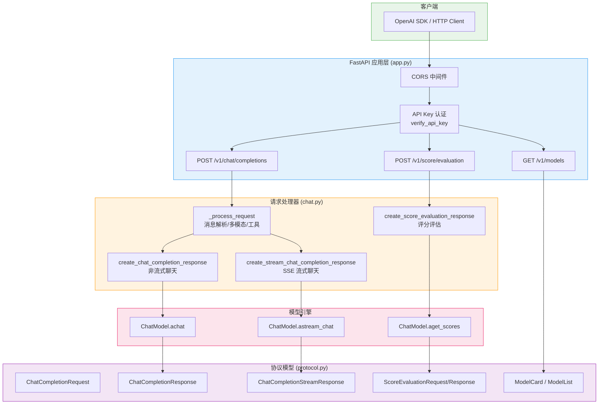
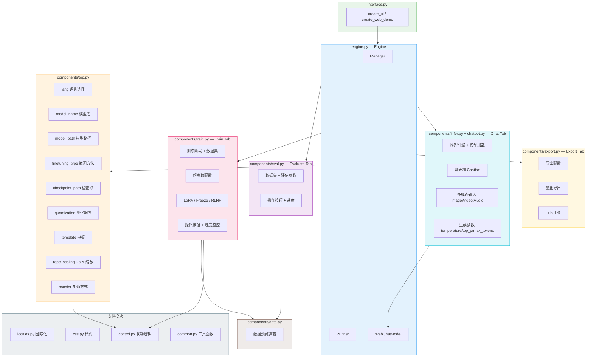

# 09 API 服务与 WebUI 交互层

> 本文档从 Shadow-FT 视角深入分析 LLaMA Factory 的 API 服务与 WebUI 交互层，揭示用户如何通过 RESTful API 或图形界面与底层模型引擎交互，以及 Shadow-FT 模型在此体系中的部署方式。

---

## 第一部分：API 服务（src/llamafactory/api/）

LLaMA Factory 的 API 服务层基于 FastAPI 框架构建，提供与 OpenAI API 兼容的接口规范，使微调后的模型能够无缝接入现有的大模型应用生态。整个 API 模块由四个核心文件组成：

| 文件 | 职责 |
|------|------|
| [app.py](file:///workspace/src/llamafactory/api/app.py) | FastAPI 应用创建、中间件配置、路由注册、生命周期管理 |
| [chat.py](file:///workspace/src/llamafactory/api/chat.py) | 请求处理器：聊天补全、流式输出、评分评估 |
| [protocol.py](file:///workspace/src/llamafactory/api/protocol.py) | 请求/响应数据模型（Pydantic） |
| [common.py](file:///workspace/src/llamafactory/api/common.py) | 共享工具函数：序列化与反序列化 |

### 1.1 应用入口：app.py

`app.py` 是 API 服务的核心入口，负责创建 FastAPI 应用实例并完成所有基础设施配置。

#### 1.1.1 生命周期管理

FastAPI 的 `lifespan` 机制用于管理应用启动与关闭时的资源分配。在 LLaMA Factory 中，生命周期管理主要关注 GPU 显存的回收：

```python
# file:///workspace/src/llamafactory/api/app.py 第54-66行
async def sweeper() -> None:
    while True:
        torch_gc()
        await asyncio.sleep(300)

@asynccontextmanager
async def lifespan(app: "FastAPI", chat_model: "ChatModel"):
    if chat_model.engine.name == EngineName.HF:
        asyncio.create_task(sweeper())
    yield
    torch_gc()
```

`sweeper` 是一个异步后台任务，每 300 秒执行一次 `torch_gc()`（PyTorch GPU 垃圾回收），防止 HuggingFace 引擎在长期运行中产生显存碎片。当引擎为 vLLM 或 SGLang 时，由于其内置显存管理机制，不需要此清扫任务。应用关闭时（`yield` 之后），再次调用 `torch_gc()` 确保显存彻底释放。

#### 1.1.2 CORS 中间件与 API Key 认证

```python
# file:///workspace/src/llamafactory/api/app.py 第69-84行
def create_app(chat_model: "ChatModel") -> "FastAPI":
    root_path = os.getenv("FASTAPI_ROOT_PATH", "")
    app = FastAPI(lifespan=partial(lifespan, chat_model=chat_model), root_path=root_path)
    app.add_middleware(
        CORSMiddleware,
        allow_origins=["*"],
        allow_credentials=True,
        allow_methods=["*"],
        allow_headers=["*"],
    )
    api_key = os.getenv("API_KEY")
    security = HTTPBearer(auto_error=False)

    async def verify_api_key(auth: Annotated[Optional[HTTPAuthorizationCredentials], Depends(security)]):
        if api_key and (auth is None or auth.credentials != api_key):
            raise HTTPException(status_code=status.HTTP_401_UNAUTHORIZED, detail="Invalid API key.")
```

CORS 配置采用全开放策略（`allow_origins=["*"]`），便于开发调试和跨域调用。API Key 认证为可选机制——仅当环境变量 `API_KEY` 被设置时才启用，通过 `HTTPBearer` 安全方案从请求头 `Authorization: Bearer <key>` 中提取凭证进行校验。这种设计使得 API 在本地开发时零配置可用，而在生产部署时可通过环境变量一键启用安全认证。

#### 1.1.3 路由注册

API 提供三个核心端点，均以 `Depends(verify_api_key)` 作为依赖项实现认证拦截：

**GET /v1/models — 模型列表**

```python
# file:///workspace/src/llamafactory/api/app.py 第86-94行
@app.get(
    "/v1/models",
    response_model=ModelList,
    status_code=status.HTTP_200_OK,
    dependencies=[Depends(verify_api_key)],
)
async def list_models():
    model_card = ModelCard(id=os.getenv("API_MODEL_NAME", "gpt-3.5-turbo"))
    return ModelList(data=[model_card])
```

返回当前加载的模型信息。模型名称通过 `API_MODEL_NAME` 环境变量配置，默认为 `gpt-3.5-turbo`，这使得该 API 可以伪装为 OpenAI 的 GPT 模型，实现与 OpenAI 客户端库的透明兼容。

**POST /v1/chat/completions — 聊天补全**

```python
# file:///workspace/src/llamafactory/api/app.py 第96-110行
@app.post(
    "/v1/chat/completions",
    response_model=ChatCompletionResponse,
    status_code=status.HTTP_200_OK,
    dependencies=[Depends(verify_api_key)],
)
async def create_chat_completion(request: ChatCompletionRequest):
    if not chat_model.engine.can_generate:
        raise HTTPException(status_code=status.HTTP_405_METHOD_NOT_ALLOWED, detail="Not allowed")

    if request.stream:
        generate = create_stream_chat_completion_response(request, chat_model)
        return EventSourceResponse(generate, media_type="text/event-stream", sep="\n")
    else:
        return await create_chat_completion_response(request, chat_model)
```

这是最核心的端点，支持两种模式：
- **非流式**：直接返回完整的 `ChatCompletionResponse`
- **流式**：通过 SSE（Server-Sent Events）逐 token 返回 `ChatCompletionStreamResponse`

路由层还做了引擎能力检查——若引擎不支持生成（如仅用于评分的模型），返回 405 错误。

**POST /v1/score/evaluation — 评分评估**

```python
# file:///workspace/src/llamafactory/api/app.py 第112-123行
@app.post(
    "/v1/score/evaluation",
    response_model=ScoreEvaluationResponse,
    status_code=status.HTTP_200_OK,
    dependencies=[Depends(verify_api_key)],
)
async def create_score_evaluation(request: ScoreEvaluationRequest):
    if chat_model.engine.can_generate:
        raise HTTPException(status_code=status.HTTP_405_METHOD_NOT_ALLOWED, detail="Not allowed")

    return await create_score_evaluation_response(request, chat_model)
```

评分端点与聊天端点互斥：仅当引擎不支持生成（`can_generate=False`）时才可用，适用于奖励模型等仅输出标量分数的场景。

#### 1.1.4 启动入口

```python
# file:///workspace/src/llamafactory/api/app.py 第127-133行
def run_api() -> None:
    chat_model = ChatModel()
    app = create_app(chat_model)
    api_host = os.getenv("API_HOST", "0.0.0.0")
    api_port = int(os.getenv("API_PORT", "8000"))
    print(f"Visit http://localhost:{api_port}/docs for API document.")
    uvicorn.run(app, host=api_host, port=api_port)
```

`run_api()` 是命令行入口，创建 `ChatModel` 实例后将其注入 FastAPI 应用，通过 uvicorn 启动 ASGI 服务器。主机和端口均可通过环境变量配置。

### 1.2 请求处理器：chat.py

`chat.py` 包含三个核心处理函数，分别对应三种 API 端点的业务逻辑。

#### 1.2.1 请求预处理：_process_request

所有聊天请求共享同一个预处理函数 `_process_request`，负责将 OpenAI 格式的请求转换为内部格式：

```python
# file:///workspace/src/llamafactory/api/chat.py 第73-169行
def _process_request(
    request: "ChatCompletionRequest",
) -> tuple[list[dict[str, str]], Optional[str], Optional[str],
           Optional[list["ImageInput"]], Optional[list["VideoInput"]], Optional[list["AudioInput"]]]:
```

该函数执行以下关键操作：

1. **系统消息提取**：若首条消息的 role 为 `system`，将其弹出并单独作为 `system` 参数
2. **消息交替校验**：确保消息遵循 user/assistant 交替模式（`u/a/u/a/u...`）
3. **角色映射**：将 API 层的 `Role` 枚举映射到数据层的 `DataRole`

```python
# file:///workspace/src/llamafactory/api/chat.py 第64-70行
ROLE_MAPPING = {
    Role.USER: DataRole.USER.value,
    Role.ASSISTANT: DataRole.ASSISTANT.value,
    Role.SYSTEM: DataRole.SYSTEM.value,
    Role.FUNCTION: DataRole.FUNCTION.value,
    Role.TOOL: DataRole.OBSERVATION.value,
}
```

4. **多模态输入处理**：支持图片、视频、音频三种模态，每种模态均支持三种输入方式：
   - Base64 编码（`data:image/png;base64,...`）
   - 本地文件路径
   - Web URL

5. **工具调用处理**：将 assistant 消息中的 `tool_calls` 序列化为 JSON 字符串，将 `tools` 参数序列化后传递给模板引擎

#### 1.2.2 非流式聊天：create_chat_completion_response

```python
# file:///workspace/src/llamafactory/api/chat.py 第184-234行
async def create_chat_completion_response(
    request: "ChatCompletionRequest", chat_model: "ChatModel"
) -> "ChatCompletionResponse":
    completion_id = f"chatcmpl-{uuid.uuid4().hex}"
    input_messages, system, tools, images, videos, audios = _process_request(request)
    responses = await chat_model.achat(
        input_messages, system, tools, images, videos, audios,
        do_sample=request.do_sample,
        temperature=request.temperature,
        top_p=request.top_p,
        max_new_tokens=request.max_tokens,
        num_return_sequences=request.n,
        stop=request.stop,
    )

    prompt_length, response_length = 0, 0
    choices = []
    for i, response in enumerate(responses):
        if tools:
            result = chat_model.engine.template.extract_tool(response.response_text)
        else:
            result = response.response_text

        if isinstance(result, list):
            tool_calls = []
            for tool in result:
                function = Function(name=tool.name, arguments=tool.arguments)
                tool_calls.append(FunctionCall(id=f"call_{uuid.uuid4().hex}", function=function))
            response_message = ChatCompletionMessage(role=Role.ASSISTANT, tool_calls=tool_calls)
            finish_reason = Finish.TOOL
        else:
            response_message = ChatCompletionMessage(role=Role.ASSISTANT, content=result)
            finish_reason = Finish.STOP if response.finish_reason == "stop" else Finish.LENGTH

        choices.append(ChatCompletionResponseChoice(index=i, message=response_message, finish_reason=finish_reason))
        prompt_length = response.prompt_length
        response_length += response.response_length

    usage = ChatCompletionResponseUsage(
        prompt_tokens=prompt_length,
        completion_tokens=response_length,
        total_tokens=prompt_length + response_length,
    )
    return ChatCompletionResponse(id=completion_id, model=request.model, choices=choices, usage=usage)
```

非流式处理的关键流程：
1. 生成唯一的 `completion_id`（格式 `chatcmpl-<uuid>`）
2. 调用 `chat_model.achat()` 异步获取完整响应（支持 `n` 参数返回多个序列）
3. 若请求中包含 `tools`，使用模板引擎的 `extract_tool` 方法从响应文本中提取工具调用
4. 根据结果类型构造不同的 `finish_reason`：`STOP`（正常结束）、`LENGTH`（达到最大长度）、`TOOL`（触发工具调用）
5. 统计 token 使用量并返回

#### 1.2.3 流式聊天：create_stream_chat_completion_response

```python
# file:///workspace/src/llamafactory/api/chat.py 第237-272行
async def create_stream_chat_completion_response(
    request: "ChatCompletionRequest", chat_model: "ChatModel"
) -> AsyncGenerator[str, None]:
    completion_id = f"chatcmpl-{uuid.uuid4().hex}"
    input_messages, system, tools, images, videos, audios = _process_request(request)
    if tools:
        raise HTTPException(status_code=status.HTTP_400_BAD_REQUEST, detail="Cannot stream function calls.")
    if request.n > 1:
        raise HTTPException(status_code=status.HTTP_400_BAD_REQUEST, detail="Cannot stream multiple responses.")

    yield _create_stream_chat_completion_chunk(
        completion_id=completion_id, model=request.model, delta=ChatCompletionMessage(role=Role.ASSISTANT, content="")
    )
    async for new_token in chat_model.astream_chat(
        input_messages, system, tools, images, videos, audios, ...
    ):
        if len(new_token) != 0:
            yield _create_stream_chat_completion_chunk(
                completion_id=completion_id, model=request.model, delta=ChatCompletionMessage(content=new_token)
            )

    yield _create_stream_chat_completion_chunk(
        completion_id=completion_id, model=request.model, delta=ChatCompletionMessage(), finish_reason=Finish.STOP
    )
    yield "[DONE]"
```

流式输出遵循 SSE 协议，输出序列为：
1. **角色声明块**：`delta={role: "assistant", content: ""}`，标识响应开始
2. **内容增量块**：每个新生成的 token 作为一个 `delta={content: "<token>"}` 块
3. **结束块**：`delta={}, finish_reason="stop"`，标识生成完成
4. **终止标记**：`[DONE]`，SSE 流结束信号

流式模式有两个限制：不支持工具调用流式输出、不支持多序列流式输出（`n > 1`）。

#### 1.2.4 评分评估：create_score_evaluation_response

```python
# file:///workspace/src/llamafactory/api/chat.py 第275-283行
async def create_score_evaluation_response(
    request: "ScoreEvaluationRequest", chat_model: "ChatModel"
) -> "ScoreEvaluationResponse":
    score_id = f"scoreval-{uuid.uuid4().hex}"
    if len(request.messages) == 0:
        raise HTTPException(status_code=status.HTTP_400_BAD_REQUEST, detail="Invalid request")

    scores = await chat_model.aget_scores(request.messages, max_length=request.max_length)
    return ScoreEvaluationResponse(id=score_id, model=request.model, scores=scores)
```

评分接口接收一组文本消息，调用 `chat_model.aget_scores()` 返回每条消息的标量分数，适用于奖励模型推理场景。

### 1.3 协议模型：protocol.py

`protocol.py` 定义了所有 API 请求和响应的 Pydantic 数据模型，严格遵循 OpenAI API 规范。

#### 1.3.1 枚举类型

```python
# file:///workspace/src/llamafactory/api/protocol.py 第24-37行
@unique
class Role(str, Enum):
    USER = "user"
    ASSISTANT = "assistant"
    SYSTEM = "system"
    FUNCTION = "function"
    TOOL = "tool"

@unique
class Finish(str, Enum):
    STOP = "stop"
    LENGTH = "length"
    TOOL = "tool_calls"
```

`Role` 枚举覆盖了对话中的五种角色，`Finish` 枚举定义了三种终止原因。两者均继承自 `str` 和 `Enum`，使得序列化时输出字符串值而非枚举名。

#### 1.3.2 核心请求/响应模型

**ChatCompletionRequest** 是最复杂的请求模型：

```python
# file:///workspace/src/llamafactory/api/protocol.py 第98-109行
class ChatCompletionRequest(BaseModel):
    model: str
    messages: list[ChatMessage]
    tools: Optional[list[FunctionAvailable]] = None
    do_sample: Optional[bool] = None
    temperature: Optional[float] = None
    top_p: Optional[float] = None
    n: int = 1
    max_tokens: Optional[int] = None
    stop: Optional[Union[str, list[str]]] = None
    stream: bool = False
```

其中 `ChatMessage` 支持纯文本和多模态混合内容：

```python
# file:///workspace/src/llamafactory/api/protocol.py 第86-89行
class ChatMessage(BaseModel):
    role: Role
    content: Optional[Union[str, list[MultimodalInputItem]]] = None
    tool_calls: Optional[list[FunctionCall]] = None
```

`MultimodalInputItem` 支持四种输入类型：`text`、`image_url`、`video_url`、`audio_url`，每种 URL 还支持 `detail` 参数控制分辨率。

**ChatCompletionResponse** 的结构：

```python
# file:///workspace/src/llamafactory/api/protocol.py 第129-135行
class ChatCompletionResponse(BaseModel):
    id: str
    object: Literal["chat.completion"] = "chat.completion"
    created: int = Field(default_factory=lambda: int(time.time()))
    model: str
    choices: list[ChatCompletionResponseChoice]
    usage: ChatCompletionResponseUsage
```

**ScoreEvaluationRequest/Response** 是 LLaMA Factory 扩展的接口，不在 OpenAI 规范中：

```python
# file:///workspace/src/llamafactory/api/protocol.py 第146-156行
class ScoreEvaluationRequest(BaseModel):
    model: str
    messages: list[str]
    max_length: Optional[int] = None

class ScoreEvaluationResponse(BaseModel):
    id: str
    object: Literal["score.evaluation"] = "score.evaluation"
    model: str
    scores: list[float]
```

### 1.4 共享工具：common.py

```python
# file:///workspace/src/llamafactory/api/common.py 第23-34行
def dictify(data: "BaseModel") -> dict[str, Any]:
    try:  # pydantic v2
        return data.model_dump(exclude_unset=True)
    except AttributeError:  # pydantic v1
        return data.dict(exclude_unset=True)

def jsonify(data: "BaseModel") -> str:
    try:  # pydantic v2
        return json.dumps(data.model_dump(exclude_unset=True), ensure_ascii=False)
    except AttributeError:  # pydantic v1
        return data.json(exclude_unset=True, ensure_ascii=False)
```

`common.py` 仅提供两个工具函数，核心特点是兼容 Pydantic v1 和 v2——通过 `try/except` 机制适配不同版本的 API。`exclude_unset=True` 确保只序列化用户实际设置的字段，未设置的可选字段不会出现在输出中，保持响应的简洁性。

### 1.5 API 架构与请求处理流程图



---

## 第二部分：WebUI（src/llamafactory/webui/）

LLaMA Factory 的 WebUI 基于 Gradio 框架构建，提供了一套完整的图形化操作界面，覆盖从模型选择、训练配置、评估预测、对话推理到模型导出的全流程。WebUI 的设计哲学是"零代码操作"——用户无需编写任何命令行参数即可完成大模型的微调与部署。

### 2.1 主界面组装：interface.py

[interface.py](file:///workspace/src/llamafactory/webui/interface.py) 是 WebUI 的顶层组装文件，定义了两种界面模式：

#### 2.1.1 完整界面：create_ui

```python
# file:///workspace/src/llamafactory/webui/interface.py 第37-70行
def create_ui(demo_mode: bool = False) -> "gr.Blocks":
    engine = Engine(demo_mode=demo_mode, pure_chat=False)
    hostname = os.getenv("HOSTNAME", os.getenv("COMPUTERNAME", platform.node())).split(".")[0]

    with gr.Blocks(title=f"LLaMA Board ({hostname})", css=CSS) as demo:
        if demo_mode:
            gr.HTML("<h1><center>LLaMA Board: A One-stop Web UI for Getting Started with LLaMA Factory</center></h1>")
            gr.DuplicateButton(value="Duplicate Space for private use", elem_classes="duplicate-button")

        engine.manager.add_elems("top", create_top())
        lang: gr.Dropdown = engine.manager.get_elem_by_id("top.lang")

        with gr.Tab("Train"):
            engine.manager.add_elems("train", create_train_tab(engine))

        with gr.Tab("Evaluate & Predict"):
            engine.manager.add_elems("eval", create_eval_tab(engine))

        with gr.Tab("Chat"):
            engine.manager.add_elems("infer", create_infer_tab(engine))

        if not demo_mode:
            with gr.Tab("Export"):
                engine.manager.add_elems("export", create_export_tab(engine))

        demo.load(engine.resume, outputs=engine.manager.get_elem_list(), concurrency_limit=None)
        lang.change(engine.change_lang, [lang], engine.manager.get_elem_list(), queue=False)
        lang.input(save_config, inputs=[lang], queue=False)

    return demo
```

完整界面（LLaMA Board）包含四个标签页：
- **Train**：训练配置面板
- **Evaluate & Predict**：评估与预测面板
- **Chat**：对话推理面板
- **Export**：模型导出面板（demo 模式下隐藏）

每个标签页的组件通过 `engine.manager.add_elems()` 注册到 Manager 中，使用 `tab_name.elem_name` 的命名规则（如 `top.lang`、`train.dataset`）实现全局唯一标识。

#### 2.1.2 纯聊天界面：create_web_demo

```python
# file:///workspace/src/llamafactory/webui/interface.py 第73-88行
def create_web_demo() -> "gr.Blocks":
    engine = Engine(pure_chat=True)
    hostname = os.getenv("HOSTNAME", os.getenv("COMPUTERNAME", platform.node())).split(".")[0]

    with gr.Blocks(title=f"LLaMA Factory Web Demo ({hostname})", css=CSS) as demo:
        lang = gr.Dropdown(choices=["en", "ru", "zh", "ko", "ja"], scale=1)
        engine.manager.add_elems("top", dict(lang=lang))

        _, _, chat_elems = create_chat_box(engine, visible=True)
        engine.manager.add_elems("infer", chat_elems)

        demo.load(engine.resume, outputs=engine.manager.get_elem_list(), concurrency_limit=None)
        lang.change(engine.change_lang, [lang], engine.manager.get_elem_list(), queue=False)
        lang.input(save_config, inputs=[lang], queue=False)

    return demo
```

纯聊天界面（Web Demo）仅包含语言选择和聊天框，聊天框默认可见（`visible=True`），适用于快速部署对话演示。

#### 2.1.3 启动函数

```python
# file:///workspace/src/llamafactory/webui/interface.py 第91-106行
def run_web_ui() -> None:
    gradio_ipv6 = is_env_enabled("GRADIO_IPV6")
    gradio_share = is_env_enabled("GRADIO_SHARE")
    server_name = os.getenv("GRADIO_SERVER_NAME", "[::]" if gradio_ipv6 else "0.0.0.0")
    print("Visit http://ip:port for Web UI, e.g., http://127.0.0.1:7860")
    fix_proxy(ipv6_enabled=gradio_ipv6)
    create_ui().queue().launch(share=gradio_share, server_name=server_name, inbrowser=True)

def run_web_demo() -> None:
    # 类似逻辑，调用 create_web_demo()
```

两个启动函数分别对应 `llamafactory-cli webui` 和 `llamafactory-cli webdemo` 命令。支持 IPv6、Gradio Share（公网临时链接）、自定义服务器地址等配置。

### 2.2 引擎管理：engine.py

[engine.py](file:///workspace/src/llamafactory/webui/engine.py) 定义了 `Engine` 类，是 WebUI 的中枢控制器：

```python
# file:///workspace/src/llamafactory/webui/engine.py 第28-38行
class Engine:
    r"""A general engine to control the behaviors of Web UI."""

    def __init__(self, demo_mode: bool = False, pure_chat: bool = False) -> None:
        self.demo_mode = demo_mode
        self.pure_chat = pure_chat
        self.manager = Manager()
        self.runner = Runner(self.manager, demo_mode)
        self.chatter = WebChatModel(self.manager, demo_mode, lazy_init=(not pure_chat))
        if not demo_mode:
            create_ds_config()
```

Engine 聚合了四个核心组件：
- **Manager**：组件状态管理器
- **Runner**：训练/评估任务运行器
- **WebChatModel**：聊天模型封装（继承自 `ChatModel`）
- **DeepSpeed 配置**：在非 demo 模式下预生成 DeepSpeed 配置文件

Engine 的关键方法：

**resume()** — 恢复界面状态：

```python
# file:///workspace/src/llamafactory/webui/engine.py 第49-73行
def resume(self):
    user_config = load_config() if not self.demo_mode else {}
    lang = user_config.get("lang", None) or "en"
    init_dict = {"top.lang": {"value": lang}, "infer.chat_box": {"visible": self.chatter.loaded}}

    if not self.pure_chat:
        current_time = get_time()
        init_dict["train.current_time"] = {"value": current_time}
        init_dict["train.output_dir"] = {"value": f"train_{current_time}"}
        init_dict["train.config_path"] = {"value": f"{current_time}.yaml"}
        init_dict["eval.output_dir"] = {"value": f"eval_{current_time}"}
        # ...

    yield self._update_component(init_dict)

    if self.runner.running and not self.demo_mode and not self.pure_chat:
        yield {elem: elem.__class__(value=value) for elem, value in self.runner.running_data.items()}
```

页面加载时自动恢复用户配置（语言偏好、上次使用的模型），若存在正在运行的任务则恢复其状态。

**change_lang()** — 国际化切换：

```python
# file:///workspace/src/llamafactory/webui/engine.py 第75-81行
def change_lang(self, lang: str):
    return {
        elem: elem.__class__(**LOCALES[elem_name][lang])
        for elem_name, elem in self.manager.get_elem_iter()
        if elem_name in LOCALES
    }
```

遍历所有注册组件，若组件名存在于 `LOCALES` 字典中，则用目标语言的标签/提示信息重新构造该组件。

### 2.3 状态管理：manager.py

[manager.py](file:///workspace/src/llamafactory/webui/manager.py) 定义了 `Manager` 类，实现了组件的全局注册与查找：

```python
# file:///workspace/src/llamafactory/webui/manager.py 第23-69行
class Manager:
    r"""A class to manage all the gradio components in Web UI."""

    def __init__(self) -> None:
        self._id_to_elem: dict[str, Component] = {}
        self._elem_to_id: dict[Component, str] = {}

    def add_elems(self, tab_name: str, elem_dict: dict[str, "Component"]) -> None:
        for elem_name, elem in elem_dict.items():
            elem_id = f"{tab_name}.{elem_name}"
            self._id_to_elem[elem_id] = elem
            self._elem_to_id[elem] = elem_id

    def get_elem_by_id(self, elem_id: str) -> "Component":
        return self._id_to_elem[elem_id]

    def get_base_elems(self) -> set["Component"]:
        return {
            self._id_to_elem["top.lang"],
            self._id_to_elem["top.model_name"],
            self._id_to_elem["top.model_path"],
            self._id_to_elem["top.finetuning_type"],
            self._id_to_elem["top.checkpoint_path"],
            self._id_to_elem["top.quantization_bit"],
            self._id_to_elem["top.quantization_method"],
            self._id_to_elem["top.template"],
            self._id_to_elem["top.rope_scaling"],
            self._id_to_elem["top.booster"],
        }
```

Manager 维护双向映射：`_id_to_elem`（ID → 组件）和 `_elem_to_id`（组件 → ID）。`get_base_elems()` 返回顶部控制栏的所有组件，这些组件被训练和评估标签页共享为输入元素。

### 2.4 控制逻辑：control.py

[control.py](file:///workspace/src/llamafactory/webui/control.py) 包含一系列纯函数，处理 UI 交互的联动逻辑：

| 函数 | 输入 | 输出 | 说明 |
|------|------|------|------|
| `can_quantize` | finetuning_type | quantization_bit | 仅 PEFT 方法支持量化 |
| `can_quantize_to` | quantization_method | quantization_bit | 不同量化方法支持不同位数 |
| `change_stage` | training_stage | dataset, packing | 切换训练阶段时重置数据集 |
| `get_model_info` | model_name | model_path, template | 根据模型名获取路径和模板 |
| `check_template` | lang, template | — | 非指令模型发出警告 |
| `get_trainer_info` | lang, output_path, do_train | log, progress, info | 获取训练进度和日志 |
| `list_checkpoints` | model_name, finetuning_type | checkpoint_path | 列出可用检查点 |
| `list_datasets` | dataset_dir, training_stage | dataset | 列出可用数据集 |
| `list_output_dirs` | model_name, finetuning_type, current_time | output_dir | 列出可恢复的输出目录 |

### 2.5 聊天逻辑：chatter.py

[chatter.py](file:///workspace/src/llamafactory/webui/chatter.py) 定义了 `WebChatModel` 类，继承自 `ChatModel`，是 WebUI 中模型加载与对话的核心：

```python
# file:///workspace/src/llamafactory/webui/chatter.py 第80-95行
class WebChatModel(ChatModel):
    def __init__(self, manager: "Manager", demo_mode: bool = False, lazy_init: bool = True) -> None:
        self.manager = manager
        self.demo_mode = demo_mode
        self.engine: Optional[BaseEngine] = None

        if not lazy_init:  # read arguments from command line
            super().__init__()

        if demo_mode and os.getenv("DEMO_MODEL") and os.getenv("DEMO_TEMPLATE"):
            model_name_or_path = os.getenv("DEMO_MODEL")
            template = os.getenv("DEMO_TEMPLATE")
            infer_backend = os.getenv("DEMO_BACKEND", "huggingface")
            super().__init__(
                dict(model_name_or_path=model_name_or_path, template=template, infer_backend=infer_backend)
            )
```

`WebChatModel` 支持三种初始化模式：
- **lazy_init=True**：延迟初始化，等待用户在 UI 中点击"加载模型"
- **lazy_init=False**：立即从命令行参数初始化（纯聊天模式）
- **demo_mode**：从环境变量加载演示模型

**load_model()** — 动态加载模型：

```python
# file:///workspace/src/llamafactory/webui/chatter.py 第101-154行
def load_model(self, data) -> Generator[str, None, None]:
    get = lambda elem_id: data[self.manager.get_elem_by_id(elem_id)]
    lang, model_name, model_path = get("top.lang"), get("top.model_name"), get("top.model_path")
    finetuning_type, checkpoint_path = get("top.finetuning_type"), get("top.checkpoint_path")
    # ... 错误检查 ...

    yield ALERTS["info_loading"][lang]
    args = dict(
        model_name_or_path=model_path,
        cache_dir=user_config.get("cache_dir", None),
        finetuning_type=finetuning_type,
        template=get("top.template"),
        rope_scaling=get("top.rope_scaling") if get("top.rope_scaling") != "none" else None,
        flash_attn="fa2" if get("top.booster") == "flashattn2" else "auto",
        use_unsloth=(get("top.booster") == "unsloth"),
        enable_liger_kernel=(get("top.booster") == "liger_kernel"),
        infer_backend=get("infer.infer_backend"),
        infer_dtype=get("infer.infer_dtype"),
        vllm_enforce_eager=True,
        trust_remote_code=True,
    )
    # ... 处理检查点和量化 ...
    super().__init__(args)
    yield ALERTS["info_loaded"][lang]
```

**stream()** — 流式对话：

```python
# file:///workspace/src/llamafactory/webui/chatter.py 第188-241行
def stream(self, chatbot, messages, lang, system, tools, image, video, audio,
           max_new_tokens, top_p, temperature, skip_special_tokens, escape_html, enable_thinking):
    with update_attr(self.engine.template, "enable_thinking", enable_thinking):
        chatbot.append({"role": "assistant", "content": ""})
        response = ""
        for new_text in self.stream_chat(messages, system, tools, ...):
            response += new_text
            if tools:
                result = self.engine.template.extract_tool(response)
            else:
                result = response

            if isinstance(result, list):
                # 工具调用：格式化为 JSON
                tool_calls = [{"name": tool.name, "arguments": json.loads(tool.arguments)} for tool in result]
                bot_text = "```json\n" + json.dumps(tool_calls, ensure_ascii=False) + "\n```"
            else:
                # 普通回复：处理思考模式
                bot_text = _format_response(result, lang, escape_html, self.engine.template.thought_words)

            chatbot[-1] = {"role": "assistant", "content": bot_text}
            yield chatbot, output_messages
```

`stream()` 方法有一个精巧的设计：通过 `update_attr` 上下文管理器临时修改模板的 `enable_thinking` 属性，在流式输出结束后自动恢复原值。`_format_response()` 函数处理推理模型的思考过程展示——将 `<think>...</think>` 标签转换为可折叠的 HTML `<details>` 元素。

### 2.6 自定义样式：css.py

[css.py](file:///workspace/src/llamafactory/webui/css.py) 定义了 WebUI 的自定义 CSS 样式：

```python
# file:///workspace/src/llamafactory/webui/css.py
CSS = r"""
.duplicate-button { ... }
.thinking-summary { ... }
.thinking-container { border-left: 2px solid #a6a6a6 !important; padding-left: 10px !important; }
.modal-box { position: fixed !important; top: 50%; left: 50%; transform: translate(-50%, -50%); ... }
"""
```

主要样式包括：
- **duplicate-button**：Hugging Face Space 复制按钮样式
- **thinking-summary / thinking-container**：推理模型思考过程的折叠展示样式
- **modal-box**：数据预览的模态弹窗样式（居中固定定位）

### 2.7 国际化：locales.py

[locales.py](file:///workspace/src/llamafactory/webui/locales.py) 实现了五语国际化（英语、俄语、中文、韩语、日语），包含两个核心字典：

- **LOCALES**：组件标签和提示信息的翻译映射，键为组件名（如 `model_name`、`learning_rate`），值为各语言的 `{label, info, value, placeholder}` 字典
- **ALERTS**：系统提示信息的翻译映射，键为提示类型（如 `err_no_model`、`info_loading`），值为各语言的字符串

### 2.8 组件模块（components/）

#### 2.8.1 顶部控制栏：top.py

[top.py](file:///workspace/src/llamafactory/webui/components/top.py) 创建全局共享的模型配置区域：

```python
# file:///workspace/src/llamafactory/webui/components/top.py 第32-71行
def create_top() -> dict[str, "Component"]:
    with gr.Row():
        lang = gr.Dropdown(choices=["en", "ru", "zh", "ko", "ja"], value=None, scale=1)
        available_models = list(SUPPORTED_MODELS.keys()) + ["Custom"]
        model_name = gr.Dropdown(choices=available_models, value=None, scale=3)
        model_path = gr.Textbox(scale=3)

    with gr.Row():
        finetuning_type = gr.Dropdown(choices=METHODS, value="lora", scale=1)
        checkpoint_path = gr.Dropdown(multiselect=True, allow_custom_value=True, scale=6)

    with gr.Row():
        quantization_bit = gr.Dropdown(choices=["none", "8", "4"], value="none")
        quantization_method = gr.Dropdown(choices=["bnb", "hqq", "eetq"], value="bnb")
        template = gr.Dropdown(choices=list(TEMPLATES.keys()), value="default")
        rope_scaling = gr.Dropdown(choices=["none", "linear", "dynamic", "yarn", "llama3"], value="none")
        booster = gr.Dropdown(choices=["auto", "flashattn2", "unsloth", "liger_kernel"], value="auto")
```

顶部控制栏包含三行配置：
1. **语言 + 模型选择 + 模型路径**
2. **微调方法 + 检查点路径**（支持多选，用于 LoRA 合并）
3. **量化 + 模板 + RoPE 缩放 + 加速方式**

组件间通过事件链实现联动：

```python
model_name.change(get_model_info, [model_name], [model_path, template], queue=False).then(
    list_checkpoints, [model_name, finetuning_type], [checkpoint_path], queue=False
).then(check_template, [lang, template])
```

选择模型名 → 自动填充路径和模板 → 刷新检查点列表 → 检查是否为指令模型。

#### 2.8.2 训练面板：train.py

[train.py](file:///workspace/src/llamafactory/webui/components/train.py) 是最复杂的组件，包含训练的所有可配置参数。面板结构如下：

- **基础配置行**：训练阶段、数据目录、数据集选择（含数据预览弹窗）
- **超参数行**：学习率、训练轮数、梯度裁剪、最大样本数、计算精度
- **序列配置行**：截断长度、批大小、梯度累积、验证集比例、学习率调度器
- **折叠面板组**：
  - Extra configurations：日志步数、保存步数、预热步数、NEFTune、额外参数、打包、提示词训练等
  - Freeze tuning：可训练层数、模块、额外模块
  - LoRA configurations：秩、缩放系数、丢弃率、LoRA+、rslora、DoRA、PiSSA、目标模块
  - RLHF configurations：Beta、Ftx、损失类型、奖励模型、PPO 参数
  - Multimodal configurations：视觉/语言模型冻结、图像/视频像素设置
  - GaLore / APOLLO / BAdam / SwanLab configurations
- **操作区**：命令预览、参数保存/载入、开始/中断按钮、输出目录、DeepSpeed 配置、进度条、损失曲线

训练操作通过 `Runner` 类执行，`Runner` 将 UI 参数解析为命令行参数后通过子进程调用 `llamafactory-cli train`，并持续监控训练日志和进度。

#### 2.8.3 评估面板：eval.py

[eval.py](file:///workspace/src/llamafactory/webui/components/eval.py) 提供评估与预测配置，参数较训练面板精简：

- 数据集选择（含预览）
- 截断长度、最大样本数、批大小、是否保存预测
- 生成参数：最大生成长度、top_p、温度
- 输出目录、操作按钮、进度显示

#### 2.8.4 聊天面板：chatbot.py + infer.py

聊天功能由两个文件协作完成：

[infer.py](file:///workspace/src/llamafactory/webui/components/infer.py) 创建推理标签页的框架：

```python
# file:///workspace/src/llamafactory/webui/components/infer.py 第32-57行
def create_infer_tab(engine: "Engine") -> dict[str, "Component"]:
    with gr.Row():
        infer_backend = gr.Dropdown(choices=["huggingface", "vllm", "sglang"], value="huggingface")
        infer_dtype = gr.Dropdown(choices=["auto", "float16", "bfloat16", "float32"], value="auto")

    with gr.Row():
        load_btn = gr.Button()
        unload_btn = gr.Button()

    info_box = gr.Textbox(show_label=False, interactive=False)

    chatbot, messages, chat_elems = create_chat_box(engine, visible=False)
    # ...
```

[chatbot.py](file:///workspace/src/llamafactory/webui/components/chatbot.py) 创建聊天框组件：

```python
# file:///workspace/src/llamafactory/webui/components/chatbot.py 第48-134行
def create_chat_box(engine: "Engine", visible: bool = False):
    with gr.Column(visible=visible) as chat_box:
        chatbot = gr.Chatbot(type="messages", show_copy_button=True)
        messages = gr.State([])
        with gr.Row():
            with gr.Column(scale=4):
                with gr.Row():
                    with gr.Column():
                        role = gr.Dropdown(choices=[Role.USER.value, Role.OBSERVATION.value])
                        system = gr.Textbox(show_label=False)
                        tools = gr.Textbox(show_label=False, lines=3)
                    with gr.Column() as mm_box:
                        with gr.Tab("Image"): image = gr.Image(type="pil")
                        with gr.Tab("Video"): video = gr.Video()
                        with gr.Tab("Audio"): audio = gr.Audio(type="filepath")
                query = gr.Textbox(show_label=False, lines=8)
                submit_btn = gr.Button(variant="primary")
            with gr.Column(scale=1):
                max_new_tokens = gr.Slider(minimum=8, maximum=8192, value=1024)
                top_p = gr.Slider(minimum=0.01, maximum=1.0, value=0.7)
                temperature = gr.Slider(minimum=0.01, maximum=1.5, value=0.95)
                # ...
```

聊天框的交互链：

```python
submit_btn.click(
    engine.chatter.append, [chatbot, messages, role, query, escape_html], [chatbot, messages, query]
).then(
    engine.chatter.stream, [chatbot, messages, lang, system, tools, ...], [chatbot, messages]
)
```

先追加用户消息到聊天记录，再流式生成助手回复。

#### 2.8.5 导出面板：export.py

[export.py](file:///workspace/src/llamafactory/webui/components/export.py) 提供模型导出功能：

```python
# file:///workspace/src/llamafactory/webui/components/export.py 第46-107行
def save_model(lang, model_name, model_path, finetuning_type, checkpoint_path, template,
               export_size, export_quantization_bit, export_quantization_dataset,
               export_device, export_legacy_format, export_dir, export_hub_model_id):
    # ... 参数校验 ...
    args = dict(
        model_name_or_path=model_path,
        finetuning_type=finetuning_type,
        template=template,
        export_dir=export_dir,
        export_hub_model_id=export_hub_model_id or None,
        export_size=export_size,
        export_quantization_bit=int(export_quantization_bit) if export_quantization_bit in GPTQ_BITS else None,
        # ...
    )
    yield ALERTS["info_exporting"][lang]
    export_model(args)
    torch_gc()
    yield ALERTS["info_exported"][lang]
```

导出面板支持：分块大小、GPTQ 量化（需校准数据集）、导出设备（CPU/Auto）、旧格式兼容、Hugging Face Hub 上传。

#### 2.8.6 数据面板：data.py

[data.py](file:///workspace/src/llamafactory/webui/components/data.py) 提供数据集预览功能，以模态弹窗形式展示：

```python
# file:///workspace/src/llamafactory/webui/components/data.py 第86-122行
def create_preview_box(dataset_dir, dataset):
    data_preview_btn = gr.Button(interactive=False, scale=1)
    with gr.Column(visible=False, elem_classes="modal-box") as preview_box:
        with gr.Row():
            preview_count = gr.Number(value=0, interactive=False, precision=0)
            page_index = gr.Number(value=0, interactive=False, precision=0)
        with gr.Row():
            prev_btn = gr.Button()
            next_btn = gr.Button()
            close_btn = gr.Button()
        with gr.Row():
            preview_samples = gr.JSON()
```

数据预览以分页方式展示（每页 2 条），支持 JSON 和 JSONL 格式的本地数据集。

### 2.9 WebUI 组件层次图



---

## 第三部分：用户交互层设计总结

### 3.1 双通道交互架构

LLaMA Factory 的用户交互层采用"双通道"设计——API 和 WebUI 作为两个并行的交互入口，共享同一套底层模型引擎（`ChatModel` + `BaseEngine`）：

| 维度 | API 服务 | WebUI |
|------|---------|-------|
| 框架 | FastAPI + Uvicorn | Gradio |
| 协议 | RESTful HTTP / SSE | WebSocket（Gradio 内部） |
| 目标用户 | 开发者 / 应用集成 | 非技术用户 / 快速实验 |
| 认证 | Bearer Token（可选） | 无 |
| 部署模式 | 单模型常驻服务 | 多功能交互面板 |
| 流式输出 | SSE（EventSourceResponse） | Generator（Gradio streaming） |
| 多模态 | Base64 / URL / 本地路径 | Gradio 组件（Image/Video/Audio） |
| 扩展接口 | 评分评估（/v1/score/evaluation） | 训练/评估/导出全流程 |

### 3.2 统一的引擎抽象

两种交互方式最终都通过 `ChatModel` 类与模型引擎交互。API 直接实例化 `ChatModel`，WebUI 通过 `WebChatModel`（继承自 `ChatModel`）增加延迟加载和 UI 状态管理。这种设计确保了：

1. **行为一致性**：无论通过 API 还是 WebUI，模型的推理行为完全相同
2. **引擎透明性**：上层无需关心底层是 HuggingFace、vLLM 还是 SGLang 引擎
3. **功能对等性**：多模态输入、工具调用、流式输出在两种通道中均可用

### 3.3 状态管理策略

API 服务是无状态的——每个请求独立处理，模型状态由 `ChatModel` 单例持有。WebUI 则是有状态的——`Manager` 管理所有组件的引用，`Runner` 跟踪训练进程状态，`WebChatModel` 维护模型加载状态。这种差异源于两者的使用场景：API 面向高并发请求，WebUI 面向单用户交互。

### 3.4 国际化与可访问性

WebUI 的国际化设计值得注意：`LOCALES` 字典以组件名为键、语言为二级键，`Engine.change_lang()` 方法遍历所有组件动态更新标签。这种设计使得新增语言只需扩展 `locales.py`，无需修改任何组件代码。API 层则不涉及国际化——其输出遵循 OpenAI API 规范，错误消息统一为英文。

---

## 第四部分：Shadow-FT 模型部署

### 4.1 Shadow-FT 模型的标准性

Shadow-FT（Shadow Fine-Tuning）的核心思想是通过嫁接（Grafting）技术将微调增量融合到基础模型中，生成一个完整的、自包含的模型。嫁接后的 Shadow-FT 模型在结构上与标准模型完全一致——它不包含任何 LoRA 适配器、残差连接或增量参数，而是一个拥有完整权重的标准 Transformer 模型。

这意味着 Shadow-FT 模型的部署无需任何特殊步骤。它就是一个普通的 HuggingFace 模型，可以通过 LLaMA Factory 的 API 或 WebUI 像加载任何其他模型一样加载和部署。

### 4.2 通过 API 部署 Shadow-FT 模型

部署 Shadow-FT 模型到 API 服务只需指定模型路径：

```bash
# 设置 Shadow-FT 模型路径
export API_MODEL_NAME="shadow-ft-llama3"
export API_HOST="0.0.0.0"
export API_PORT="8000"

# 启动 API 服务（模型路径通过命令行参数或配置文件传入）
llamafactory-cli api --model_name_or_path /path/to/shadow-ft-model --template llama3
```

由于 Shadow-FT 模型是标准模型，无需指定 `finetuning_type`、`adapter_name_or_path` 等参数。API 服务启动后，Shadow-FT 模型即可通过 OpenAI 兼容接口提供服务：

```python
from openai import OpenAI

client = OpenAI(base_url="http://localhost:8000/v1", api_key="none")
response = client.chat.completions.create(
    model="shadow-ft-llama3",
    messages=[{"role": "user", "content": "你好，请介绍一下自己"}],
    stream=True,
)
for chunk in response:
    if chunk.choices[0].delta.content:
        print(chunk.choices[0].delta.content, end="")
```

### 4.3 通过 WebUI 部署 Shadow-FT 模型

在 WebUI 中部署 Shadow-FT 模型同样简单：

1. 在顶部控制栏选择 "Custom" 模型
2. 在模型路径中填入 Shadow-FT 模型的路径
3. 选择对应的对话模板
4. 微调方法选择 "full"（因为 Shadow-FT 模型已经是完整模型）
5. 检查点路径留空（无需适配器）
6. 切换到 "Chat" 标签页，点击 "Load model"
7. 模型加载完成后即可开始对话

### 4.4 Shadow-FT 模型的部署优势

与 LoRA 适配器部署相比，Shadow-FT 模型在部署层面具有显著优势：

| 维度 | LoRA 适配器部署 | Shadow-FT 模型部署 |
|------|----------------|-------------------|
| 加载方式 | 基础模型 + 适配器 | 直接加载完整模型 |
| 推理开销 | 额外的 LoRA 计算开销 | 无额外开销 |
| 显存占用 | 基础模型 + 适配器权重 | 仅模型权重 |
| 兼容性 | 依赖 PEFT 库 | 标准 HuggingFace 格式 |
| 引擎支持 | 部分引擎有限制 | 所有引擎完全兼容 |
| 多适配器合并 | 需手动合并 | 嫁接时已完成合并 |

特别值得注意的是引擎兼容性。在 API 服务的 `create_chat_completion` 路由中，代码检查 `chat_model.engine.can_generate` 来判断引擎是否支持生成。对于 vLLM 和 SGLang 等高性能推理引擎，LoRA 适配器的支持可能有限制，而 Shadow-FT 模型作为标准模型，可以在任何引擎上无障碍运行。

### 4.5 Shadow-FT 模型的导出与上传

通过 WebUI 的导出面板，Shadow-FT 模型可以进一步导出为量化版本或上传至 Hugging Face Hub：

```python
# file:///workspace/src/llamafactory/webui/components/export.py 第46-107行
def save_model(lang, model_name, model_path, finetuning_type, ...):
    args = dict(
        model_name_or_path=model_path,
        finetuning_type=finetuning_type,
        template=template,
        export_dir=export_dir,
        export_hub_model_id=export_hub_model_id or None,
        export_quantization_bit=int(export_quantization_bit) if export_quantization_bit in GPTQ_BITS else None,
        # ...
    )
    export_model(args)
```

Shadow-FT 模型支持 GPTQ 量化导出（4/8 bit），进一步压缩模型体积以适应资源受限的部署环境。导出后的量化模型同样可以通过 API 或 WebUI 直接部署。

### 4.6 部署流程总结

Shadow-FT 模型的部署遵循与标准模型完全相同的流程，无需任何 Shadow-FT 特定的配置或代码修改。这得益于 Shadow-FT 嫁接技术的设计目标——在模型层面消除微调痕迹，使微调后的模型在部署时与原始模型无异。从用户交互层的角度看，Shadow-FT 模型就是"另一个模型"，API 和 WebUI 的所有功能对其完全透明可用。

---

## 附录：关键文件索引

| 文件路径 | 说明 |
|---------|------|
| [src/llamafactory/api/app.py](file:///workspace/src/llamafactory/api/app.py) | FastAPI 应用创建与路由注册 |
| [src/llamafactory/api/chat.py](file:///workspace/src/llamafactory/api/chat.py) | 聊天/流式/评分请求处理器 |
| [src/llamafactory/api/protocol.py](file:///workspace/src/llamafactory/api/protocol.py) | Pydantic 协议模型定义 |
| [src/llamafactory/api/common.py](file:///workspace/src/llamafactory/api/common.py) | 序列化工具函数 |
| [src/llamafactory/webui/interface.py](file:///workspace/src/llamafactory/webui/interface.py) | WebUI 主界面组装 |
| [src/llamafactory/webui/engine.py](file:///workspace/src/llamafactory/webui/engine.py) | Engine 中枢控制器 |
| [src/llamafactory/webui/manager.py](file:///workspace/src/llamafactory/webui/manager.py) | 组件状态管理器 |
| [src/llamafactory/webui/control.py](file:///workspace/src/llamafactory/webui/control.py) | UI 联动控制逻辑 |
| [src/llamafactory/webui/chatter.py](file:///workspace/src/llamafactory/webui/chatter.py) | WebChatModel 聊天封装 |
| [src/llamafactory/webui/css.py](file:///workspace/src/llamafactory/webui/css.py) | 自定义 CSS 样式 |
| [src/llamafactory/webui/locales.py](file:///workspace/src/llamafactory/webui/locales.py) | 五语国际化配置 |
| [src/llamafactory/webui/runner.py](file:///workspace/src/llamafactory/webui/runner.py) | 训练/评估任务运行器 |
| [src/llamafactory/webui/common.py](file:///workspace/src/llamafactory/webui/common.py) | WebUI 工具函数 |
| [src/llamafactory/webui/components/top.py](file:///workspace/src/llamafactory/webui/components/top.py) | 顶部控制栏组件 |
| [src/llamafactory/webui/components/train.py](file:///workspace/src/llamafactory/webui/components/train.py) | 训练配置面板 |
| [src/llamafactory/webui/components/eval.py](file:///workspace/src/llamafactory/webui/components/eval.py) | 评估面板 |
| [src/llamafactory/webui/components/chatbot.py](file:///workspace/src/llamafactory/webui/components/chatbot.py) | 聊天框组件 |
| [src/llamafactory/webui/components/infer.py](file:///workspace/src/llamafactory/webui/components/infer.py) | 推理面板 |
| [src/llamafactory/webui/components/export.py](file:///workspace/src/llamafactory/webui/components/export.py) | 导出面板 |
| [src/llamafactory/webui/components/data.py](file:///workspace/src/llamafactory/webui/components/data.py) | 数据预览组件 |
