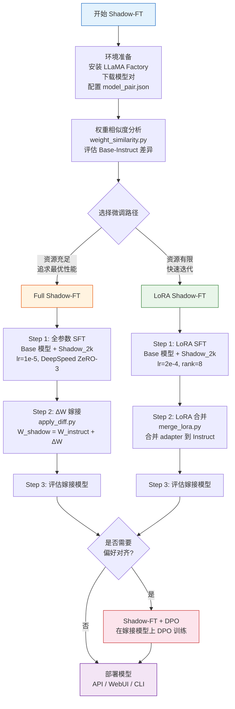

# 10 Shadow-FT 使用指南与案例

> 本文档采用"分-总-分"结构：首先按使用场景分类介绍 Shadow-FT 的各类应用路径，其次总览 Shadow-FT 最佳实践，最后提供完整的复现案例。

---

## 第一部分：使用场景分类

### 1.1 场景一：全参数 Shadow-FT（Full Shadow-FT）

**适用场景**：拥有充足的 GPU 资源（多卡 A100/H100），追求模型性能最大化，希望 ΔW 增量以完整精度嫁接到 Instruct 模型。

全参数 Shadow-FT 是论文中的核心实验路径。其核心思想是在 Base 模型上进行全参数 SFT，得到完整的微调权重 W_tuned，然后计算 ΔW = W_tuned - W_base，将 ΔW 嫁接到 Instruct 模型上，得到 W_shadow = W_instruct + ΔW。由于全参数微调不引入低秩近似，ΔW 保留了完整的训练信息，理论上可以达到最优的嫁接效果。

**关键特征**：
- 训练阶段更新全部模型参数
- 使用 DeepSpeed ZeRO-3 进行分布式训练
- 学习率较低（1e-5），避免过拟合
- 增量嫁接仅对线性层执行（注意力投影 + MLP 投影）
- 嫁接工具：[`apply_diff.py`](file:///workspace/src/shadow/apply_diff.py)

### 1.2 场景二：LoRA Shadow-FT

**适用场景**：GPU 资源有限（单卡或少量显卡），需要快速迭代实验，或对模型性能要求相对宽松。

LoRA Shadow-FT 是全参数路径的高效替代方案。它在 Base 模型上仅训练低秩适配器参数（LoRA adapter），然后将训练好的 adapter 合并到 Instruct 模型上。由于 LoRA 的增量表示为低秩矩阵乘积 ΔW = A × B，相比全参数路径存在信息压缩，但训练速度和显存占用大幅降低。

**关键特征**：
- 仅训练 LoRA 适配器参数（rank=8 时约 0.1% 参数量）
- 无需 DeepSpeed ZeRO-3，单卡即可运行
- 学习率较高（2e-4），补偿低秩约束下的更新能力
- 嫁接工具：[`merge_lora.py`](file:///workspace/src/shadow/merge_lora.py)，底层调用 `llamafactory-cli export`
- 支持 B2I（核心嫁接）和 I2I（对照实验）两种合并方向

### 1.3 场景三：Shadow-FT + DPO 对齐

**适用场景**：在 Shadow-FT SFT 阶段之后，希望进一步提升模型的偏好对齐能力，使模型输出更符合人类偏好。

Shadow-FT + DPO 是两阶段训练方案：第一阶段通过 Shadow-FT 完成 SFT 知识注入，第二阶段在嫁接后的模型上进行 DPO（Direct Preference Optimization）对齐训练。这种组合利用了 Shadow-FT 保留 Instruct 对齐能力的优势，同时通过 DPO 进一步优化模型输出质量。

**关键特征**：
- 第一阶段：Shadow-FT SFT（Full 或 LoRA 路径均可）
- 第二阶段：在嫁接模型上执行 DPO 训练
- DPO 阶段使用偏好数据集（如 `dpo_en_demo`）
- 两阶段解耦，可独立调优

### 1.4 场景四：多模态 Shadow-FT

**适用场景**：视觉-语言模型（VLM）的 Shadow-FT 微调，如 Qwen2.5-VL 等多模态模型。

多模态 Shadow-FT 的原理与纯语言模型完全一致——在 Base 模型上训练、将增量嫁接到 Instruct 模型。区别在于多模态模型包含视觉编码器等额外组件，但 Shadow-FT 的增量嫁接逻辑不变：仅对线性层执行 ΔW 嫁接，非线性的视觉编码器层直接沿用 Instruct 模型的原始权重。

**关键特征**：
- 训练数据需包含多模态样本（图像+文本对）
- 使用对应的多模态模板（如 `qwen2_5vl`）
- 增量嫁接逻辑与纯语言模型相同
- 需要额外的视觉处理器配置

### 1.5 场景五：权重相似度分析

**适用场景**：在选择模型对之前，希望量化 Base 模型与 Instruct 模型之间的权重差异，评估 Shadow-FT 嫁接的可行性。

权重相似度分析是 Shadow-FT 实验的前置步骤。通过计算 σ 指标（相对差距比），可以判断 Base 和 Instruct 模型的权重是否足够接近——σ 越小，嫁接效果越可预测。该分析工具也适用于研究不同模型家族的 Base-Instruct 权重差异规律。

**关键特征**：
- 使用 [`weight_similarity.py`](file:///workspace/src/shadow/weight_similarity.py) 计算 σ 指标
- 逐层加载策略，支持 70B+ 大模型
- BF16→FP32 上转，确保数值精度
- 辅助稀疏度分析

### 1.6 场景六：自动化批量实验

**适用场景**：需要在大规模模型对上批量运行 Shadow-FT 实验，自动生成训练脚本、执行嫁接并收集评估结果。

[`run.sh`](file:///workspace/run.sh) 是 Shadow-FT 的自动化流程编排脚本，它根据配置参数自动生成完整的训练+嫁接+评估脚本，支持 LoRA 和 Full 两种路径的切换，以及多模型对的批量处理。

**关键特征**：
- 通过 `USE_LORA` 开关一键切换 LoRA/Full 路径
- 从 [`model_pair.json`](file:///workspace/examples/model_pair.json) 自动解析模型对
- 自动匹配对话模板
- 生成评估列表，便于后续批量评测

---

## 第二部分：Shadow-FT 最佳实践总览

### 2.1 Shadow-FT 端到端使用流程图



### 2.2 核心最佳实践

#### 实践一：模型对选择

Shadow-FT 的前提条件是 Base 模型和 Instruct 模型来自**同一模型家族、同一规模版本**。例如 `Qwen3-8B-Base` 对应 `Qwen3-8B`，`Llama-3.1-8B` 对应 `Llama-3.1-8B-Instruct`。跨家族或跨规模的模型对会导致 ΔW 嫁接失效。

项目在 [`model_pair.json`](file:///workspace/examples/model_pair.json) 中预定义了 31 组经过验证的模型对，涵盖 Qwen3、Qwen2.5、Falcon、Gemma、Mistral、Yi、Baichuan、InternLM2、GLM-4、Seed-Coder 共 10 个模型家族。使用前请确认模型对在该文件中有对应条目。

#### 实践二：学习率选择

| 微调路径 | 推荐学习率 | 原因 |
|----------|-----------|------|
| LoRA Shadow-FT | 2e-4 | LoRA 仅更新低秩适配器参数，需要较大学习率才能产生足够的权重变化 |
| Full Shadow-FT | 1e-5 | 全参数微调更新所有参数，较小学习率避免过拟合和训练不稳定 |

两者相差 20 倍，反映了参数更新规模对学习率量级的需求差异。请勿混用——LoRA 使用 1e-5 会导致训练不充分，Full 使用 2e-4 则容易过拟合。

#### 实践三：LoRA 秩选择

LoRA rank=8 是 Shadow-FT 实验验证过的默认值，在性能和效率之间取得了良好平衡。增大 rank（如 16、32）可能带来边际性能提升，但也会增加显存占用和训练时间。对于快速验证场景，rank=8 已足够。

#### 实践四：数据集规模

Shadow_2k 数据集（2000 条样本）是论文实验的标准配置。Shadow-FT 的核心论点之一是**少量数据即可实现有效嫁接**——2K 样本足以在 Base 模型上学到有意义的增量，嫁接到 Instruct 后即可获得显著提升。如需更多数据，可扩展至 Shadow_5k 或自定义数据集。

#### 实践五：增量嫁接范围

全参数路径的 `apply_diff.py` 仅对**线性层**执行 ΔW 嫁接，包括：
- 注意力投影层：`q_proj`、`k_proj`、`v_proj`、`o_proj`
- MLP 投影层：`up_proj`、`gate_proj`、`down_proj`

非线性层（LayerNorm、Embedding 等）直接沿用 Instruct 模型的原始权重。这一设计基于论文的观察：指令对齐的权重变化主要集中在线性变换层，而非线性的归一化和嵌入层变化较小。

#### 实践六：DeepSpeed 配置

| 微调路径 | DeepSpeed 配置 | 原因 |
|----------|---------------|------|
| Full Shadow-FT | ZeRO-3（`ds_z3_config.json`） | 全参数微调需跨 GPU 分片模型参数、梯度和优化器状态 |
| LoRA Shadow-FT | 可选（无需 DeepSpeed） | LoRA 可训练参数极少，单卡即可运行 |

全参数路径必须使用 DeepSpeed ZeRO-3，否则大模型（7B+）的显存需求将超出单卡容量。项目在 [`examples/deepspeed/`](file:///workspace/examples/deepspeed/) 下提供了多种配置：
- [`ds_z3_config.json`](file:///workspace/examples/deepspeed/ds_z3_config.json)：标准 ZeRO-3
- [`ds_z3_offload_config.json`](file:///workspace/examples/deepspeed/ds_z3_offload_config.json)：ZeRO-3 + CPU 卸载（显存更紧张时使用）
- [`ds_z2_config.json`](file:///workspace/examples/deepspeed/ds_z2_config.json)：ZeRO-2（仅分片优化器状态和梯度）

#### 实践七：对话模板匹配

不同模型家族使用不同的对话模板，模板错误会导致训练数据格式化不正确，严重影响模型性能。[`run.sh`](file:///workspace/run.sh) 中的模板自动匹配逻辑如下：

| 模型名称关键字 | 模板名 | 示例模型 |
|---------------|--------|---------|
| `*Llama-3*` | `llama3` | Meta-Llama-3-8B |
| `*Qwen3*` | `qwen3` | Qwen3-8B-Base |
| `*Qwen2*` | `qwen` | Qwen2.5-7B |
| `*gemma3*` | `gemma3` | gemma-3-27b |
| `*gemma*` | `gemma` | gemma-2-9b |
| `*Mistral*` | `mistral` | Mistral-7B-v0.1 |
| `*Falcon*` | `falcon` | falcon-7b |
| `*Yi*` | `yi` | Yi-6B |
| `*Baichuan*` | `baichuan2` | Baichuan2-7B |
| `*internlm2*` | `intern2` | internlm2-7b |

手动指定训练命令时，务必使用正确的 `--template` 参数。

---

## 第三部分：完整复现案例

### 3.1 环境准备

#### 3.1.1 安装 LLaMA Factory

```bash
# 克隆项目
git clone https://github.com/hiyouga/LLaMA-Factory.git
cd LLaMA-Factory

# 安装依赖（包含 PyTorch 和评估指标）
pip install -e ".[torch,metrics]"
```

#### 3.1.2 关键依赖确认

Shadow-FT 依赖以下核心库，安装完成后请确认版本：

```bash
python3 -c "import torch; print(f'torch: {torch.__version__}')"
python3 -c "import transformers; print(f'transformers: {transformers.__version__}')"
python3 -c "import peft; print(f'peft: {peft.__version__}')"
python3 -c "import safetensors; print(f'safetensors: {safetensors.__version__}')"
python3 -c "import huggingface_hub; print(f'huggingface_hub: {huggingface_hub.__version__}')"
```

| 依赖库 | 用途 | Shadow-FT 中的角色 |
|--------|------|-------------------|
| `torch` | 深度学习框架 | 模型训练与张量运算 |
| `transformers` | 模型加载与分词器 | SFT 训练、模型加载 |
| `peft` | 参数高效微调 | LoRA 适配器训练 |
| `safetensors` | 安全张量格式 | 权重读写（apply_diff.py、weight_similarity.py） |
| `huggingface_hub` | 模型仓库交互 | 分片保存权重（save_torch_state_dict） |

#### 3.1.3 下载 Base/Instruct 模型对

Shadow-FT 需要同一模型家族的 Base 和 Instruct 两个版本。以 Qwen3-8B 为例：

```bash
# 方式一：使用 huggingface-cli 下载
huggingface-cli download Qwen/Qwen3-8B-Base --local-dir ./models/Qwen3-8B-Base
huggingface-cli download Qwen/Qwen3-8B --local-dir ./models/Qwen3-8B

# 方式二：在训练命令中直接使用 HuggingFace Hub ID
# llamafactory-cli train --model_name_or_path Qwen/Qwen3-8B-Base ...
# 框架会自动下载
```

#### 3.1.4 配置 model_pair.json

模型对配置文件位于 [`examples/model_pair.json`](file:///workspace/examples/model_pair.json)，格式如下：

```json
{
  "name": "Qwen3-8B-Base",
  "hf_base_path": "Qwen/Qwen3-8B-Base",
  "hf_instruct_path": "Qwen/Qwen3-8B"
}
```

如需添加自定义模型对，按上述格式追加到 JSON 数组即可。`name` 字段需与 `run.sh` 中的 `BASE_MODELS` 数组元素匹配。

#### 3.1.5 确认数据集

Shadow-FT 使用 `Shadow_2k` 数据集，配置在 [`data/dataset_info.json`](file:///workspace/data/dataset_info.json) 中：

```json
"Shadow_2k": {
  "file_name": "Shadow_2k.parquet",
  "formatting": "sharegpt",
  "columns": {
    "messages": "conversations"
  }
}
```

数据文件 [`data/Shadow_2k.parquet`](file:///workspace/data/Shadow_2k.parquet) 采用 ShareGPT 格式，包含约 2000 条多轮对话样本。

---

### 3.2 案例一：全参数 Shadow-FT 完整复现

本案例以 Llama-3-8B 为例，演示全参数 Shadow-FT 的完整流程。

#### Step 1：在 Base 模型上进行全参数 SFT

```bash
llamafactory-cli train \
  --model_name_or_path meta-llama/Meta-Llama-3-8B \
  --stage sft \
  --finetuning_type full \
  --dataset Shadow_2k \
  --template llama3 \
  --cutoff_len 4096 \
  --max_samples 2000 \
  --per_device_train_batch_size 2 \
  --gradient_accumulation_steps 16 \
  --lr_scheduler_type cosine \
  --warmup_ratio 0.1 \
  --num_train_epochs 1 \
  --learning_rate 1e-5 \
  --bf16 \
  --deepspeed examples/deepspeed/ds_z3_config.json \
  --output_dir saves/Shadow-FT/full/llama3-8b-base-sft \
  --logging_steps 1 \
  --save_steps 1000 \
  --plot_loss true \
  --fp16_proxy_eval_loss
```

**参数说明**：

| 参数 | 值 | 说明 |
|------|----|------|
| `--model_name_or_path` | Base 模型路径 | 在 Base 模型上训练，不是 Instruct |
| `--stage` | `sft` | 监督微调阶段 |
| `--finetuning_type` | `full` | 全参数微调 |
| `--dataset` | `Shadow_2k` | Shadow-FT 专用数据集 |
| `--template` | `llama3` | Llama-3 系列的对话模板 |
| `--cutoff_len` | `4096` | 最大序列长度 |
| `--max_samples` | `2000` | 使用全部 Shadow_2k 数据 |
| `--learning_rate` | `1e-5` | 全参数微调推荐学习率 |
| `--deepspeed` | `ds_z3_config.json` | ZeRO-3 分布式训练 |
| `--fp16_proxy_eval_loss` | — | 使用 FP16 近似计算评估损失，降低显存占用 |

训练完成后，微调后的 Base 模型权重保存在 `saves/Shadow-FT/full/llama3-8b-base-sft/` 目录下。

#### Step 2：使用 apply_diff.py 进行 ΔW 嫁接

```bash
python3 src/shadow/apply_diff.py \
  --tuned_model saves/Shadow-FT/full/llama3-8b-base-sft \
  --target_model meta-llama/Meta-Llama-3-8B-Instruct \
  --base_model meta-llama/Meta-Llama-3-8B
```

**参数说明**：

| 参数 | 含义 |
|------|------|
| `--tuned_model` | Step 1 输出的微调后 Base 模型路径（W_tuned） |
| `--target_model` | Instruct 模型路径（W_instruct），ΔW 将嫁接到此模型 |
| `--base_model` | 原始 Base 模型路径（W_base），用于计算 ΔW = W_tuned - W_base |
| `--max_shard_size` | 分片保存的最大分片大小，默认 2GB |

**执行过程**：

1. 加载三个模型的权重（支持 safetensors 分片、单文件 bin、多分片 bin 三种格式）
2. 对线性层计算 ΔW = W_tuned - W_base
3. 嫁接：W_shadow = W_instruct + ΔW（仅线性层）
4. 非线性层直接沿用 Instruct 模型原始权重
5. 保存嫁接后的模型到 `saves/Shadow-FT/full/llama3-8b-base-sft/merged-B2I/`
6. 复制 Instruct 模型的 tokenizer 和 config 到输出目录

**调试输出示例**：

```
===== DEBUG: first layer self_attn.q_proj =====
A weight shape: torch.Size([4096, 4096])
B weight shape: torch.Size([4096, 4096])
C weight shape: torch.Size([4096, 4096])
NEW weight shape: torch.Size([4096, 4096])
Delta weight mean (a-c): 0.000123456
Abs delta weight mean (|a-c|): 0.001234567
==============================================
```

#### Step 3：评估嫁接模型

```bash
# 使用 llamafactory-cli eval 进行标准化评测
llamafactory-cli eval \
  --model_name_or_path saves/Shadow-FT/full/llama3-8b-base-sft/merged-B2I \
  --template llama3 \
  --task mmlu \
  --split test

# 或使用对话模式进行定性评估
llamafactory-cli chat \
  --model_name_or_path saves/Shadow-FT/full/llama3-8b-base-sft/merged-B2I \
  --template llama3
```

---

### 3.3 案例二：LoRA Shadow-FT 完整复现

本案例以 Qwen3-8B 为例，演示 LoRA Shadow-FT 的完整流程。

#### Step 1：在 Base 模型上进行 LoRA SFT

```bash
llamafactory-cli train \
  --model_name_or_path Qwen/Qwen3-8B-Base \
  --stage sft \
  --finetuning_type lora \
  --lora_rank 8 \
  --lora_target all \
  --dataset Shadow_2k \
  --template qwen3 \
  --cutoff_len 4096 \
  --max_samples 2000 \
  --per_device_train_batch_size 2 \
  --gradient_accumulation_steps 16 \
  --lr_scheduler_type cosine \
  --warmup_ratio 0.1 \
  --num_train_epochs 1 \
  --learning_rate 2e-4 \
  --bf16 \
  --output_dir saves/Shadow-FT/lora/qwen3-8b-base-lora \
  --logging_steps 1 \
  --save_steps 1000 \
  --plot_loss true
```

**与全参数路径的关键差异**：

| 参数 | LoRA 路径 | Full 路径 |
|------|----------|-----------|
| `--finetuning_type` | `lora` | `full` |
| `--lora_rank` | `8` | — |
| `--lora_target` | `all` | — |
| `--learning_rate` | `2e-4` | `1e-5` |
| `--deepspeed` | 不需要 | `ds_z3_config.json` |

训练完成后，LoRA 适配器权重保存在 `saves/Shadow-FT/lora/qwen3-8b-base-lora/` 目录下。注意 LoRA 输出的是适配器文件（`adapter_model.safetensors`），而非完整的模型权重。

#### Step 2：使用 merge_lora.py 合并到 Instruct 模型

```bash
python3 src/shadow/merge_lora.py \
  --adapter_path saves/Shadow-FT/lora/qwen3-8b-base-lora \
  --target_base Qwen/Qwen3-8B \
  --merge_tag B2I \
  --template qwen3
```

**参数说明**：

| 参数 | 含义 |
|------|------|
| `--adapter_path` | Step 1 输出的 LoRA 适配器目录 |
| `--target_base` | 目标 Instruct 模型路径，LoRA 将合并到此模型 |
| `--merge_tag` | 合并标签，输出目录命名为 `merged-{merge_tag}` |
| `--template` | 对话模板，需与训练时一致 |

**执行过程**：

1. 在适配器目录下创建 `merged-B2I/` 子目录
2. 生成 YAML 配置文件 `merged-B2I/merge_lora_config.yaml`：
   ```yaml
   model_name_or_path: Qwen/Qwen3-8B
   adapter_name_or_path: saves/Shadow-FT/lora/qwen3-8b-base-lora
   template: qwen3
   finetuning_type: lora
   export_size: 5
   export_device: cpu
   export_legacy_format: false
   trust_remote_code: true
   export_dir: saves/Shadow-FT/lora/qwen3-8b-base-lora/merged-B2I
   ```
3. 调用 `llamafactory-cli export merged-B2I/merge_lora_config.yaml`
4. 框架加载 Instruct 模型 → 注入 LoRA 适配器 → 合并并卸载 → 保存完整模型

**合并原理**：LoRA 的增量表示为 ΔW = A × B（低秩矩阵乘积），合并操作等效于 W_shadow = W_instruct + A × B。与全参数路径的显式 ΔW 计算不同，LoRA 路径的增量嫁接隐含在 `merge_and_unload()` 过程中。

**跳过逻辑**：如果目标目录已存在 `.safetensors` 文件，脚本会跳过合并，避免重复计算。

#### Step 3：评估嫁接模型

```bash
llamafactory-cli eval \
  --model_name_or_path saves/Shadow-FT/lora/qwen3-8b-base-lora/merged-B2I \
  --template qwen3 \
  --task mmlu \
  --split test
```

**对照实验**：LoRA 路径还支持 I2I 对照实验，即在 Instruct 模型上训练 LoRA 后合并回 Instruct：

```bash
# 在 Instruct 模型上训练 LoRA
llamafactory-cli train \
  --model_name_or_path Qwen/Qwen3-8B \
  --stage sft \
  --finetuning_type lora \
  --lora_rank 8 \
  --lora_target all \
  --dataset Shadow_2k \
  --template qwen3 \
  --cutoff_len 4096 \
  --max_samples 2000 \
  --per_device_train_batch_size 2 \
  --gradient_accumulation_steps 16 \
  --lr_scheduler_type cosine \
  --warmup_ratio 0.1 \
  --num_train_epochs 1 \
  --learning_rate 2e-4 \
  --bf16 \
  --output_dir saves/Shadow-FT/lora/qwen3-8b-instruct-lora

# I2I 合并
python3 src/shadow/merge_lora.py \
  --adapter_path saves/Shadow-FT/lora/qwen3-8b-instruct-lora \
  --target_base Qwen/Qwen3-8B \
  --merge_tag I2I \
  --template qwen3
```

通过对比 B2I（Shadow-FT）和 I2I（直接在 Instruct 上训练）的效果，可以验证 Shadow-FT 的优势。

---

### 3.4 案例三：Shadow-FT + DPO 两阶段训练

本案例演示在 Shadow-FT SFT 阶段之后，进一步进行 DPO 对齐训练。

#### Step 1：完成 Shadow-FT SFT 阶段

按照案例一或案例二完成 SFT 阶段，得到嫁接后的模型。以 LoRA Shadow-FT 为例：

```bash
# SFT 阶段（同案例二 Step 1-2）
# 最终嫁接模型路径：
# saves/Shadow-FT/lora/qwen3-8b-base-lora/merged-B2I
```

#### Step 2：在嫁接模型上进行 DPO 训练

```bash
llamafactory-cli train \
  --model_name_or_path saves/Shadow-FT/lora/qwen3-8b-base-lora/merged-B2I \
  --stage dpo \
  --finetuning_type lora \
  --lora_rank 8 \
  --lora_target all \
  --dataset dpo_en_demo \
  --template qwen3 \
  --cutoff_len 4096 \
  --max_samples 1000 \
  --per_device_train_batch_size 1 \
  --gradient_accumulation_steps 8 \
  --learning_rate 5e-6 \
  --num_train_epochs 3 \
  --lr_scheduler_type cosine \
  --warmup_ratio 0.1 \
  --bf16 \
  --pref_beta 0.1 \
  --pref_loss sigmoid \
  --output_dir saves/Shadow-FT/dpo/qwen3-8b-shadow-dpo
```

**DPO 关键参数说明**：

| 参数 | 值 | 说明 |
|------|----|------|
| `--stage` | `dpo` | 直接偏好优化阶段 |
| `--dataset` | `dpo_en_demo` | 偏好数据集（含 chosen/rejected 对） |
| `--learning_rate` | `5e-6` | DPO 通常使用更小的学习率 |
| `--pref_beta` | `0.1` | DPO 的 β 参数，控制偏好强度 |
| `--pref_loss` | `sigmoid` | 使用标准 DPO 损失函数 |

#### Step 3：合并 DPO LoRA 并评估

```bash
python3 src/shadow/merge_lora.py \
  --adapter_path saves/Shadow-FT/dpo/qwen3-8b-shadow-dpo \
  --target_base saves/Shadow-FT/lora/qwen3-8b-base-lora/merged-B2I \
  --merge_tag DPO \
  --template qwen3
```

---

### 3.5 案例四：权重相似度分析

在进行 Shadow-FT 实验之前，建议先分析 Base 和 Instruct 模型之间的权重差异。

#### 运行权重相似度分析

```bash
python3 src/shadow/weight_similarity.py \
  --B Qwen/Qwen3-8B-Base \
  --I Qwen/Qwen3-8B
```

**输出示例**：

```
Total layers: 32
Processing Layer 0 ...
key: model.layers.0.self_attn.q_proj.weight, sigma: 0.0312
key: model.layers.0.self_attn.k_proj.weight, sigma: 0.0289
key: model.layers.0.self_attn.v_proj.weight, sigma: 0.0356
key: model.layers.0.self_attn.o_proj.weight, sigma: 0.0298
key: model.layers.0.mlp.gate_proj.weight, sigma: 0.0412
key: model.layers.0.mlp.up_proj.weight, sigma: 0.0387
key: model.layers.0.mlp.down_proj.weight, sigma: 0.0365
...
Processing Layer 31 ...
...
Average sigma across all tensors: 0.0342
```

**σ 指标解读**：

| σ 范围 | 含义 | Shadow-FT 嫁接预期 |
|--------|------|-------------------|
| σ < 0.02 | Base 和 Instruct 权重非常接近 | 嫁接效果高度可预测 |
| 0.02 ≤ σ < 0.05 | 存在适度差异（常见范围） | 嫁接效果良好 |
| σ ≥ 0.05 | 差异较大 | 需谨慎评估嫁接效果 |

σ 的计算公式为：

$$\sigma(W_A, W_B) = \frac{\sum|W_A - W_B|}{\sum|W_A| + \sum|W_B|}$$

该脚本采用逐层加载策略，每次仅加载当前层的权重到内存，避免 70B+ 大模型导致 OOM。BF16 张量在计算前会上转为 FP32，确保数值精度。

---

### 3.6 案例五：使用 run.sh 自动化实验

[`run.sh`](file:///workspace/run.sh) 是 Shadow-FT 的自动化流程编排脚本，可一键生成完整的训练+嫁接脚本。

#### 配置参数

编辑 [`run.sh`](file:///workspace/run.sh) 顶部的全局变量：

```bash
# 切换 LoRA / Full 路径
USE_LORA=true    # true → LoRA Shadow-FT; false → Full Shadow-FT

# LoRA 参数
lora_ranks=(8)
ratios=(0.5)
learning_rates_lora=(2e-4)

# Full SFT 参数
learning_rates_sft=(1e-5)

# 模型列表（名称需与 model_pair.json 中的 name 字段匹配）
BASE_MODELS=(
  "Qwen3-0.6B-Base"
  # "Qwen3-8B-Base"
  # "Qwen2.5-7B"
)

# 本地模型目录（为空则从 HuggingFace 下载）
MODEL_DIR=""
# MODEL_DIR="/data/models"  # 本地路径
```

#### 运行脚本

```bash
bash run.sh
```

脚本执行后不会直接开始训练，而是在 `scripts/` 目录下生成训练脚本，例如：

```
scripts/train_Qwen3-0.6B-Base_0622150000.sh
```

#### 执行生成的训练脚本

```bash
# 查看生成的脚本内容
cat scripts/train_Qwen3-0.6B-Base_0622150000.sh

# 执行训练
bash scripts/train_Qwen3-0.6B-Base_0622150000.sh
```

生成的脚本包含以下部分：

1. **环境变量设置**：`VLLM_WORKER_MULTIPROC_METHOD`、`HF_HUB_OFFLINE` 等
2. **Base 模型训练命令**：`llamafactory-cli train --model_name_or_path <Base> ...`
3. **Instruct 模型训练命令**：`llamafactory-cli train --model_name_or_path <Instruct> ...`
4. **增量嫁接命令**：
   - LoRA 模式：`python3 src/shadow/merge_lora.py ...`
   - Full 模式：`python3 src/shadow/apply_diff.py ...`
5. **评估列表**：以注释形式列出所有待评估的实验配置

#### 解读结果

训练和嫁接完成后，结果保存在 `results/` 目录下，目录结构如下：

```
results/
└── 0622/
    └── result-Qwen3-0.6B-Base-0622/
        ├── B-2k-lora-rank8-lr0.0002-Shadow_2k/    # Base LoRA 训练输出
        ├── I-2k-lora-rank8-lr0.0002-Shadow_2k/    # Instruct LoRA 训练输出
        ├── merged-B2I/                             # Shadow-FT 嫁接结果
        └── merged-I2I/                             # 对照实验结果
```

---

### 3.7 案例六：多模态 Shadow-FT

多模态 Shadow-FT 的原理与纯语言模型完全一致，区别在于训练数据包含多模态样本，且需要使用对应的多模态模板。

#### 以 Qwen2.5-VL 为例的 LoRA Shadow-FT

```bash
# Step 1: 在 Base 模型上进行 LoRA SFT
llamafactory-cli train \
  --model_name_or_path Qwen/Qwen2.5-VL-7B-Base \
  --stage sft \
  --finetuning_type lora \
  --lora_rank 8 \
  --lora_target all \
  --dataset mllm_demo \
  --template qwen2_5vl \
  --cutoff_len 4096 \
  --max_samples 1000 \
  --per_device_train_batch_size 1 \
  --gradient_accumulation_steps 8 \
  --learning_rate 2e-4 \
  --num_train_epochs 1 \
  --lr_scheduler_type cosine \
  --warmup_ratio 0.1 \
  --bf16 \
  --output_dir saves/Shadow-FT/lora/qwen2.5vl-7b-base-lora

# Step 2: 合并 LoRA 到 Instruct 模型
python3 src/shadow/merge_lora.py \
  --adapter_path saves/Shadow-FT/lora/qwen2.5vl-7b-base-lora \
  --target_base Qwen/Qwen2.5-VL-7B-Instruct \
  --merge_tag B2I \
  --template qwen2_5vl

# Step 3: 评估
llamafactory-cli chat \
  --model_name_or_path saves/Shadow-FT/lora/qwen2.5vl-7b-base-lora/merged-B2I \
  --template qwen2_5vl
```

**多模态注意事项**：
- 训练数据需包含图像路径（`images` 字段），参考 [`data/mllm_demo.json`](file:///workspace/data/mllm_demo.json) 的格式
- 使用 `qwen2_5vl` 模板而非 `qwen2` 或 `qwen3`
- 增量嫁接逻辑不变——仅对线性层执行 ΔW 嫁接
- 视觉编码器（ViT）的非线性层直接沿用 Instruct 模型权重

---

## 第四部分：常见问题与故障排除

### 4.1 显存不足（OOM）

**症状**：训练过程中出现 `torch.cuda.OutOfMemoryError`。

**解决方案**：

| 方案 | 操作 | 适用场景 |
|------|------|---------|
| 减小批次大小 | `--per_device_train_batch_size 1` | 单卡 OOM |
| 增加梯度累积 | `--gradient_accumulation_steps 32` | 补偿减小批次的影响 |
| 使用 DeepSpeed ZeRO-3 | `--deepspeed examples/deepspeed/ds_z3_config.json` | Full SFT 大模型 |
| 使用 ZeRO-3 Offload | `--deepspeed examples/deepspeed/ds_z3_offload_config.json` | ZeRO-3 仍然 OOM |
| 切换到 LoRA | `--finetuning_type lora --lora_rank 8` | Full SFT 资源不足 |
| 减小序列长度 | `--cutoff_len 2048` | 长序列导致 OOM |

### 4.2 模型对不匹配

**症状**：`apply_diff.py` 执行后输出异常，或嫁接模型效果极差。

**原因**：Base 模型和 Instruct 模型不是来自同一模型家族或同一规模版本。

**解决方案**：
- 确认模型对在 [`model_pair.json`](file:///workspace/examples/model_pair.json) 中有对应条目
- 检查模型架构是否一致（层数、隐藏维度等）
- 使用 `weight_similarity.py` 计算 σ 指标，σ 过大（>0.1）说明模型对可能不匹配

### 4.3 对话模板错误

**症状**：训练损失正常但模型输出格式混乱，或出现重复的特殊标记。

**原因**：使用了错误的 `--template` 参数。

**解决方案**：
- 参照上文的模板匹配表选择正确的模板
- Llama-3 系列使用 `llama3`（不是 `llama2`）
- Qwen3 系列使用 `qwen3`（不是 `qwen`）
- Gemma-3 系列使用 `gemma3`（不是 `gemma`）

### 4.4 LoRA 合并跳过

**症状**：`merge_lora.py` 输出 `[skip] ... already has safetensors files and pass.`。

**原因**：目标目录已存在 `.safetensors` 文件，脚本自动跳过以避免重复计算。

**解决方案**：
- 如果需要重新合并，删除 `merged-{merge_tag}/` 目录下的 `.safetensors` 文件后重新运行
- 如果是预期行为（已合并过），则无需操作

### 4.5 DeepSpeed 保存检查点失败

**症状**：Full SFT 训练完成后，`output_dir` 中缺少模型文件。

**原因**：DeepSpeed ZeRO-3 的检查点保存需要 `stage3_gather_16bit_weights_on_model_save: true` 配置。

**解决方案**：
- 确认使用的是 [`ds_z3_config.json`](file:///workspace/examples/deepspeed/ds_z3_config.json)，其中已包含该配置
- 如果使用自定义 DeepSpeed 配置，确保添加此选项

### 4.6 apply_diff.py 找不到权重文件

**症状**：`FileNotFoundError: No .safetensors or pytorch_model.bin found in ...`。

**原因**：指定的模型路径不包含权重文件。

**解决方案**：
- 检查路径是否正确（绝对路径或相对路径）
- 确认目录中包含 `.safetensors` 文件或 `pytorch_model.bin`
- 如果使用 HuggingFace Hub ID，需先下载到本地

---

## 附录：Shadow-FT 核心文件索引

| 文件 | 路径 | 功能 |
|------|------|------|
| 全参数嫁接脚本 | [`src/shadow/apply_diff.py`](file:///workspace/src/shadow/apply_diff.py) | 计算 ΔW 并嫁接到 Instruct 模型 |
| LoRA 合并脚本 | [`src/shadow/merge_lora.py`](file:///workspace/src/shadow/merge_lora.py) | 将 LoRA adapter 合并到 Instruct 模型 |
| 权重相似度脚本 | [`src/shadow/weight_similarity.py`](file:///workspace/src/shadow/weight_similarity.py) | 计算 Base-Instruct σ 指标 |
| 模型对配置 | [`examples/model_pair.json`](file:///workspace/examples/model_pair.json) | 31 组 Base-Instruct 模型对 |
| 自动化脚本 | [`run.sh`](file:///workspace/run.sh) | 一键生成训练+嫁接脚本 |
| Shadow-2k 数据集 | [`data/Shadow_2k.parquet`](file:///workspace/data/Shadow_2k.parquet) | Shadow-FT 专用微调数据 |
| 数据集配置 | [`data/dataset_info.json`](file:///workspace/data/dataset_info.json) | 数据集注册表 |
| DeepSpeed ZeRO-3 | [`examples/deepspeed/ds_z3_config.json`](file:///workspace/examples/deepspeed/ds_z3_config.json) | 分布式训练配置 |
| DeepSpeed ZeRO-3 Offload | [`examples/deepspeed/ds_z3_offload_config.json`](file:///workspace/examples/deepspeed/ds_z3_offload_config.json) | ZeRO-3 + CPU 卸载配置 |
| LoRA SFT 样例 | [`examples/train_lora/llama3_lora_sft.yaml`](file:///workspace/examples/train_lora/llama3_lora_sft.yaml) | LoRA 训练配置参考 |
| Full SFT 样例 | [`examples/train_full/llama3_full_sft.yaml`](file:///workspace/examples/train_full/llama3_full_sft.yaml) | Full 训练配置参考 |
| DPO 样例 | [`examples/train_lora/llama3_lora_dpo.yaml`](file:///workspace/examples/train_lora/llama3_lora_dpo.yaml) | DPO 训练配置参考 |
